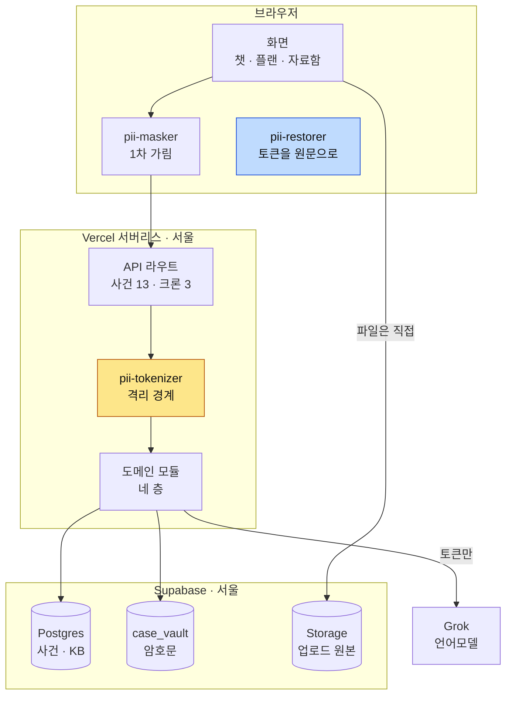
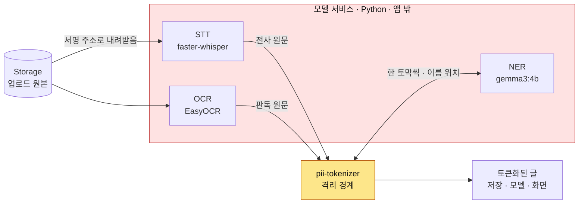
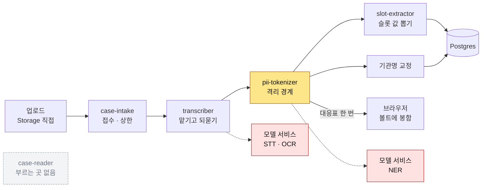
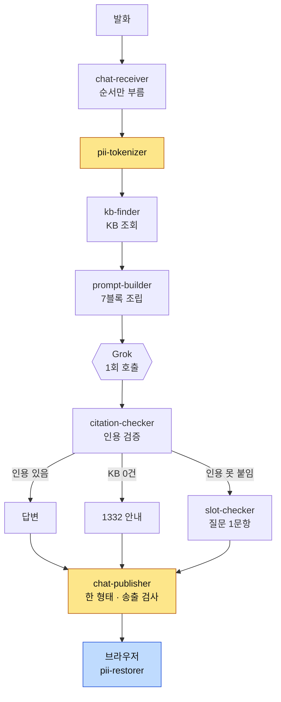
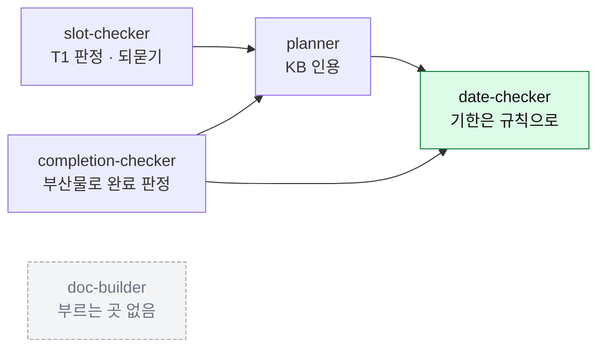
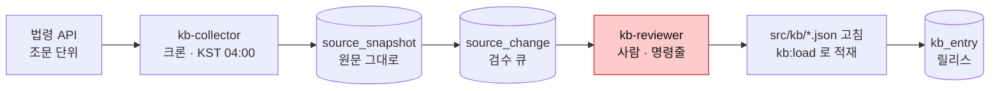
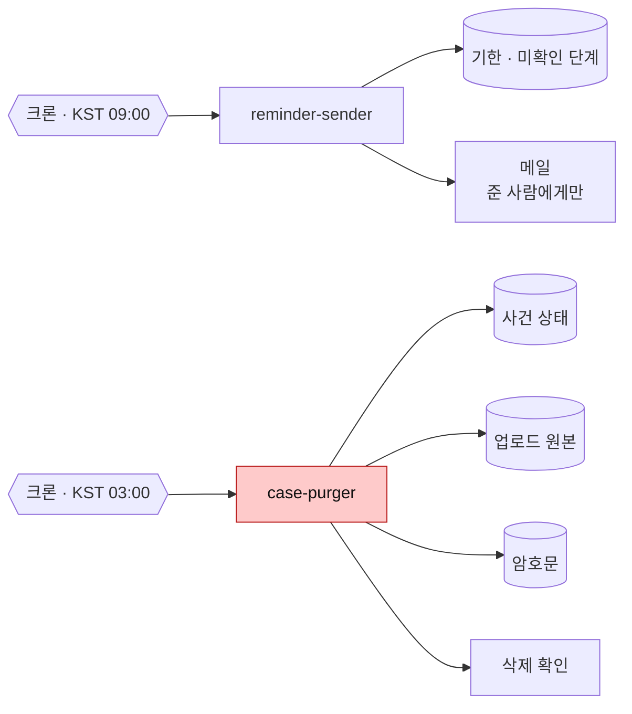
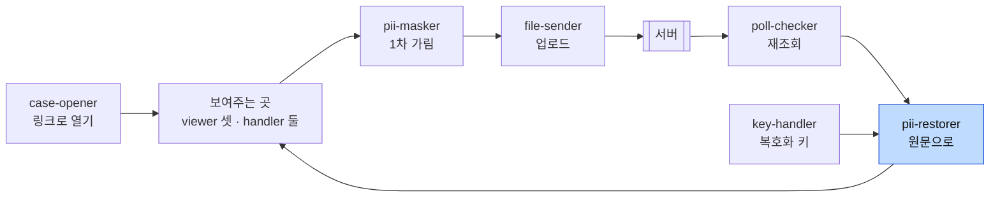
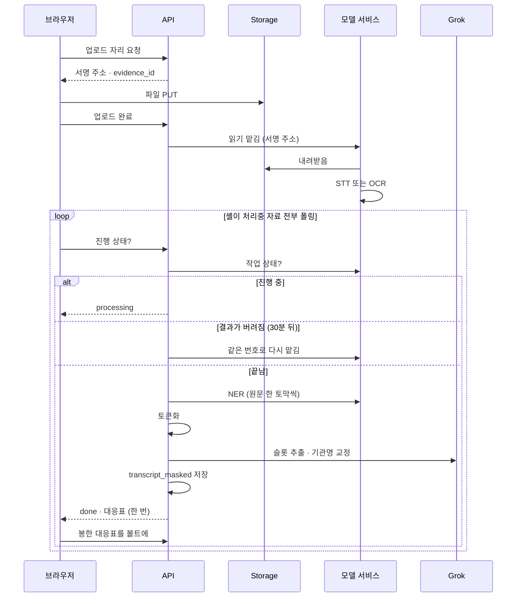
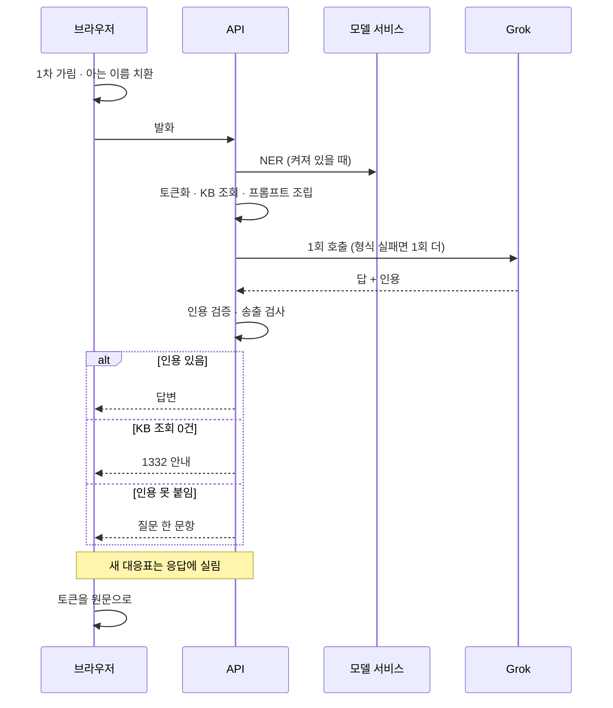

# 아키텍처 — FinAlly가 어떻게 구성되는가

> 2026-09-06 `main` 기준입니다. 앱은 Next.js 하나(TypeScript)이고, 모델을 돌리는 일만 앱 밖의
> Python 서비스(`services/transcriber/`)가 맡습니다. 각 절은 지금 실제로 도는 것을 적고, 아직 안 붙은 것은
> 그 자리에 한 줄로 적습니다.

## 이 문서의 자리

| 문서 | 답하는 질문 |
| --- | --- |
| **`ARCHITECTURE.md`** (여기) | 무엇이 어디서 어떻게 도는가 — 기술 선택·모듈 배치·저장소·배포 |
| [`spec/`](spec/) | 제품이 무엇을 만족해야 하는가 (계약) |
| [`rfc/`](rfc/) | 파일을 어디에 두는가 (작업 규약) |
| [`decisions/`](decisions/) | 왜 그렇게 정했나 (이력) |
| [`deploy/README.md`](deploy/README.md) | 지금 무엇이 올라가 있나 — 릴리스·켜진 스위치·주소 |

계약은 spec이 정본이고, 여기는 그 계약을 무엇으로 구현하는가입니다. 어긋나면 spec이 이깁니다.
배포본의 그 순간 상태(어느 KB 릴리스인지, 2차 탐지가 켜졌는지)는 날마다 바뀌므로 `deploy/README.md`가 적습니다.

먼저 읽을 것 — [모듈 명칭](spec/common/08-16-module-names.md) · [모듈 경계](spec/common/08-16-module-boundaries.md) ·
[PII 격리 경계](spec/common/08-14-pii-boundary.md).

---

## 1. 한눈에

### 요청이 지나는 길



- **노란 칸이 격리 경계입니다.** 여기를 지나지 않은 글은 외부 언어모델로 나갈 수 없습니다.
- **파란 칸은 서버에 없습니다.** 응답은 토큰 상태로 내려오고, 복호화 키가 브라우저에만 있어(§4 층 C) 서버는 토큰을
  원문으로 되돌릴 수 없습니다. 서버가 새 토큰을 만들면 그 대응표를 그 응답에 한 번 실어 보내고, 브라우저가 자기 키로
  봉해 볼트에 맡깁니다.
- 파일은 API를 거치지 않고 브라우저에서 저장소로 바로 올라갑니다. 하루 1회 도는 크론 셋은 §4 층 4에 있습니다.

### 원문이 흐르는 구간



- **빨간 상자에는 계좌번호와 이름이 그대로 흐릅니다.** 녹음을 글로 옮기는 STT, 이미지를 글로 옮기는 OCR,
  글에서 이름을 찾는 NER은 전부 토큰화 이전 단계입니다. 그래서 이 서비스가 어디에 떠 있느냐가 곧
  개인정보가 어디를 지나느냐입니다 → §6.
- NER은 경계 그 자체가 아니라 `pii-tokenizer`가 부르는 도구입니다. 경계는 하나입니다.

근거 — [ADR-009](decisions/009-restore-mapping-location.md) · [ADR-028](decisions/028-runtime-and-module-shape.md) ·
[ADR-043](decisions/043-gpu-hosting.md) · [ADR-062](decisions/062-transcript-mapping-handover.md) · [ADR-075](decisions/075-chat-mapping-handover.md)

## 2. 기술 스택

| 영역 | 선택 | 어디에 |
| --- | --- | --- |
| 언어 | TypeScript(앱 전부) · Python(모델 서비스 하나) | `src/` · `services/transcriber/` |
| 프론트 | Next.js 16 App Router · React 19 · Tailwind v4 · shadcn/ui | `src/package.json` |
| 백엔드 런타임 | Vercel 서버리스 함수 · 리전 `icn1`(서울) · Hobby 플랜 | `src/vercel.json` |
| 관계형 DB | Supabase Postgres(서울) · 드라이버 `postgres.js` · ORM 없음 | `src/lib/db.ts` |
| 볼트 | 같은 Postgres의 `case_vault` 스키마 · 암호문만 | `src/migrations/0004` |
| 객체 저장소 | Supabase Storage `evidence` 버킷(비공개) · 서명 주소로만 접근 | `src/lib/storage.ts` |
| 언어모델 | Grok(xAI) `grok-4.5` · OpenAI 호환 `/chat/completions` 하나 · SDK 없음 · 도구 호출 안 씀 | `src/lib/llm.ts` |
| STT · OCR · NER | FastAPI 서비스 · faster-whisper `large-v3`(GPU) 또는 `medium`(CPU) · EasyOCR · Ollama `gemma3:4b` | `services/transcriber/` |
| KB 검색 | 조건 조회(track · 유형 · 기관 · 날짜 · 버전) · 벡터 검색 아님 | `src/modules/kb-finder/` |
| 주기 실행 | Vercel Cron 셋(알림 · 파기 · 법령 수집) · 앱의 API 라우트를 깨움 | `src/vercel.json` |
| 메일 | Brevo REST | `src/lib/mailer.ts` |
| 공휴일 | 코드 안의 표 · 임시공휴일은 안 들어옴 | `src/lib/holidays-table.ts` |
| 속도 제한 | 프로세스 메모리 · 공유 저장소 없음 | `src/lib/rate-limit.ts` |
| 배포 | GitHub Actions · `main` 머지가 곧 배포 · 배포 뒤 Playwright 스모크 | `.github/workflows/` |

서버리스 함수는 본문 크기와 실행 시간에 제한이 있어서, 아래 계약이 거기서 나왔습니다.

| 계약 | 이유 |
| --- | --- |
| 업로드는 서명 주소로 저장소에 직접 | 녹음이 수십 MB라 함수를 통과시키면 본문 한계에 걸립니다 |
| 전사·판독은 맡기고 폴링 | 몇 분 걸리는 일을 함수 안에서 기다릴 수 없습니다. 서비스 왕복 한 번은 8초 안에 끝냅니다 |
| 챗은 스트리밍 없이 응답 1회 | 챗 라우트만 `maxDuration = 60`이고, 모델 호출은 55초에서 앱이 먼저 끊습니다 |
| 2차 탐지는 동기 호출 | 발화 한 토막이라 GPU에서 1초 안팎입니다. 기본 12초, CPU 서버면 `NER_TIMEOUT_MS`로 늘립니다 |
| 모델 재시도는 형식을 어겼을 때 한 번 | 3~8초짜리 호출을 여러 번 반복하면 함수가 먼저 끊깁니다 |
| 크론은 하루 1회 | Hobby 플랜이 그 이상을 허용하지 않습니다 |

근거 — [ADR-012](decisions/012-kb-collection.md) · [ADR-016](decisions/016-retention-and-datastore.md) · [ADR-025](decisions/025-scheduled-jobs.md) ·
[ADR-028](decisions/028-runtime-and-module-shape.md) · [ADR-049](decisions/049-vault-in-postgres.md) · [ADR-052](decisions/052-stt-configuration.md) ·
[ADR-053](decisions/053-deploy-on-merge.md) · [ADR-078](decisions/078-shell-polls-all-processing-evidence.md)

## 3. 데이터 저장소

셋으로 나눈 이유는 한 번의 유출로 암호문과 사건 구조가 함께 나가지 않게 하기 위해서입니다.

| 저장소 | 담는 것 | 원문 PII |
| --- | --- | :---: |
| Postgres 공개 스키마 | 사건 상태(슬롯·플랜·부산물·기한·대화) · 감사 로그 · KB · 법령 스냅샷 | 없음 |
| Postgres `case_vault` 스키마 | 토큰↔원문 대응표(브라우저가 봉한 암호문) | 있음 · 서버는 키 없음 |
| Supabase Storage `evidence` | 업로드된 증거 원본 | 있음 · 비공개 버킷 · 사건과 함께 파기 |

- **DDL의 정본은 [데이터 모델](spec/backend/08-16-data-model.md)이고 실행 사본은 [`src/migrations/`](src/migrations/)입니다.**
  `0001`~`0010`이 공유 DB에 전부 적용돼 있습니다. 공개 스키마 표 17개(`schema_migrations` 포함)와
  `case_vault.restore_mapping` 하나입니다. 둘은 같은 커밋에 오고, CI의 `schema-names`가 마이그레이션에 없는
  표·칸 이름으로 SQL을 쓰는 자리를 막습니다.
- **적용은 `npm run migrate`로 합니다.** 앱이 쓰는 드라이버로 순번 SQL을 돌리고 이력을 `schema_migrations`에 남깁니다.
  ORM을 쓰지 않는 이유는 DDL이 두 곳에 생기기 때문입니다.
- **접속 문자열이 둘입니다.** 앱은 트랜잭션 풀러(6543), 마이그레이션은 세션 풀러(5432)를 씁니다. DDL은 트랜잭션 풀러로 못 갑니다.
- **볼트를 같은 Postgres에 둔 이유** — 분리 원칙이 막으려던 사고는 키와 암호문이 함께 새는 것인데, 키가 서버에 없어
  같은 인스턴스여도 그 사고가 일어나지 않습니다.
- **Storage에는 서명 주소로만 닿습니다.** 올릴 때 5분, 읽을 때 15분입니다. spec이 적은 「저장 시 암호화 + 사건별 키」는
  아직 코드에 없습니다. 지금 지키는 것은 비공개 버킷, 짧은 서명 주소, 사건과 함께하는 파기입니다.
- **보존·파기** — `purge_after`는 마지막 활동일부터 180일(`CASE_PURGE_DAYS`)입니다. 기산이 생성일이 아닌 이유는
  공고 뒤에 피해를 알고 들어온 사람이 진입 시점에 이미 두 달을 지나 있기 때문입니다. 파기 크론(KST 03:00)이
  `case-purger`를 깨우고, Postgres·Storage·볼트를 지운 뒤 실제로 지워졌는지 확인합니다. Storage에는 네이티브 만료가
  없어서 직접 지웁니다.

근거 — [ADR-010](decisions/010-case-store.md) · [ADR-016](decisions/016-retention-and-datastore.md) · [ADR-019](decisions/019-module-code-sync.md) ·
[ADR-025](decisions/025-scheduled-jobs.md) · [ADR-049](decisions/049-vault-in-postgres.md) · [research/06](docs/research/06-경로별-실측조사.md) §5

## 4. 모듈

이름의 정본은 [모듈 명칭](spec/common/08-16-module-names.md)이고, 책임과 금지는 [모듈 경계](spec/common/08-16-module-boundaries.md)입니다.
여기에는 그 이름들이 서로 어떻게 이어지는지를 그립니다. 가르는 기준은 언제 도는가입니다.

서른둘 전부 코드가 있습니다. 서버 모듈의 `index.ts`는 `import "server-only"`, 브라우저 모듈은 `import "client-only"`로
시작해 반대쪽에서 가져오면 빌드가 막힙니다. 회색 점선 칸 둘(`case-reader`·`doc-builder`)은 코드는 있지만 아직 아무 데서도
부르지 않습니다.

### 층 1 · 증거가 들어올 때 (한 번)



- **판단은 앱에, 모델은 서비스에.** 「먼저 말한 쪽이 A」, 「말풍선 좌우로 화자를 가른다」 같은 판단은 `transcriber`
  모듈이 하고, Python 서비스는 글로 옮기기만 합니다. 모델을 갈아끼워도 모듈은 안 바뀝니다.
- **2차 탐지는 `pii-tokenizer` 안에서 돕니다.** 1차 정규식이 계좌·주민번호·카드·전화를 잡고, `NER_URL`이 있으면
  같은 서비스의 `/ner`이 이름을 찾고, 기관명 허용 목록이 경유 서비스 이름을 지킵니다. `NER_URL`이 비면 이름이
  안 가려지고 그 사실이 응답의 `nerApplied`에 드러납니다. 채웠는데 서비스가 죽으면 슬롯·챗·부산물 쓰기가 503으로
  멈춥니다. 못 가리면 안 내보내는 것이 설계입니다.
- **토큰화 뒤에 언어모델이 두 번 더 갑니다.** 슬롯 값 추출(확신도 0.7 이상만)과 기관명 교정입니다. 둘 다 확정은
  사용자가 한 번의 탭으로 합니다.
- `case-reader`의 결과를 쓰던 관리자 조회가 폐기돼 부르는 곳이 없습니다. 절차 분기에는 원래 쓰이지 않습니다.
  분기축은 경유 서비스 하나입니다.

### 층 2 · 사용자가 말할 때마다 (매 턴)



- **세 갈래가 `chat-publisher` 하나로 모여 같은 껍데기로 나갑니다.** 화면이 갈래를 분기하지 않습니다.
  `chat-receiver`는 부르기만 하고 판정하지 않습니다. 이 순서를 모으는 것은 `src/flows/chat-turn.ts`이고
  감사 기록도 거기서 남깁니다.
- **에러가 나가지 않는 경로가 둘입니다.** 근거를 못 찾으면 실패가 아니라 되묻기로 갑니다.
- **서버가 조회 조건을 전부 압니다.** `track`·유형·기관·오늘 날짜·KB 버전을 서버가 넣으므로 모델이 필터를 우회할 수 없습니다.
- **이름은 양쪽에서 같은 번호를 씁니다.** 브라우저는 이미 아는 이름을 보내기 전에 그 이름표로 바꾸고, 서버가 새로 찾은
  이름의 대응표는 응답의 `pii_mappings`로 돌려줍니다. 서버는 그 대응표를 보관하지 않습니다.

### 층 3 · 사건 상태가 바뀔 때



- **초록 칸에 언어모델을 쓰지 않습니다.** 3영업일·14일 유예·2개월 공고·5영업일은 전부 코드의 규칙입니다.
  공휴일은 코드 안의 표로 답하고, 표 밖의 연도는 「공휴일 아님」이 아니라 오류로 멈춥니다.
- **`planner`는 근거 없는 단계를 저장할 수 없습니다.** KB 항목 번호·버전·출처·시행일이 비면 스키마가 거부합니다.
- **`completion-checker`는 올린 파일을 증빙으로 치지 않습니다.** L2는 판독 결과에 접수번호 자리나 공공기관 이름이
  있을 때만 통과하고, 판독이 아직이면 보류했다가 판독이 끝날 때 마칩니다. L3(사용자 자기 신고)는 `unconfirmed`로 남습니다.
- 이 층을 부르는 흐름이 `src/flows/`에 있습니다. 슬롯 답(`answer-slot`), 플랜 재생성(`regenerate-plan`),
  기한 계산(`compute-deadlines`), 부산물 판정 마무리(`settle-artifacts`), 통지문에서 기산일 뽑기(`anchor-from-artifact`)입니다.
- `doc-builder`는 서식 칸 정의가 KB에 없어 부를 자리가 없습니다. 기재 안내 화면은 셸 `src/app/c/[token]/doc.tsx`가 맡습니다.

### 층 4 · 하루 1회



- **수집원은 하나입니다.** `src/lib/law-fetcher.ts`가 국가법령정보 Open API를 조문 단위로 가져오고, 등록된 소스는
  통신사기피해환급법과 그 시행령 둘입니다. 소스 하나가 실패해도 나머지는 돌고, 앱은 영향이 없습니다.
- **빨간 칸을 건너뛰는 경로가 없습니다.** 수집기는 `kb_entry`를 쓰지 않고, 검수의 승인도 반영이 아닙니다.
  `kb_entry`에 쓰는 길은 `npm run kb:load` 하나이고, 앱이 인용하는 릴리스는 `KB_VERSION`이 고정합니다.
  관리자 화면이 없으므로 검수는 `npm run kb:review`로 합니다.
- **변경 감지에 비교 로직이 없습니다.** `source_snapshot`의 `(source_key, content_hash)` 유일 제약에 삽입이 성공하면 그것이 변경입니다.

같은 층에 사용자 데이터를 읽고 지우는 잡이 둘 더 있습니다.



크론 요청은 `Authorization: Bearer` 헤더 하나로 가리고, 비밀값이 비어 있으면 무조건 막습니다. 메일에는 기한·단계
제목·사건 링크만 실리고 이름·계좌는 실리지 않습니다. 문구는 `src/lib/mailer.ts` 한 곳에 있고 아직 임시입니다.

### 층 없음 · 항상

| 이름 | 맡는 일 |
| --- | --- |
| `audit-logger` | 모델 호출·사건 생성·파기·슬롯 확정을 토큰화 텍스트 기준으로 기록. 해시 사슬로 사후 조작 검출 → §8 |
| `retry-checker` | 예외의 `retryable` 하나만 보고 재시도 판단. 예외 종류를 분기하지 않음 |

### 층 C · 브라우저

시간축이 아니라 무엇을 책임지는가로 묶습니다. 화면이 열려 있는 동안 여러 가지가 동시에 돌기 때문입니다.



| 이름 | 맡는 일 | 하지 않는 것 |
| --- | --- | --- |
| `case-opener` | URL 토큰으로 사건을 열고 복사·공유를 제공 | 잃은 링크를 복구해 주는 척하기 |
| `pii-masker` | 나가기 전 정규식 1차 가림. 이미 아는 이름은 그 이름표로 바꿈 | 가리기 전 원문을 네트워크로 보내기 · 이름을 새로 찾기 |
| `key-handler` | 복호화 키 보관(IndexedDB · 꺼낼 수 없는 형태) · 볼트 암호문 복호 | 키를 서버·로그·DB로 보내기 |
| `poll-checker` | `poll_after_ms`로 재조회. 셸이 처리중인 자료 전부를 어느 화면에서든 묻음 | 스트리밍·웹소켓 쓰기 |
| `file-sender` | 증거·부산물 업로드와 상태 추적 | `pii-masker`를 건너뛴 경로 만들기 |
| `transcript-viewer` | 전사 표시 · 기계가 읽은 값을 사용자가 확인하는 자리 | 복원된 원문을 서버로 되돌리기 |
| `plan-viewer` | 타임라인·단계·배지 · T0 상시 노출 | 체크만으로 완료 표시 |
| `deadline-viewer` | 기한 표시(`primary`·`grace`·`info`) | 날짜를 계산하기 |
| `chat-handler` | 발화 전송 · 응답과 슬롯 질문 표시 | 인용 번호·판단 근거를 화면에 쓰기 |
| `work-handler` | 작업 차례 판정 + 유형별 패널 렌더 | 판정을 렌더 안에 섞기 |
| `pii-restorer` | 토큰을 원문으로. 브라우저가 그리는 자리는 전부 복원 | 서버에 복원 함수 두기 |
| `doc.tsx`(셸) | 서식 칸에 원문을 채워 보여줌 | 서버가 만든 완성 문서를 그대로 받기 |

브라우저는 원문을 보고, 토큰은 경계 밖으로 나갈 때만 씁니다. `pii-masker`가 1차, 서버의 `pii-tokenizer`가 2차이고
둘 다 지나야 외부 언어모델에 닿습니다.

### 물리 배치

| 무엇 | 어디 | 어디서 도나 |
| --- | --- | --- |
| 화면 | `src/app/page.tsx`(랜딩) · `src/app/start/`(진입·동의·첫 문항) · `src/app/c/[token]/`(사건 화면 셸) | 브라우저 |
| 문지기 | `src/proxy.ts` — `/api/admin/*`은 늘 401, `/api/cron/*`은 Bearer 확인 | 서버 · 라우트 앞 |
| API 진입점 | `src/app/api/**/route.ts` — 사건 13 + 크론 3. 전부 `handleRoute` 껍데기를 지납니다 | 서버 |
| 흐름 | `src/flows/` — 라우트 하나가 모듈 여럿을 순서대로 부르는 자리. 경계를 지나는 순서가 여기 한 번만 적힙니다 | 서버 |
| 도메인 모듈 | `src/modules/{이름}/` — 층 1·2·3·4는 서버, 층 C는 브라우저 | 서버 / 브라우저 |
| 자원 접근 구현 | `src/lib/` — `db` · `storage` · `llm` · `inference` · `ner` · `mailer` · `holidays` · `rate-limit` · `law-fetcher` | 서버 |
| 조립 | `src/lib/container.ts`가 포트에 구현을 꽂고 `src/lib/wire.ts`가 프로세스에 하나만 둡니다 | 서버 |
| 명령줄 | `src/scripts/` — `npm run migrate` · `kb:load` · `kb:collect` · `kb:review` · `config:report` · `probe:llm`. `server-only` 때문에 `npm run`으로만 부릅니다 | 소유자 기기 |
| KB 원본 | `src/kb/*.json` — 공통 · 유형별 여덟 · 통장묶기 · 기관 · 공공기관 | 적재기가 읽음 |
| 마이그레이션 | `src/migrations/0001`~`0010` | `npm run migrate` |
| 스모크 | `src/smoke/smoke.spec.ts` — 배포 뒤 실제 주소에서 한 바퀴 | GitHub Actions |
| 모델 서비스 | `services/transcriber/` — FastAPI · `POST /jobs` · `GET /jobs/{id}` · `POST /ner` · `/health` | 앱 밖 · §6 |
| 서버 준비 | `deploy/` — `oci-provision.py`(상시 서버) · `runpod-pod.py`(시연 팟) | 사람이 돌림 |

진입점은 HTTP만 알고 판단은 모듈이 합니다. `handleRoute`가 요청 파싱, 링크 토큰 풀기, 크론 비밀값, 속도 제한,
상태 코드, 계측 헤더까지 맡고, 도메인 모듈은 자기가 HTTP로 불렸는지 모릅니다. 그래서 크론과 명령줄이 같은 모듈을
같은 조립본으로 부릅니다. 모듈은 필요한 외부 자원을 인터페이스로 선언하고 구현을 주입받습니다. 붙지 않은 자원은
「무엇이 왜 없는지 말하며 멈추는 대역」이 채웁니다. 속도 제한만 예외로 메모리 카운터로 조용히 돕니다.

근거 — [ADR-014](decisions/014-module-names.md) · [ADR-015](decisions/015-citation-and-reask.md) · [ADR-022](decisions/022-chat-turn-boundaries.md) ·
[ADR-023](decisions/023-frontend-module-names.md) · [ADR-028](decisions/028-runtime-and-module-shape.md) · [ADR-034](decisions/034-browser-shows-plaintext.md) ·
[ADR-056](decisions/056-transcript-org-normalization.md) · [ADR-064](decisions/064-doc-filler-retired.md) · [ADR-067](decisions/067-pii-confirm-server-masks.md) ·
[ADR-068](decisions/068-no-admin-screen.md) · [ADR-069](decisions/069-evidence-slot-extraction.md) · [ADR-072](decisions/072-law-collection-wired.md) ·
[ADR-077](decisions/077-upload-is-not-proof.md) · [ADR-078](decisions/078-shell-polls-all-processing-evidence.md) · [ADR-079](decisions/079-known-name-reuse.md) ·
[RFC-002](rfc/002-kb-authoring.md) · [기한 계산 규칙](spec/common/08-16-deadline-rules.md)

## 5. 데이터 흐름

### 증거 업로드와 판독



- **서버가 스스로 결과를 받아 오지 않습니다.** 서비스에서 서버로 결과가 건너오는 길은 브라우저의 폴링 하나입니다.
  대응표를 받을 브라우저가 없으면 토큰화가 헛돌기 때문입니다. 그래서 셸이 처리중인 자료 전부를 어느 화면에서든 묻고,
  서비스가 결과를 버렸으면 같은 번호로 다시 맡깁니다.
- 접수는 멱등이라 두 번 와도 모델을 두 번 돌리지 않습니다. 글로 올린 증거(`kind: text`)는 맡길 것이 없어 바로 토큰화합니다.

### 챗 한 턴



세 갈래 모두 200입니다. 모델이 인용 형식을 두 번 다 어기면 `502 KB_CITATION_MISSING`으로 멈춥니다. 근거 없이 답하느니 안 답합니다.

### 사건 상태가 바뀌는 길

- **슬롯 답** `PATCH /slots/{key}` → `answer-slot` → `pii-tokenizer`(되묻기에 「맞아요」면 서버가 가림) → `slot-checker` →
  `regenerate-plan` → `planner` → `compute-deadlines` → `date-checker`. 사건과 플랜은 한 트랜잭션에 함께 저장됩니다.
- **부산물** `POST /steps/{id}/artifacts` → `completion-checker` → 끝난 단계의 기한은 `met`으로 닫힘 → 통지문이면
  `anchor-from-artifact`가 기산일을 뽑아 확인 탭으로.
- **재진입** `GET /cases/{token}` · `/plan` · `/deadlines` · `/messages` · `/vault` — 서버는 토큰 상태 그대로 내리고
  브라우저가 볼트를 열어 원문으로 그립니다.

근거 — [ADR-046](decisions/046-case-and-plan-together.md) · [ADR-050](decisions/050-history-and-vault-read.md) · [ADR-051](decisions/051-idempotent-ingest.md) ·
[ADR-062](decisions/062-transcript-mapping-handover.md) · [ADR-075](decisions/075-chat-mapping-handover.md) · [ADR-078](decisions/078-shell-polls-all-processing-evidence.md) ·
[에러 계약](spec/backend/08-16-errors.md) §4

## 6. 외부 의존

| 무엇 | 쓰임 | 선택 | 경계 |
| --- | --- | --- | :---: |
| 언어모델 | 챗 · 슬롯 값 추출 · 기관명 교정 | Grok `grok-4.5`. 인용 계약을 3/3 지킨 유일한 xAI 모델. `LLM_*` 셋을 채우면 다른 OpenAI 호환 제공자로 감 | 지남 · 토큰만 |
| STT | 녹음 전사 | faster-whisper `large-v3`(GPU). 상시 CPU 서버는 `medium`이고 음성 길이의 3.7배가 걸림 | 경계 이전 |
| OCR | 이미지 → 텍스트 | EasyOCR ko/en + 좌표로 행 복원 | 경계 이전 |
| NER | 2차 이름 탐지 | Ollama `gemma3:4b`. 같은 서비스의 `/ner`. 깨끗한 텍스트에서 누출 0%·과차단 0% | 경계 그 자체 |
| 법령 | KB 수집 | 국가법령정보 Open API · 조문 단위 | 해당 없음 |
| 메일 | 기한 알림 | Brevo. 무료 300통/일 · 도메인 없이 발신자 인증만으로 | PII 없음 |
| 공휴일 | 영업일 계산 | 코드 안의 표. 정본이 정한 특일 API는 키가 없어 안 붙음 | 해당 없음 |

STT·OCR·NER은 토큰화 이전이라 이 서비스가 어디 있느냐가 곧 원문이 어디를 지나느냐입니다. 앱은 그 서비스를
`TRANSCRIBER_URL`·`NER_URL` 주소로만 알고, 그 주소가 설정이 아니라 정책입니다.

**모델 서비스가 뜨는 자리는 둘입니다.**

| | 상시 | 시연 |
| --- | --- | --- |
| 어디 | OCI `A1.Flex` 2코어 ARM · 미국 버지니아 · sslip.io 도메인 · Caddy HTTPS | RunPod RTX 4090 팟. STT·OCR·NER을 한 팟에. 시간당 과금 · 끝나면 terminate |
| 세우는 도구 | `deploy/oci-provision.py` · `services/transcriber/bootstrap.sh` · `compose.yaml` | `deploy/runpod-pod.py` · `runpod-provision.sh` · 순서는 [`runpod-bench.md`](deploy/runpod-bench.md) |
| NER | 켤 수 있으나 한 발화 10.7~12.3초. `NER_TIMEOUT_MS` 25초쯤 필요 | 0.3초 안팎 |
| 인증 | 공유 비밀값 하나. 앱 쪽 `TRANSCRIBER_TOKEN`·`NER_TOKEN`과 같은 값 | 같음 |

둘 다 국외입니다. 정해진 것은 「개발·시연은 해외 대여 + 합성 데이터만, 운영은 국내」이고, 발표에서 「운영은 토큰화
이전 단계를 국내에서만 돌린다」를 명시합니다. 국내로 옮길 때 앱에서 바꾸는 것은 주소 두 줄입니다.

서비스 내부 — `POST /jobs`는 서명 주소를 받아 파일을 내려받고 202로 답한 뒤 백그라운드에서 돕니다. 끝난 작업은
30분 뒤 버립니다. 엔진은 `FINALLY_ENGINE`(기본 `echo`, 모델 없이 흐름만) · `FINALLY_DEVICE` · `FINALLY_STT` ·
`FINALLY_COMPUTE`로 갈아끼웁니다. 시험은 CI의 `services-check`가 돌립니다.

국가법령정보 API는 `efYd`(시행일) 파라미터로 과거 시점 조문을 재현합니다. 조문마다 시행일이 따로 있어 가상자산의
2026-10-01 분기가 배포 없이 동작합니다.

근거 — [ADR-012](decisions/012-kb-collection.md) · [ADR-043](decisions/043-gpu-hosting.md) · [ADR-052](decisions/052-stt-configuration.md) ·
[research/09](docs/research/09-로컬모델-PII인식-실측.md) · [research/11](docs/research/11-로컬OCR-PII인식-실측.md) ·
[PII 격리 경계](spec/common/08-14-pii-boundary.md) · `services/transcriber/README.md`

## 7. 배포

- **앱은 Vercel입니다.** 프로젝트 `finai/fin-ally` · 루트 디렉터리 `src` · 리전 `icn1`. 여는 주소는
  `https://fin-ally-khaki.vercel.app`입니다.
- **데이터는 Supabase(서울)입니다.** 앱·DB·저장소가 같은 리전이어야 요청마다 대륙을 건너지 않습니다.
- **올리는 것은 GitHub Actions입니다.**

```
main 에 src/** 가 푸시됨
  → 그 순간의 main 끝을 받음        (실행에 박힌 커밋이 아님 — 밀린 실행이 살아나도 옛 커밋으로 안 돌아감)
  → npm run typecheck · npm test   (브랜치 보호가 없어 배포 잡 안에서 다시 봄)
  → .git 없는 사본을 vercel deploy --prod
  → smoke 워크플로가 실제 주소에서 한 바퀴  (Playwright · 모델은 안 부름)
```

- **환경은 Production 하나입니다.** PR 미리보기는 일부러 안 만듭니다. 환경변수만 바꿨을 때는 Actions 탭에서
  `deploy`를 다시 겁니다.
- **환경변수 이름의 정본은 [API 계약](spec/common/08-14-api.md) §1.2이고 값은 Vercel 프로젝트 설정에 있습니다.**
  값을 넣는 길은 소유자의 `vercel` CLI 또는 `vercel-env` 워크플로 둘입니다.
- **시연 자료** — 합성 자료 셋 [`assets/demo/09-01-mock-evidence/`](assets/demo/09-01-mock-evidence/)을 시작 화면의
  「Mock 파일로 실행」 칩이 한 번에 담습니다. 담긴 뒤로는 사람이 고른 파일과 같은 길로 올라가고 전사되고 가려집니다.
  칩은 `NEXT_PUBLIC_DEMO_MOCK=1` 빌드에서만 보입니다.

CI가 막는 것은 사람이 손으로 돌리는 명령과 같은 스크립트입니다.

| 워크플로 | 무엇을 보나 | 언제 |
| --- | --- | --- |
| `code-check` | `src/` typecheck · vitest · build | PR · `main` (`src/**`) |
| `services-check` | `services/transcriber` unittest | PR · `main` (`services/**`) |
| `route-contract` | 모든 라우트가 `handleRoute`를 지나는가 | `src/app/api/**` |
| `schema-names` | 마이그레이션에 없는 표·칸 이름으로 SQL을 쓰는가 | `src/**` |
| `module-sync` | 모듈 폴더 ↔ 명칭 정본 ↔ 마이그레이션 | PR · `main` |
| `doc-integrity` | 링크 · 앵커 · ID · 파일명 · 번호 · ADR 불변성 | PR · `main` |
| `repo-structure-gate` | 폴더가 바뀌면 `rfc/` 수정이 함께 왔는가 | PR · `main` |
| `deploy` → `smoke` | 위 배포 흐름 | `main` (`src/**`) · 수동 |
| `vercel-env` | 배포 환경변수 갱신 후 재배포 | 수동 |

DB 통합시험(`npm run test:db`)만 CI 밖입니다. 실제 Postgres가 있어야 돌아서 소유자 기기에서 돌립니다.

근거 — [ADR-016](decisions/016-retention-and-datastore.md) · [ADR-053](decisions/053-deploy-on-merge.md) · [ADR-059](decisions/059-public-repo-secrets-out.md) ·
[RFC-001 「CI가 강제합니다」](rfc/001-repo-structure.md) · [`deploy/README.md`](deploy/README.md)

## 8. 관측

- **감사 로그** — `audit_log` 표. `case.opened` · `slot.confirmed` · `chat.context_built` · `llm.called` · `llm.failed` ·
  `case.purged`를 토큰화 텍스트 기준으로 남기고, `prev_hash ‖ audit_id ‖ event_type ‖ detail ‖ created_at`의 SHA-256
  사슬로 사후 조작을 검출합니다. 사건이 파기돼도 남습니다. PII가 없기 때문입니다.
- **응답 헤더 넷이 모든 응답에 붙습니다.** `X-Pii-Token-Count` · `X-Pii-Egress-Residual` · `X-Kb-Version` · `X-Audit-Id`.
  담을 것이 없으면 빈 값이 아니라 없다는 뜻의 값(`none`, 잔여 건수는 `0`)을 찍습니다. 개인정보 보호가 작동한다는 것을
  응답 자체가 보여 주는 자리입니다.
- **설정 현황** — `npm run config:report`가 무엇이 붙었고 무엇이 대역인지(2차 탐지 · 메일 · 공휴일 출처 · 속도 제한
  저장소 · KB 릴리스)를 한 장으로 냅니다.
- **수집기 생존 확인** — `source_registry.last_success_at`이 주기의 두 배를 넘으면 크론 응답의 `stale`에 실리고
  함수 로그에 경고가 남습니다.
- **모델 호출 시간** — `src/lib/llm.ts`가 시도마다 실제 소요를 로그에 남깁니다. 배포 환경은 개발 기기보다 느립니다.
- **애플리케이션 로그는 Vercel 함수의 콘솔 로그가 전부입니다.** 구조화 로그나 외부 수집기는 없습니다.
- **배포 뒤 확인**은 `smoke` 워크플로(랜딩 · 사건 생성 · 링크 재진입 · 플랜과 근거 · 404/400 · 볼트 왕복)이고,
  모델은 부르지 않으니 챗은 서버 로그로 따로 봅니다.

근거 — [데이터 모델](spec/backend/08-16-data-model.md) §10 · [API 계약](spec/common/08-14-api.md) §1.1 · `src/lib/telemetry.ts` · `src/modules/audit-logger/audit.ts`
