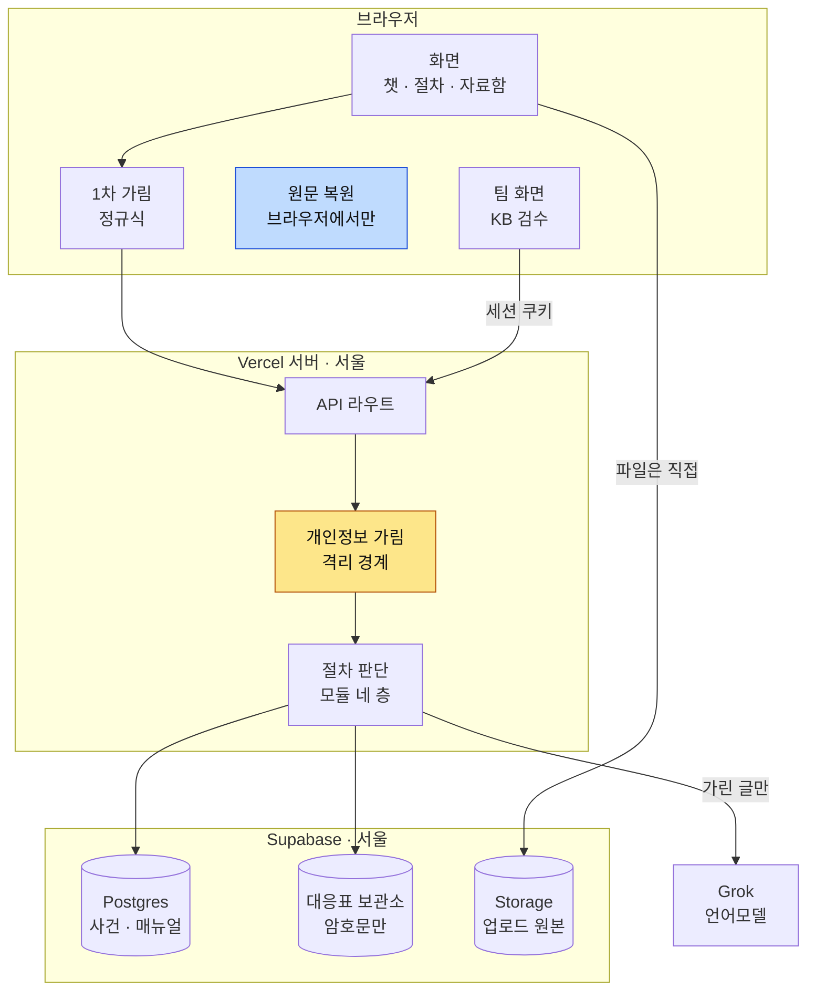
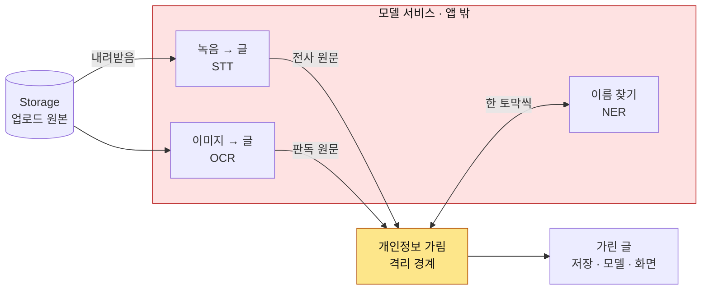
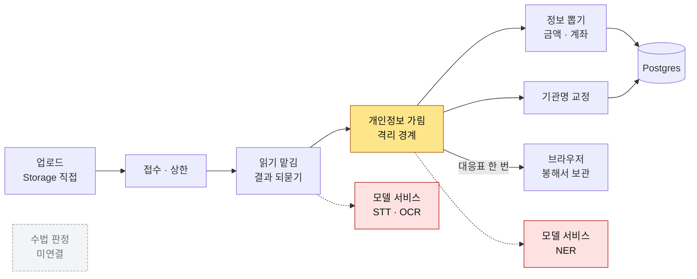
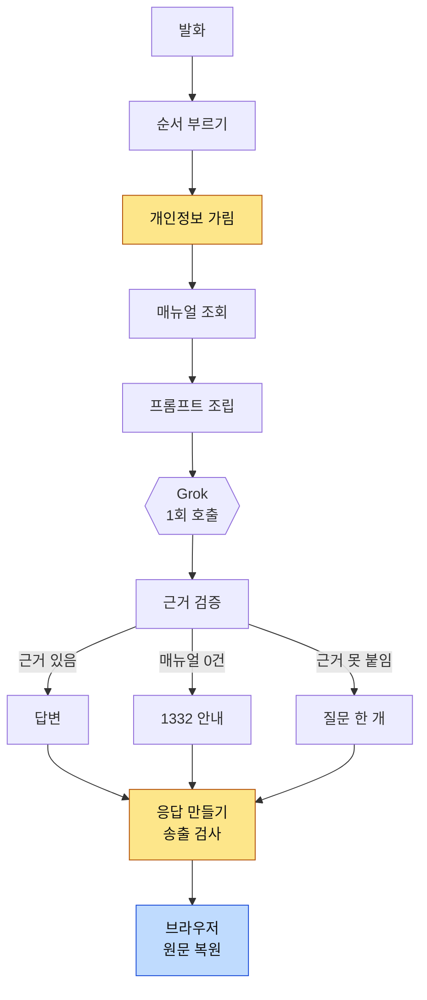
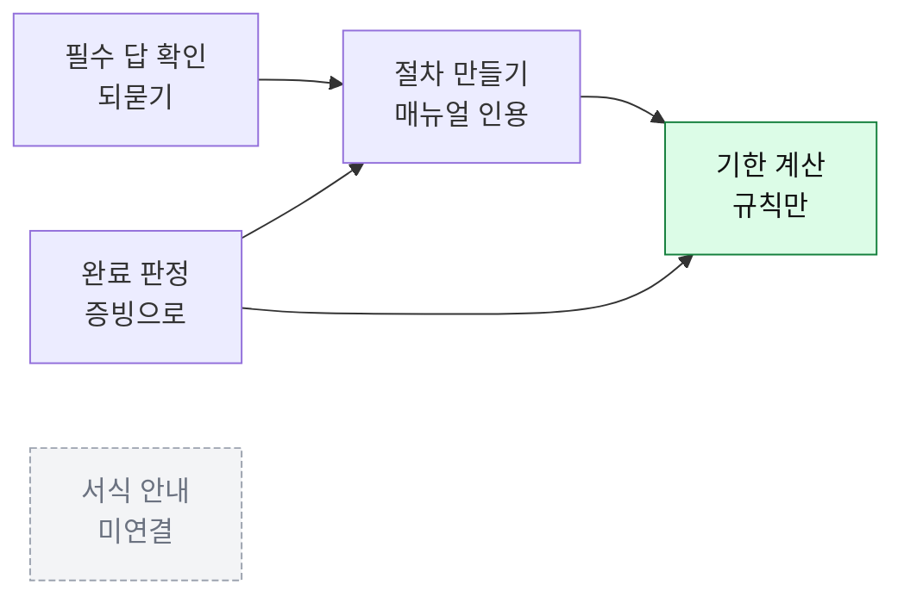
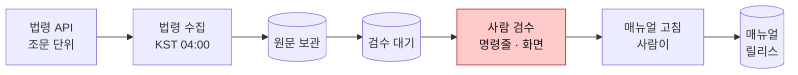
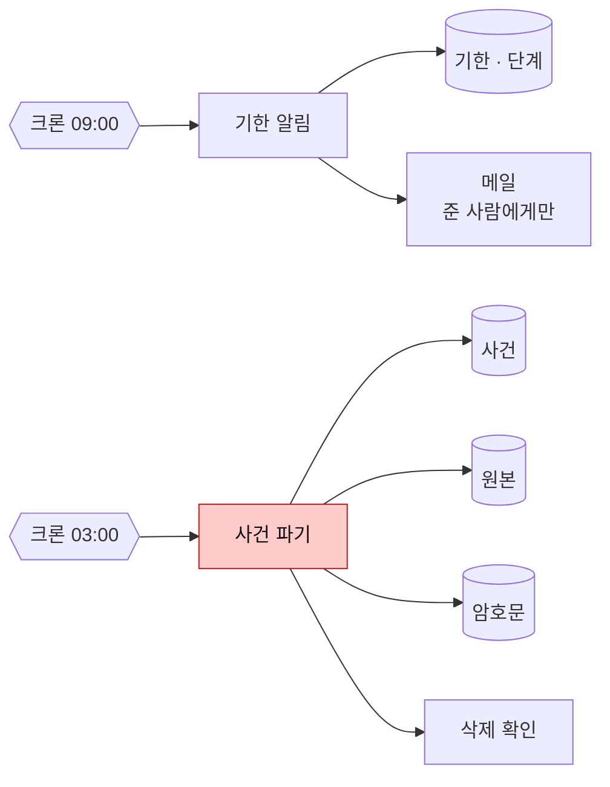
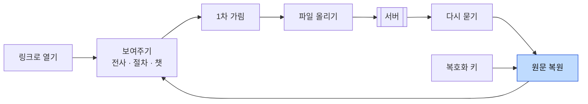
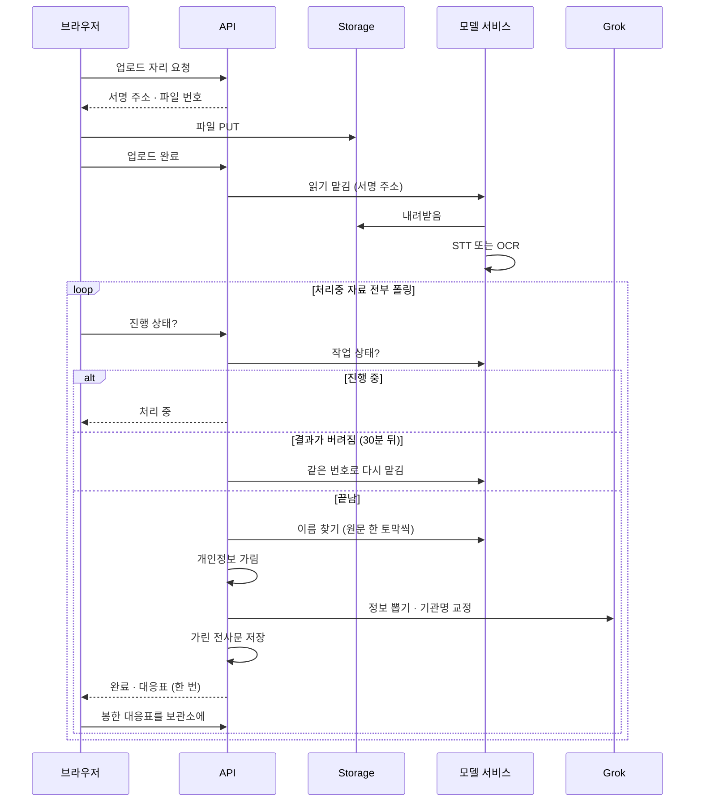
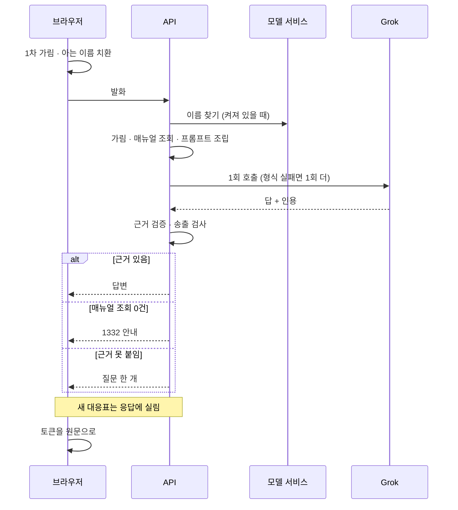

# 아키텍처 — FinAlly가 어떻게 구성되는가

## 1. 한눈에

### 요청이 지나는 길



용어 넷을 먼저 정한다.

| 말 | 뜻 |
| --- | --- |
| 토큰 | 계좌번호·이름 같은 개인정보를 `[계좌-1]` 같은 자리표로 바꾼 것. 외부로는 이 상태로만 나간다 |
| 대응표 | 토큰과 원문의 짝. 브라우저가 자기 키로 암호화해 보관소(볼트)에 둔다 |
| 매뉴얼(KB) | 법령 근거가 붙은 절차 목록. 답변과 절차는 여기서만 인용한다 |
| 슬롯 | 사건 정보 칸(피해 금액·시각·상대 계좌·경유 기관 등). 문진과 자료 판독으로 채운다 |

- 노란 칸이 격리 경계다. 외부 언어모델로 나가는 글은 전부 여기서 토큰으로 바뀐다.
- 파란 칸은 브라우저에만 있다. 복호화 키가 브라우저에만 있어 서버 응답은 토큰 상태로 내려오고, 복원은 브라우저가 한다.
  서버가 새 토큰을 만들면 대응표를 그 응답에 한 번 싣고, 브라우저가 봉해 보관소에 저장한다.
- 파일은 서명 주소를 받아 브라우저에서 Storage로 직접 올린다. API를 거치지 않는다.

### 원문이 흐르는 구간



- 빨간 상자는 토큰으로 바꾸기 전 단계다. 녹음을 글로 옮기는 STT, 이미지를 글로 옮기는 OCR, 글에서 사람 이름을 찾는 NER 모두 계좌번호·이름이 그대로 있는 원문을 다룬다. 이 서비스는 앱과 별도로 뜨는 Python 프로그램이고 배치는 §6.
- NER은 개인정보 가림 단계가 부르는 도구다. 경계는 하나다.

근거 — [ADR-009](decisions/009-restore-mapping-location.md) · [ADR-028](decisions/028-runtime-and-module-shape.md) ·
[ADR-043](decisions/043-gpu-hosting.md) · [ADR-062](decisions/062-transcript-mapping-handover.md) · [ADR-075](decisions/075-chat-mapping-handover.md)

## 2. 기술 스택

| 영역 | 선택 | 어디에 |
| --- | --- | --- |
| 언어 | TypeScript(앱 전부) · Python(모델 서비스 하나) | `src/` · `services/transcriber/` |
| 프론트 | Next.js 16 App Router · React 19 · Tailwind v4 · shadcn/ui | `src/package.json` |
| 백엔드 런타임 | Vercel 서버리스 함수 · 리전 `icn1`(서울) · Hobby 플랜 | `src/vercel.json` |
| 관계형 DB | Supabase Postgres(서울) · 드라이버 `postgres.js` · ORM 없음 | `src/lib/db.ts` |
| 대응표 보관소(볼트) | 같은 Postgres의 `case_vault` 스키마 · 암호문만 | `src/migrations/0004` |
| 객체 저장소 | Supabase Storage `evidence` 버킷(비공개) · 서명 주소로만 접근 | `src/lib/storage.ts` |
| 언어모델 | Grok(xAI) `grok-4.5` · OpenAI 호환 `/chat/completions` 하나 · SDK 없음 · 도구 호출 안 씀 | `src/lib/llm.ts` |
| STT · OCR · NER | FastAPI 서비스 · faster-whisper `large-v3`(GPU) 또는 `medium`(CPU) · EasyOCR · Ollama `gemma3:4b` | `services/transcriber/` |
| 매뉴얼 검색 | 조건 조회(트랙 · 경유 유형 · 기관 · 날짜 · 버전) · 벡터 검색 아님 | `src/modules/kb-finder/` |
| 주기 실행 | Vercel Cron 셋(알림 · 파기 · 법령 수집) · 앱의 API 라우트를 깨움 | `src/vercel.json` |
| 메일 | Brevo REST | `src/lib/mailer.ts` |
| 공휴일 | 코드 안의 표 · 임시공휴일은 안 들어옴 | `src/lib/holidays-table.ts` |
| 속도 제한 | 프로세스 메모리 · 공유 저장소 없음 | `src/lib/rate-limit.ts` |
| 배포 | GitHub Actions · `main` 머지가 곧 배포 · 배포 뒤 Playwright 스모크 | `.github/workflows/` |

서버리스 함수의 본문 크기·실행 시간 제한에 맞춘 규칙:

| 규칙 | 값 |
| --- | --- |
| 업로드는 서명 주소로 Storage에 직접 | 녹음 파일 수십 MB · 함수 본문 한계 밖 |
| 전사·판독은 맡기고 폴링 | 서비스 왕복 한 번 8초 상한 (`src/lib/inference.ts`) |
| 챗은 스트리밍 없이 응답 1회 | 챗 라우트 `maxDuration = 60` · 모델 호출 55초에서 앱이 끊음 (`src/lib/llm.ts`) |
| 이름 찾기(NER)는 동기 호출 | 기본 12초 · CPU 서버면 `NER_TIMEOUT_MS`로 조정 |
| 모델 재시도는 형식 실패 시 1회 | `retry-checker` |
| 크론은 하루 1회 | Hobby 플랜 제한 |

근거 — [ADR-012](decisions/012-kb-collection.md) · [ADR-016](decisions/016-retention-and-datastore.md) · [ADR-025](decisions/025-scheduled-jobs.md) ·
[ADR-028](decisions/028-runtime-and-module-shape.md) · [ADR-049](decisions/049-vault-in-postgres.md) · [ADR-052](decisions/052-stt-configuration.md) ·
[ADR-053](decisions/053-deploy-on-merge.md) · [ADR-078](decisions/078-shell-polls-all-processing-evidence.md)

## 3. 데이터 저장소

| 저장소 | 담는 것 | 원문 개인정보 |
| --- | --- | :---: |
| Postgres 공개 스키마 | 사건 상태(슬롯 · 절차 · 증빙 · 기한 · 대화) · 감사 로그 · 매뉴얼 · 법령 스냅샷 | 없음 |
| Postgres `case_vault` 스키마 | 토큰↔원문 대응표(브라우저가 봉한 암호문) | 있음 · 서버는 키 없음 |
| Supabase Storage `evidence` | 업로드된 자료 원본 | 있음 · 비공개 버킷 · 사건과 함께 파기 |

- DDL 정본은 [데이터 모델](spec/backend/08-16-data-model.md), 실행 사본은 [`src/migrations/`](src/migrations/) `0001`~`0010`. 공유 DB에 전부 적용돼 있다.
  공개 스키마 표 17개(`schema_migrations` 포함) + `case_vault.restore_mapping` 1개. 둘은 같은 커밋에 오고, CI `schema-names`가 마이그레이션에 없는 표·칸 이름을 막는다.
- 적용은 `npm run migrate`. 앱 드라이버로 순번 SQL을 돌리고 이력을 `schema_migrations`에 남긴다. ORM 없음.
- 접속 문자열 둘: 앱은 트랜잭션 풀러(6543), 마이그레이션은 세션 풀러(5432). DDL은 트랜잭션 풀러로 못 간다.
- 대응표 보관소는 같은 Postgres의 별도 스키마다. 복호화 키가 서버에 없어 인스턴스를 분리할 필요가 없다.
- Storage 접근은 서명 주소로만 한다. 올릴 때 5분, 읽을 때 15분. spec의 「저장 시 암호화 + 사건별 키」는 코드에 없다.
- 보존 기간은 마지막 활동일부터 180일(`CASE_PURGE_DAYS`). 파기 크론(KST 03:00)이 Postgres · Storage · 보관소를 지운 뒤 삭제를 확인한다. Storage에는 만료 설정이 없어 직접 지운다.

근거 — [ADR-010](decisions/010-case-store.md) · [ADR-016](decisions/016-retention-and-datastore.md) · [ADR-019](decisions/019-module-code-sync.md) ·
[ADR-025](decisions/025-scheduled-jobs.md) · [ADR-049](decisions/049-vault-in-postgres.md) · [research/06](docs/research/06-경로별-실측조사.md) §5

## 4. 모듈

이름의 정본은 [모듈 명칭](spec/common/08-16-module-names.md), 책임과 금지는 [모듈 경계](spec/common/08-16-module-boundaries.md). 층은 실행 시점으로 나눈다. 그림에는 하는 일을 적고, 모듈 이름은 그림 아래 표에서 잇는다.

- 모듈 32개 전부 코드가 있다. 서버 모듈의 `index.ts`는 `import "server-only"`, 브라우저 모듈은 `import "client-only"`로 시작한다.
- 회색 점선 칸 둘(수법 판정 · 서식 안내)은 코드는 있으나 호출처가 없다.

### 층 1 · 자료가 들어올 때 (한 번)



| 그림 | 모듈 | 하는 일 |
| --- | --- | --- |
| 접수 · 상한 | `case-intake` | 사건을 만들고 파일을 접수한다. 사건당 파일 30개 · 300MB 상한 |
| 읽기 맡김 | `transcriber` | 모델 서비스에 STT·OCR을 맡기고 결과를 되묻는다. 화자 판정(먼저 말한 쪽이 A, 말풍선 좌우)은 여기서 한다 |
| 개인정보 가림 | `pii-tokenizer` | 1차 정규식(계좌 · 주민번호 · 카드 · 전화) + NER(이름) + 기관명 허용 목록 |
| 정보 뽑기 | `slot-extractor` | 가린 글에서 금액 · 시각 · 상대 계좌 · 사칭 기관을 뽑는다(Grok · 확신도 0.7 이상만). 확정은 사용자 탭 |
| 기관명 교정 | `src/lib/org-repair.ts` | 전사문의 기관 이름을 사전과 맞춘다(Grok). 확정은 사용자 탭 |
| 수법 판정 | `case-reader` | 결과를 쓰던 관리자 화면이 폐기돼 호출처 없음. 절차 분기에는 쓰이지 않는다 |

- `NER_URL`이 비면 이름은 안 가려지고 응답의 `nerApplied`로 표시된다. `NER_URL`이 있는데 서비스가 죽으면 슬롯 · 챗 · 증빙 쓰기가 503으로 멈춘다.

### 층 2 · 사용자가 말할 때마다 (매 턴)



| 그림 | 모듈 | 하는 일 |
| --- | --- | --- |
| 순서 부르기 | `chat-receiver` | 아래 단계를 순서대로 부른다. 판정은 하지 않는다 |
| 개인정보 가림 | `pii-tokenizer` | 층 1과 같은 모듈 |
| 매뉴얼 조회 | `kb-finder` | 사건의 트랙 · 경유 유형 · 기관 · 오늘 날짜 · 매뉴얼 버전으로 조회. 조건은 서버가 넣고 모델은 바꿀 수 없다 |
| 프롬프트 조립 | `prompt-builder` | 7블록 조립. 사용자 글과 전사문에는 격리 태그를 씌운다 |
| 근거 검증 | `citation-checker` | 답의 인용이 조회 결과 안에 있는지 확인하고 세 갈래 중 하나로 보낸다 |
| 질문 한 개 | `slot-checker` | 근거를 못 붙이면 부족한 슬롯을 묻는 질문 한 개를 낸다 |
| 응답 만들기 | `chat-publisher` | 세 갈래를 같은 응답 형태로 만들고, 나가기 전에 남은 개인정보를 검사한다 |
| 원문 복원 | `pii-restorer` | 브라우저에서 토큰을 원문으로 되돌린다 |

- 흐름은 `src/flows/chat-turn.ts`. 감사 기록도 여기서 남긴다.
- 이름 번호: 브라우저는 아는 이름을 토큰으로 바꿔 보내고, 서버가 새로 찾은 이름은 응답의 `pii_mappings`로 돌려준다. 서버는 대응표를 보관하지 않는다.

### 층 3 · 사건 상태가 바뀔 때



| 그림 | 모듈 | 하는 일 |
| --- | --- | --- |
| 필수 답 확인 | `slot-checker` | 절차를 만들 수 있는 최소 답(T1)이 찼는지 판정하고 다음 질문 한 개를 고른다 |
| 절차 만들기 | `planner` | 매뉴얼을 인용해 절차 단계를 만든다. 매뉴얼 항목 번호 · 버전 · 출처 · 시행일이 없는 단계는 스키마 제약으로 저장이 거부된다 |
| 기한 계산 | `date-checker` | 3영업일 · 14일 유예 · 2개월 공고 · 5영업일을 코드 규칙으로 센다. 언어모델을 쓰지 않는다. 공휴일은 코드 안의 표, 표 밖 연도는 오류 |
| 완료 판정 | `completion-checker` | 접수번호(L1) · 판독 결과에 접수번호 자리나 공공기관 이름이 있는 파일(L2) · 사용자 자기 신고(L3, `unconfirmed`)로 단계 완료를 판정. 판독 중이면 보류 |
| 서식 안내 | `doc-builder` | 서식 칸 정의가 매뉴얼에 없어 호출처 없음. 기재 안내 화면은 `src/app/c/[token]/doc.tsx` |

- 이 층을 부르는 흐름(`src/flows/`): `answer-slot` · `regenerate-plan` · `compute-deadlines` · `settle-artifacts` · `anchor-from-artifact`.

### 층 4 · 하루 1회





| 그림 | 모듈 | 하는 일 |
| --- | --- | --- |
| 법령 수집 | `kb-collector` | `src/lib/law-fetcher.ts`가 국가법령정보 API에서 조문 단위로 가져와 `source_snapshot`에 보관. 등록 소스는 통신사기피해환급법과 시행령 둘 |
| 사람 검수 | `kb-reviewer` | `npm run kb:review` **또는 화면 `/admin/kb`(S-12)** 로 `source_change`의 변경분을 승인 · 반려 · 보류. 조문과 매뉴얼은 `link.ts` 가 `legal_basis` 글에서 규칙으로 잇는다(추정). 승인이 매뉴얼 반영은 아니다 |
| 매뉴얼 고침 | 사람 + `npm run kb:load` | `src/kb/*.json`을 고치고 적재한다. `kb_entry`에 쓰는 길은 이것 하나. 앱이 인용하는 릴리스는 `KB_VERSION`이 고정 |
| 기한 알림 | `reminder-sender` | 다가온 기한 · 미확인 단계를 이메일을 준 사람에게만 보낸다. 기한 · 단계 제목 · 사건 링크만 실린다 |
| 사건 파기 | `case-purger` | 180일 지난 사건을 Postgres · Storage · 보관소에서 지우고 삭제를 확인한다 |

- 변경 감지는 `source_snapshot`의 `(source_key, content_hash)` 유일 제약. 삽입이 성공하면 변경이다.
- 크론 인증은 `Authorization: Bearer <CRON_SECRET>`. 비밀값이 비어 있으면 차단.

### 층 없음 · 항상

| 모듈 | 하는 일 |
| --- | --- |
| `audit-logger` | 모델 호출 · 사건 생성 · 파기 · 슬롯 확정을 토큰 상태로 기록. 해시 사슬 → §8 |
| `retry-checker` | 예외의 `retryable` 하나만 보고 재시도 판단 |

### 층 C · 브라우저



| 그림 | 모듈 | 하는 일 | 하지 않는 것 |
| --- | --- | --- | --- |
| 링크로 열기 | `case-opener` | URL 토큰으로 사건을 연다 · 복사 · 공유 | 잃은 링크 복구 |
| 1차 가림 | `pii-masker` | 정규식 1차 가림 · 아는 이름은 토큰으로 치환 | 가리기 전 원문 전송 · 이름 새로 찾기 |
| 파일 올리기 | `file-sender` | 자료 · 증빙 업로드와 상태 추적 | 1차 가림 우회 |
| 다시 묻기 | `poll-checker` | `poll_after_ms`로 재조회 · 처리중 자료 전부를 어느 화면에서든 폴링 | 스트리밍 · 웹소켓 |
| 복호화 키 | `key-handler` | 키 보관(IndexedDB · 꺼낼 수 없는 형태) · 보관소 복호 | 키를 서버 · 로그 · DB로 전송 |
| 원문 복원 | `pii-restorer` | 토큰을 원문으로. 브라우저가 그리는 자리는 전부 복원 | 서버 측 복원 |
| 보여주기 | `transcript-viewer` | 전사 표시 · 기계가 읽은 값을 사용자가 확인 | 복원 원문을 서버로 전송 |
| 보여주기 | `plan-viewer` | 절차 타임라인 · 단계 · 배지 · 안전 절차(T0) 상시 노출 | 체크만으로 완료 표시 |
| 보여주기 | `deadline-viewer` | 기한 표시(`primary` · `grace` · `info`) | 날짜 계산 |
| 보여주기 | `chat-handler` | 발화 전송 · 응답과 질문 표시 | 인용 번호 · 판단 근거 표시 |
| 보여주기 | `work-handler` | 지금 할 작업 판정 + 유형별 패널 렌더 | 판정을 렌더에 섞기 |
| 보여주기 | `doc.tsx`(셸) | 서식 칸에 원문을 채워 표시 | 서버가 만든 완성 문서 수신 |

1차 가림이 브라우저, 개인정보 가림이 서버다. 둘 다 지나야 외부 언어모델에 닿는다. 브라우저 화면은 원문을 보여 준다.

### 물리 배치

| 무엇 | 어디 | 어디서 도나 |
| --- | --- | --- |
| 화면 | `src/app/page.tsx`(랜딩) · `src/app/start/`(진입 · 동의 · 첫 문항) · `src/app/c/[token]/`(사건 화면 셸) · **`src/app/admin/kb/`(KB 검수 큐 — 팀용 · 피해자 화면에서 링크하지 않음)** | 브라우저 |
| 문지기 | `src/proxy.ts` — `/api/admin/*` 401 · `/api/cron/*` Bearer 확인. **`/api/admin-login` 만 밖** — 비밀번호를 대조해 세션 쿠키를 굽는다 | 서버 · 라우트 앞 |
| API 진입점 | `src/app/api/**/route.ts` — 사건 13 + 크론 3 + **관리자 7**(로그인 · 로그아웃 · 검수 큐 5) · 전부 `handleRoute` 경유 | 서버 |
| 흐름 | `src/flows/` — 라우트 하나가 모듈 여럿을 순서대로 부르는 자리 | 서버 |
| 도메인 모듈 | `src/modules/{이름}/` — 층 1 · 2 · 3 · 4는 서버, 층 C는 브라우저 | 서버 / 브라우저 |
| 자원 접근 구현 | `src/lib/` — `db` · `storage` · `llm` · `inference` · `ner` · `mailer` · `holidays` · `rate-limit` · `law-fetcher` | 서버 |
| 조립 | `src/lib/container.ts`(포트에 구현 주입) · `src/lib/wire.ts`(프로세스당 하나) | 서버 |
| 명령줄 | `src/scripts/` — `npm run migrate` · `kb:load` · `kb:collect` · `kb:review` · **`admin:hash`** · `config:report` · `probe:llm` (`server-only` 때문에 `npm run`으로만) | 소유자 기기 |
| 매뉴얼 원본 | `src/kb/*.json` — 공통 · 경유 유형별 8 · 통장묶기 · 기관 · 공공기관 | 적재기가 읽음 |
| 마이그레이션 | `src/migrations/0001`~`0010` | `npm run migrate` |
| 스모크 | `src/smoke/smoke.spec.ts` — 배포 뒤 실제 주소에서 한 바퀴 | GitHub Actions |
| 모델 서비스 | `services/transcriber/` — FastAPI · `POST /jobs` · `GET /jobs/{id}` · `POST /ner` · `/health` | 앱 밖 · §6 |
| 서버 준비 | `deploy/` — `oci-provision.py`(상시 서버) · `runpod-pod.py`(시연 팟) | 사람이 돌림 |

- `handleRoute`가 요청 파싱 · 링크 토큰 풀기 · 크론 비밀값 · 속도 제한 · 상태 코드 · 계측 헤더를 맡는다. 도메인 모듈은 HTTP를 모른다. 크론과 명령줄이 같은 모듈을 같은 조립본으로 부른다.
- 모듈은 외부 자원을 인터페이스로 선언하고 `container.ts`가 구현을 주입한다. 미설정 자원은 호출 시 원인을 말하며 멈추는 대역(`src/lib/not-configured.ts`)이 채운다. 속도 제한만 메모리 카운터로 돈다.

근거 — [ADR-014](decisions/014-module-names.md) · [ADR-015](decisions/015-citation-and-reask.md) · [ADR-022](decisions/022-chat-turn-boundaries.md) ·
[ADR-023](decisions/023-frontend-module-names.md) · [ADR-028](decisions/028-runtime-and-module-shape.md) · [ADR-034](decisions/034-browser-shows-plaintext.md) ·
[ADR-056](decisions/056-transcript-org-normalization.md) · [ADR-064](decisions/064-doc-filler-retired.md) · [ADR-067](decisions/067-pii-confirm-server-masks.md) ·
[ADR-068](decisions/068-no-admin-screen.md) · [ADR-069](decisions/069-evidence-slot-extraction.md) · [ADR-072](decisions/072-law-collection-wired.md) ·
[ADR-077](decisions/077-upload-is-not-proof.md) · [ADR-078](decisions/078-shell-polls-all-processing-evidence.md) · [ADR-079](decisions/079-known-name-reuse.md) ·
[ADR-087](decisions/087-kb-review-screen.md) · [RFC-002](rfc/002-kb-authoring.md) · [기한 계산 규칙](spec/common/08-16-deadline-rules.md)

## 5. 데이터 흐름

### 자료 업로드와 판독



- 서비스의 결과를 서버로 가져오는 길은 브라우저 폴링뿐이다. 브라우저 셸이 처리중 자료 전부를 어느 화면에서든 폴링하고, 서비스가 결과를 버렸으면(30분 뒤) 같은 번호로 다시 맡긴다.
- 접수는 멱등이다. 같은 자료로 두 번 와도 모델을 두 번 돌리지 않는다.
- 글로 올린 자료(`kind: text`)는 맡기지 않고 바로 가린다.

### 챗 한 턴



- 세 갈래 모두 200이다. 모델이 인용 형식을 두 번 다 어기면 `502 KB_CITATION_MISSING`.

### 사건 상태가 바뀌는 길

- 슬롯 답: `PATCH /slots/{key}` → `answer-slot` → 개인정보 가림(되묻기에 「맞아요」면 서버가 가림) → 필수 답 확인 → `regenerate-plan` → 절차 만들기 → `compute-deadlines` → 기한 계산. 사건과 절차는 한 트랜잭션.
- 증빙: `POST /steps/{id}/artifacts` → 완료 판정 → 끝난 단계의 기한은 `met` → 통지문이면 `anchor-from-artifact`가 기산일을 뽑아 확인 탭으로.
- 재진입: `GET /cases/{token}` · `/plan` · `/deadlines` · `/messages` · `/vault`. 서버는 토큰 상태로 내리고 브라우저가 보관소를 열어 원문으로 그린다.

근거 — [ADR-046](decisions/046-case-and-plan-together.md) · [ADR-050](decisions/050-history-and-vault-read.md) · [ADR-051](decisions/051-idempotent-ingest.md) ·
[ADR-062](decisions/062-transcript-mapping-handover.md) · [ADR-075](decisions/075-chat-mapping-handover.md) · [ADR-078](decisions/078-shell-polls-all-processing-evidence.md) ·
[에러 계약](spec/backend/08-16-errors.md) §4

## 6. 외부 의존

| 무엇 | 쓰임 | 선택 | 경계 |
| --- | --- | --- | :---: |
| 언어모델 | 챗 · 정보 뽑기 · 기관명 교정 | Grok `grok-4.5`(인용 계약 3/3 · 2026-08-28 실측). `LLM_*` 셋으로 다른 OpenAI 호환 제공자로 교체 가능 | 지남 · 토큰만 |
| STT | 녹음 → 글 | faster-whisper `large-v3`(GPU). 상시 CPU 서버는 `medium`, 음성 길이의 3.7배 | 경계 이전 |
| OCR | 이미지 → 글 | EasyOCR ko/en + 좌표로 행 복원 | 경계 이전 |
| NER | 이름 찾기 | Ollama `gemma3:4b` · 같은 서비스의 `/ner` · 깨끗한 텍스트에서 누출 0% · 과차단 0% | 경계 그 자체 |
| 법령 | 매뉴얼 수집 | 국가법령정보 Open API · 조문 단위 · `efYd`(시행일)로 과거 시점 조문 조회 | 해당 없음 |
| 메일 | 기한 알림 | Brevo · 무료 300통/일 · 발신자 인증만으로 발송 | 개인정보 없음 |
| 공휴일 | 영업일 계산 | 코드 안의 표. 특일 API는 키가 없어 미연결 | 해당 없음 |

STT · OCR · NER은 토큰으로 바꾸기 전 단계다. 앱은 이 서비스를 `TRANSCRIBER_URL` · `NER_URL` 주소로만 안다.

| | 상시 | 시연 |
| --- | --- | --- |
| 어디 | OCI `A1.Flex` 2코어 ARM · 미국 버지니아 · sslip.io 도메인 · Caddy HTTPS | RunPod RTX 4090 팟 · STT · OCR · NER 한 팟 · 시간당 과금 · 끝나면 terminate |
| 세우는 도구 | `deploy/oci-provision.py` · `services/transcriber/bootstrap.sh` · `compose.yaml` | `deploy/runpod-pod.py` · `runpod-provision.sh` · [`runpod-bench.md`](deploy/runpod-bench.md) |
| NER | 한 발화 10.7~12.3초 · `NER_TIMEOUT_MS` 25초 필요 | 0.3초 안팎 |
| 인증 | 공유 비밀값 하나 (앱의 `TRANSCRIBER_TOKEN` · `NER_TOKEN`) | 같음 |

- 둘 다 국외다. 개발 · 시연은 해외 대여 + 합성 데이터만, 운영은 국내. 국내 이전 시 앱에서 바꾸는 것은 주소 두 줄.
- 서비스 내부: `POST /jobs`가 서명 주소를 받아 파일을 내려받고 202로 답한 뒤 백그라운드에서 돈다. 끝난 작업은 30분 뒤 버린다.
  엔진은 `FINALLY_ENGINE`(기본 `echo` · 모델 없이 흐름만) · `FINALLY_DEVICE` · `FINALLY_STT` · `FINALLY_COMPUTE`로 교체. 시험은 CI `services-check`.

근거 — [ADR-012](decisions/012-kb-collection.md) · [ADR-043](decisions/043-gpu-hosting.md) · [ADR-052](decisions/052-stt-configuration.md) ·
[research/09](docs/research/09-로컬모델-PII인식-실측.md) · [research/11](docs/research/11-로컬OCR-PII인식-실측.md) ·
[PII 격리 경계](spec/common/08-14-pii-boundary.md) · `services/transcriber/README.md`

## 7. 배포

- 앱: Vercel · 프로젝트 `finai/fin-ally` · 루트 디렉터리 `src` · 리전 `icn1` · 주소 `https://fin-ally-khaki.vercel.app`
- 데이터: Supabase 서울. 앱 · DB · 저장소가 같은 리전.
- 배포는 GitHub Actions:

```
main 에 src/** 가 푸시됨
  → 그 순간의 main 끝을 받음        (실행에 박힌 커밋이 아님)
  → npm run typecheck · npm test   (브랜치 보호가 없어 배포 잡 안에서 다시 검사)
  → .git 없는 사본을 vercel deploy --prod
  → smoke 워크플로가 실제 주소에서 한 바퀴  (Playwright · 모델은 안 부름)
```

- 환경은 Production 하나. PR 미리보기는 만들지 않는다. 환경변수만 바꿨을 때는 Actions 탭에서 `deploy`를 다시 건다.
- 환경변수 이름의 정본은 [API 계약](spec/common/08-14-api.md) §1.2, 값은 Vercel 프로젝트 설정. 넣는 길은 소유자의 `vercel` CLI 또는 `vercel-env` 워크플로. 관리자 비밀번호는 `ADMIN_PASSWORD_HASH`(scrypt) 하나이고 `npm run admin:hash`로 만들어 저장소 시크릿에 둔다 ([ADR-087](decisions/087-kb-review-screen.md)).
- 시연 자료: 합성 자료 셋 [`assets/demo/09-01-mock-evidence/`](assets/demo/09-01-mock-evidence/). 시작 화면의 「예시 자료로 체험하기」 칩이 한 번에 담고, 이후 사람이 고른 파일과 같은 길로 처리된다. 칩은 `NEXT_PUBLIC_DEMO_MOCK=1` 빌드에서만 보인다.

| 워크플로 | 무엇을 보나 | 언제 |
| --- | --- | --- |
| `code-check` | `src/` typecheck · vitest · build | PR · `main` (`src/**`) |
| `services-check` | `services/transcriber` unittest | PR · `main` (`services/**`) |
| `route-contract` | 모든 라우트가 `handleRoute`를 지나는가 | `src/app/api/**` |
| `schema-names` | 마이그레이션에 없는 표 · 칸 이름 사용 여부 | `src/**` |
| `module-sync` | 모듈 폴더 ↔ 명칭 정본 ↔ 마이그레이션 | PR · `main` |
| `doc-integrity` | 링크 · 앵커 · ID · 파일명 · 번호 · ADR 불변성 | PR · `main` |
| `repo-structure-gate` | 폴더가 바뀌면 `rfc/` 수정이 함께 왔는가 | PR · `main` |
| `deploy` → `smoke` | 위 배포 흐름 | `main` (`src/**`) · 수동 |
| `vercel-env` | 배포 환경변수 갱신 후 재배포 | 수동 |

DB 통합시험(`npm run test:db`)만 CI 밖이다. 실제 Postgres가 필요해 소유자 기기에서 돌린다.

근거 — [ADR-016](decisions/016-retention-and-datastore.md) · [ADR-053](decisions/053-deploy-on-merge.md) · [ADR-059](decisions/059-public-repo-secrets-out.md) ·
[RFC-001 「CI가 강제합니다」](rfc/001-repo-structure.md) · [`deploy/README.md`](deploy/README.md)

## 8. 관측

- 감사 로그: `audit_log` 표. `case.opened` · `slot.confirmed` · `chat.context_built` · `llm.called` · `llm.failed` · `case.purged`를 토큰 상태로 기록.
  `prev_hash ‖ audit_id ‖ event_type ‖ detail ‖ created_at`의 SHA-256 사슬. 사건이 파기돼도 남는다(개인정보 없음).
- 응답 헤더 넷: `X-Pii-Token-Count` · `X-Pii-Egress-Residual` · `X-Kb-Version` · `X-Audit-Id`. 모든 응답에 붙고, 값이 없으면 `none`(잔여 건수는 `0`).
- 설정 현황: `npm run config:report` — 이름 찾기 · 메일 · 공휴일 출처 · 속도 제한 저장소 · 매뉴얼 릴리스가 붙었는지.
- 수집기 생존: `source_registry.last_success_at`이 주기의 두 배를 넘으면 크론 응답의 `stale`과 함수 로그 경고.
- 모델 호출 시간: `src/lib/llm.ts`가 시도마다 소요 시간을 로그에 남긴다.
- 애플리케이션 로그는 Vercel 함수 콘솔 로그뿐이다. 구조화 로그 · 외부 수집기 없음.
- 배포 뒤 확인: `smoke` 워크플로(랜딩 · 사건 생성 · 링크 재진입 · 절차와 근거 · 404/400 · 보관소 왕복). 모델은 부르지 않으므로 챗은 서버 로그로 본다.

근거 — [데이터 모델](spec/backend/08-16-data-model.md) §10 · [API 계약](spec/common/08-14-api.md) §1.1 · `src/lib/telemetry.ts` · `src/modules/audit-logger/audit.ts`
