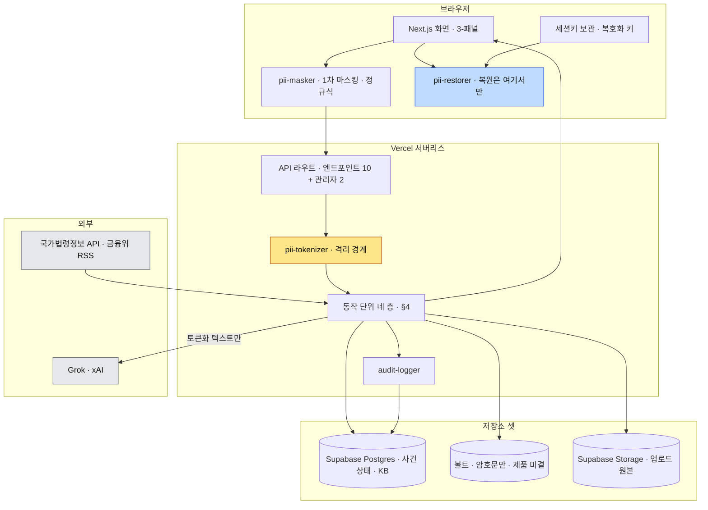
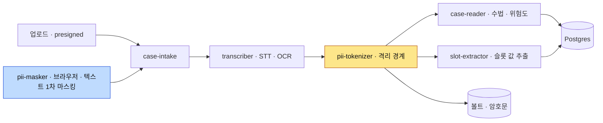
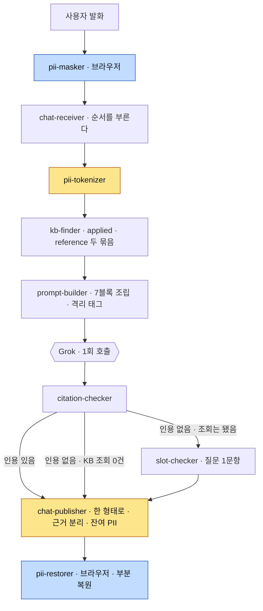
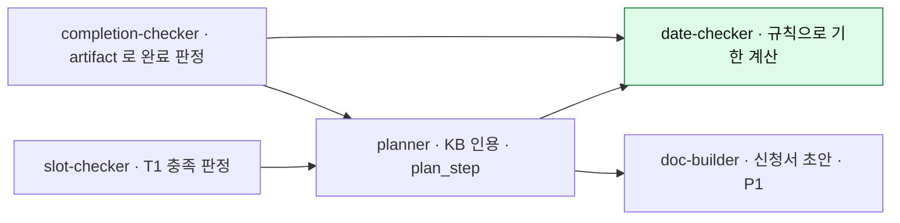
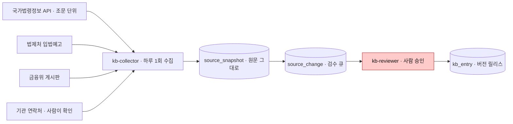
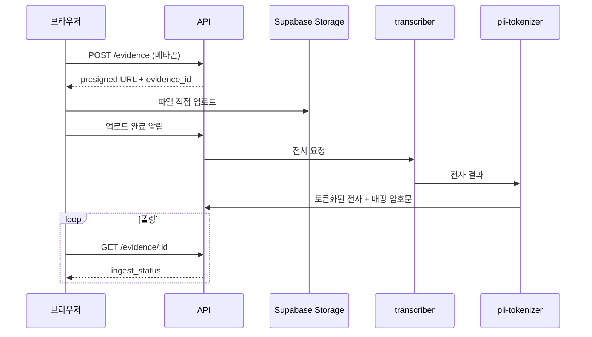
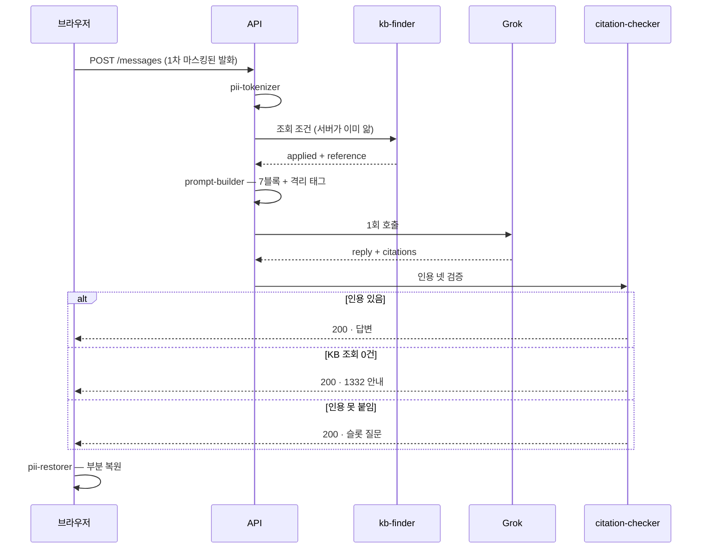

# 아키텍처 — FinAlly가 어떻게 구성되는가

> **상태: 채워짐(2026-08-16 · 2026-08-17 개정).** 백엔드 정의가 끝나 각 절이 실제 선택을 가리킵니다.
> **모듈의 물리 배치와 언어는 [ADR-021](decisions/021-runtime-and-module-shape.md)로 해소됐습니다** —
> Next.js 안, 전부 TypeScript입니다. 남은 미결은 §10에 모아 두었습니다 —
> **NER 선택**과 **파기·리마인더 실행 수단**이 큰 둘입니다.

## 이 문서의 자리

| 문서 | 답하는 질문 |
| --- | --- |
| **`ARCHITECTURE.md`** (여기) | **무엇이 어디서 어떻게 도는가** — 기술 선택·모듈 배치·저장소·배포 |
| [`spec/`](spec/) | 제품이 **무엇을 만족해야 하는가** (계약) |
| [`rfc/`](rfc/) | 파일을 **어디에 두는가** (작업 규약) |
| [`decisions/`](decisions/) | **왜 그렇게 정했나** (이력) |

**spec에 있는 것을 여기 다시 적지 마세요.** 계약은 spec이 정본이고, 여기는 그 계약을 **무엇으로 구현하는가**입니다.
어긋나면 spec이 이깁니다. 구조를 바꾸는 결정을 내렸다면 `decisions/`에 ADR을 남기고 여기를 고칩니다.

**먼저 읽을 것** — [모듈 명칭](spec/common/08-16-module-names.md)(이름의 정본·네 층) ·
[모듈 경계](spec/common/08-16-module-boundaries.md)(책임·금지) ·
[PII 격리 경계](spec/common/08-14-pii-boundary.md)(협상 대상 아님).

---

## 1. 한눈에

**노란 칸이 격리 경계입니다.** 여기를 지나지 않은 텍스트가 외부로 나가면
[PII 격리 경계](spec/common/08-14-pii-boundary.md) 위반입니다.

**파란 칸은 서버에 없습니다.** 복원은 브라우저에서만 일어납니다 — 서버에는 복호화 키가 없어
복원 자체가 **구조적으로 불가능**합니다 → [ADR-009](decisions/009-restore-mapping-location.md).

## 2. 기술 스택

| 영역 | 선택 | 정본 |
| --- | --- | --- |
| **언어** | **TypeScript** — 화면·API·도메인 모듈 전부. 별도 백엔드 없음 | [ADR-021](decisions/021-runtime-and-module-shape.md) |
| 프론트 | Next.js (App Router) · React · Tailwind v4 · shadcn/ui | `src/package.json` |
| 디자인 토큰 | FinAlly 도메인 토큰 | `src/app/globals.css` · [design-system](spec/frontend/design-system/) |
| 백엔드 런타임 | **Vercel 서버리스 함수** | [API 계약](spec/common/08-14-api.md) |
| 관계형 DB | **Supabase Postgres** (`ap-northeast-2` 서울) — 사건 상태·KB | [ADR-016](decisions/016-retention-and-datastore.md) |
| 볼트 | 복원 매핑 암호문. **제품 미결** — 리전 확인 후 → §10 | [ADR-016](decisions/016-retention-and-datastore.md) |
| 객체 저장소 | **Supabase Storage** — 업로드 원본. 저장 시 암호화 | [ADR-016](decisions/016-retention-and-datastore.md) |
| 언어모델 | **Grok (xAI)** — OpenAI 호환 (`https://api.x.ai/v1`). **도구 호출 안 씀** | [챗 컨텍스트](spec/backend/08-16-chat-context.md) |
| KB 검색 | **조건 조회** — 벡터 유사도 아님 | [ADR-012](decisions/012-kb-collection.md) |
| 작업 큐·스케줄러 | **미정** → §10 | |

**서버리스라는 선택이 여러 계약을 이미 결정했습니다.** 함수의 본문 크기·실행 시간 제한 때문입니다.

| 계약 | 왜 그렇게 됐나 |
| --- | --- |
| 업로드는 **presigned URL** | 녹음이 수십 MB라 API 함수를 통과시키면 본문 한계에 걸립니다 |
| 챗은 **스트리밍 없이 응답 1회** | 장시간 연결 유지에 제약이 있습니다 |
| 전사 진행은 **폴링** | 위와 같은 이유 |
| LLM 재시도 최대 2회 | 3~8초짜리 호출을 반복하면 함수가 먼저 끊깁니다 → [에러 계약](spec/backend/08-16-errors.md) §2 |

## 3. 데이터 저장소

**셋으로 나눈 이유는 한 번의 유출로 암호문과 사건 구조가 함께 나가지 않게 하기 위해서입니다** → [ADR-010](decisions/010-case-store.md).

| 저장소 | 담는 것 | 원문 PII |
| --- | --- | :---: |
| Supabase Postgres | 사건 상태 — 슬롯·플랜·부산물·기한·대화·감사 · KB | **없음** |
| 볼트 (제품 미결) | 토큰↔원문 대응 (암호문) | 있음 — **서버는 키 없음** |
| Supabase Storage | 업로드된 증거 원본 | 있음 — 저장 시 암호화, 사건별 키 |

> **앱은 Vercel, 데이터는 Supabase입니다.** `Vercel Postgres`는 2024-12 폐지돼 Neon으로 이관됐고
> Neon에는 서울 리전이 없습니다 → [ADR-016](decisions/016-retention-and-datastore.md).
> **볼트만 미결**입니다 — ADR-010의 "다른 인스턴스에 둔다"는 분리 원칙을 지키면서 리전도 맞춰야 해서입니다.

- **DDL 위치** — [데이터 모델](spec/backend/08-16-data-model.md). 테이블 14개, **PostgreSQL 방언**입니다
- **마이그레이션 방식** — 미정 → §10
- **보존·파기** — `case.purge_after` **마지막 활동일부터 180일**(`CASE_PURGE_DAYS`).
  세 저장소가 **같은 날 함께** 죽습니다 → [ADR-016](decisions/016-retention-and-datastore.md)
  - 표준 트랙만 D+100이고(공고 2개월 + 환급금 결정 14일), 이의제기가 붙으면 D+160입니다 →
    [research/06](docs/research/06-경로별-실측조사.md) §5
  - 기산이 생성일이 아니라 **마지막 활동일**입니다. 공고 후에 피해를 알고 들어온 사람은 진입 시점에 이미 두 달이 지나 있습니다
- **파기 실행 수단** — `pg_cron`이 유력합니다(Supabase 내장). 다만 ⚠️ **Storage에는 네이티브 만료가 없어**
  파일 파기는 잡이 Storage API를 호출하도록 **직접 만들고 실제로 지워지는지 검증**해야 합니다 → §10

> **DDL을 쓰기 전에** [저장 경계 표](spec/common/08-16-domain-model.md)를 확인하세요.
> 복원 매핑 원문·복호화 키를 담는 컬럼은 어떤 이유로도 만들지 않습니다.

## 4. 모듈

**이름의 정본은 [모듈 명칭](spec/common/08-16-module-names.md)이고, 책임과 금지는 [모듈 경계](spec/common/08-16-module-boundaries.md)입니다.**
여기에는 그 이름들이 **서로 어떻게 이어지는지**를 그립니다.

가르는 기준은 **언제 도는가**입니다 → [ADR-014](decisions/014-module-names.md).

### 층 1 · 증거가 들어올 때 (한 번)

**`pii-masker` 는 텍스트 입력에만 겁니다.** 녹음·이미지는 정규식을 걸 대상이 아니라 그대로
객체 저장소로 올라가고(presigned), 전사된 뒤 `pii-tokenizer` 가 받습니다. **파일 경로에서는
1차 마스킹이 없으므로 2차가 유일한 방어선입니다** → [PII 격리 경계](spec/common/08-14-pii-boundary.md).

**`case-reader`의 산출물은 절차 분기에 쓰이지 않습니다.** 분기축은 경유 서비스 하나입니다 →
[채널 매트릭스](spec/backend/08-14-channel-matrix.md). 화면 표시와 관리자 조회에서만 소비됩니다.

**`slot-extractor`와 `slot-checker`는 다른 층입니다.** 값을 뽑는 것은 LLM이 하고(여기),
충분한지 판정하는 것은 규칙이 합니다(층 3).

### 층 2 · 사용자가 말할 때마다 (매 턴)

**노란 칸이 둘입니다.** 들어올 때 `pii-tokenizer`, 나갈 때 `chat-publisher` — 경계를 지키는 자리가
방향마다 하나씩입니다 → [ADR-022](decisions/022-chat-turn-boundaries.md).

**세 갈래가 `chat-publisher` 로 모입니다.** 답변·1332 안내·슬롯 질문이 같은 껍데기로 나가서
화면이 갈래를 분기하지 않습니다. **어느 갈래인지 판정하는 것은 `citation-checker`, 그 갈래를
형태로 옮기는 것은 `chat-publisher`** 입니다 — 판정이 뒤로 새면 갈래가 두 곳에서 결정됩니다.

**파란 칸 둘이 브라우저입니다** — 들어갈 때 `pii-masker`, 나올 때 `pii-restorer`. 이 사이의 모든 것이 서버입니다.

**이 층에서 에러가 나가지 않는 경로가 둘입니다.** 근거를 못 찾으면 실패가 아니라
**되묻기**로 갑니다 → [ADR-015](decisions/015-citation-and-reask.md) · `CLAUDE.md` 불변 규칙 5.

**서버는 조회 조건을 전부 알고 있어 모델에게 묻지 않습니다** — `track`·`channel_id`·`org_id`·오늘 날짜·현재 KB 버전.
그래서 모델이 필터를 우회할 방법이 없습니다 → [데이터 모델](spec/backend/08-16-data-model.md) §11.2.

### 층 3 · 사건 상태가 바뀔 때

**초록 칸에 LLM을 쓰지 않습니다.** 3영업일·14일 유예·2개월 공고·5영업일은 전부 코드의 규칙입니다 →
`CLAUDE.md` 불변 규칙 7 · [기한 계산 규칙](spec/common/08-16-deadline-rules.md).

**`planner`는 근거 없는 단계를 저장할 수 없습니다.** `kb_entry_id`·`kb_version`·`source_url`·`effective_from`이
비면 적재가 거부됩니다 — 불변 규칙 1을 **스키마로** 강제하는 자리입니다.

### 층 4 · 하루 1회

**빨간 칸을 건너뛰는 경로를 만들지 않습니다.** 수집기가 `kb_entry`를 직접 쓰지 않습니다 →
[KB 운영](spec/backend/08-14-kb-operations.md) 원칙 4.

**변경 감지에 별도 비교 로직이 없습니다.** `source_snapshot`의 `(source_key, content_hash)` 유일 제약에
삽입이 성공하면 그것이 곧 변경입니다.

### 층 없음 · 항상

| 이름 | 맡는 일 |
| --- | --- |
| `audit-logger` | 모든 LLM 호출을 토큰화 텍스트 기준으로 기록. 해시 사슬로 사후 조작 검출 |
| `retry-checker` | 예외의 `retryable` 하나만 보고 재시도 판단. 예외 종류를 분기하지 않음 |

### 물리 배치

**Next.js 안입니다. 별도 백엔드를 두지 않습니다** → [ADR-021](decisions/021-runtime-and-module-shape.md).

| 무엇 | 어디 | 어디서 도나 |
| --- | --- | --- |
| 화면 | `src/app/**/page.tsx` | 브라우저 |
| API 진입점 | `src/app/api/**/route.ts` | 서버 (Vercel 함수) |
| 도메인 모듈 | `src/modules/{이름}/` | 대부분 서버. `pii-masker`·`pii-restorer` 는 **브라우저** |
| 자원 접근 구현 | `src/lib/` | 서버 |

**진입점은 HTTP만 알고 판단은 모듈이 합니다.** `route.ts` 가 맡는 것은 요청 파싱·인증·속도 제한·
상태 코드·계측 헤더까지이고, 도메인 모듈은 **자기가 HTTP로 불렸는지 모릅니다.** 그래야 파기 배치나
리마인더처럼 다른 경로에서 같은 모듈을 부를 수 있고, HTTP 없이 시험할 수 있습니다.

**각 모듈은 필요한 외부 자원을 자기 폴더의 `contract.ts` 에 인터페이스로 선언하고 구현을 주입받습니다.**
NER 모델·볼트 제품·공휴일 출처가 미정이어도 그 자리를 인터페이스로 두면 모듈을 완성할 수 있습니다.
**저장소 접근과 LLM 호출에는 모듈 이름을 만들지 않습니다** — 도메인 판단을 하지 않는 자원 접근입니다.

**`pii-restorer` 를 서버에서 부르면 빌드가 실패해야 합니다.** `server-only`·`client-only` 표시로
[ADR-009](decisions/009-restore-mapping-location.md)를 문서가 아니라 구조로 강제합니다.

위 이름들은 **책임의 단위이지 서버의 개수가 아닙니다** → [모듈 경계](spec/common/08-16-module-boundaries.md).

## 5. 데이터 흐름

### 증거 업로드 — 원본이 API를 통과하지 않습니다

### 챗 한 턴 — 모델 호출은 한 번뿐입니다

**어느 갈래로도 에러가 나가지 않습니다.** 셋 다 200입니다 → [에러 계약](spec/backend/08-16-errors.md) §4.

## 6. 외부 의존

| 무엇 | 쓰임 | 선택 | 경계 |
| --- | --- | --- | :---: |
| LLM API | 수법 판별·절차 선택·플랜 문장·챗 | **Grok (xAI)** | 지남 — 토큰화 텍스트만 |
| STT | 녹음 전사(화자 분리) | Whisper급 + 브라우저 Web Speech 폴백 | **경계 이전** ⚠️ |
| OCR | 이미지 → 텍스트 | Vision 입력 | **경계 이전** ⚠️ |
| NER | 2차 PII 스크러빙 | **미정** → §10 | 경계 그 자체 |
| 법령 수집 | KB 파이프라인 | 국가법령정보 Open API · 법제처 입법예고 API | 해당 없음 |
| 공지 수집 | KB 파이프라인 | 금융위 RSS + 게시판 목록 | 해당 없음 |

> ⚠️ **STT·OCR은 `pii-tokenizer` 이전 단계라 외부 API를 쓰면 원문이 나갑니다.**
> 선택 전에 [경계 정의](spec/common/08-14-pii-boundary.md)를 확인하세요 — 이 자리가 경계의 가장 약한 고리입니다.

**국가법령정보 API는 `efYd`(시행일) 파라미터로 과거 시점 조문을 재현합니다.** 조문마다 시행일이 따로 있어
`CH-crypto`의 2026-10-01 분기가 **배포 없이** 동작합니다 → [ADR-012](decisions/012-kb-collection.md).

## 7. 환경과 시크릿

정본은 [API 계약](spec/common/08-14-api.md)의 환경 변수 표입니다.

| 변수 | 무엇 | 필수 |
| --- | --- | :---: |
| `DATABASE_URL` | 관계형 DB 접속 | Y |
| `KV_URL` | 볼트 저장소 접속 | Y |
| `VAULT_MASTER_KEY` | 볼트 마스터 키 | Y |
| `BLOB_TOKEN` | 객체 저장소 접근 | Y |
| `XAI_API_KEY` | Grok API 키 | Y |
| `ADMIN_USERNAME` · `ADMIN_PASSWORD_HASH` | 관리자 1계정. **해시로만** | Y |
| `CASE_PURGE_DAYS` | 사건 보관 기간. 기본 **180** (마지막 활동일 기준) | N |
| `KB_FETCH_CRON` | 수집 주기. 기본 하루 1회 | N |

- **`VAULT_MASTER_KEY`가 노출되면 볼트 암호문이 전부 풀립니다.** 다른 값보다 엄하게 취급합니다
- **평문 비밀번호는 환경변수에도 넣지 않습니다**
- **타임존은 `Asia/Seoul` 고정** → [기한 계산 규칙](spec/common/08-16-deadline-rules.md).
  DB는 `TIMESTAMPTZ`로 UTC 저장하고 세션 타임존으로 렌더합니다
- `.env.example` 파일: **미작성** → §10

## 8. 배포

- **배포 대상: Vercel.** 대회 배포 URL 요건이 있습니다 → [용어와 전제](spec/common/08-14-glossary.md) §9
- **데이터는 Supabase(서울)입니다.** ADR-010이 "저장소가 전부 Vercel 제품이라 별도 설정이 없다"를
  이유로 들었지만, 그 대가가 **리전**이었습니다 — 계정·네트워크 설정이 하나 늘어나는 것을 감수합니다 →
  [ADR-016](decisions/016-retention-and-datastore.md)
- 환경 분리(로컬·데모): **미정** → §10
- 심사 데모용 시드 데이터: **미정** → §10.
  한국어 공개 데이터가 0건이라 **합성이 불가피합니다** → [용어와 전제](spec/common/08-14-glossary.md)

## 9. 관측

- **감사 로그** — `audit_log` 테이블. 모든 LLM 호출을 토큰화 텍스트 기준으로 기록하고,
  `prev_hash ‖ … ‖ created_at`의 SHA-256 사슬로 사후 조작을 검출합니다 →
  [데이터 모델](spec/backend/08-16-data-model.md) §10
- **감사 로그는 사건이 파기돼도 남습니다.** PII가 없으므로 남길 수 있습니다
- **수집기 생존 확인** — `source_registry.last_success_at`이 주기의 두 배를 넘으면 경고.
  조용히 멈춘 수집기가 가장 위험합니다
- 애플리케이션 로그: **미정** → §10

## 10. 아직 안 정해진 것

### 구조에 걸리는 것

| 무엇 | 왜 걸려 있나 | 어디에 |
| --- | --- | --- |
| **볼트 제품** | 분리 원칙(다른 인스턴스)과 리전을 함께 만족해야 합니다. Vercel KV 유지 여부 | [ADR-016](decisions/016-retention-and-datastore.md) |
| **파기·리마인더 실행 수단** | `pg_cron`이 답이 됐지만 **Storage 파일 파기는 직접 구현**해야 합니다 | [ADR-016](decisions/016-retention-and-datastore.md) |
| **재진입·식별 모델** | 계정을 안 만들기로 했는데 **180일** 뒤 사용자가 어떻게 돌아오나 | [핸드오프 ②](docs/plans/08-16-backend-handoff.md) |
| **문진 선택지의 정본** | 질문 문구와 선택지를 어디서 가져오나 | [핸드오프 ⑤](docs/plans/08-16-backend-handoff.md) |

**재진입은 복호화 키와 직결됩니다.** 브라우저를 바꾸면 키가 없어 서류를 못 만듭니다 →
[ADR-009](decisions/009-restore-mapping-location.md).

### 채우면 되는 것

- NER 모델·서비스 선택 (경계 그 자체라 우선순위가 높습니다).
  **[ADR-021](decisions/021-runtime-and-module-shape.md) 이후 제약이 하나 붙었습니다** — Vercel 서버리스 함수에
  모델을 띄울 수 없어, 자체 호스팅을 택하면 `pii-tokenizer` 만 별도 서비스로 떼야 합니다.
  인터페이스로 선언해 두므로 나머지 모듈은 영향을 받지 않습니다
- Grok 모델명과 단가
- 마이그레이션 방식 · `.env.example` · 환경 분리 · 시드 데이터 · 애플리케이션 로그

여기서 새로 생긴 미결은 각 절에 남기고, 결정되면 그 자리를 채우면서 근거를 `decisions/`에 ADR로 남깁니다.
