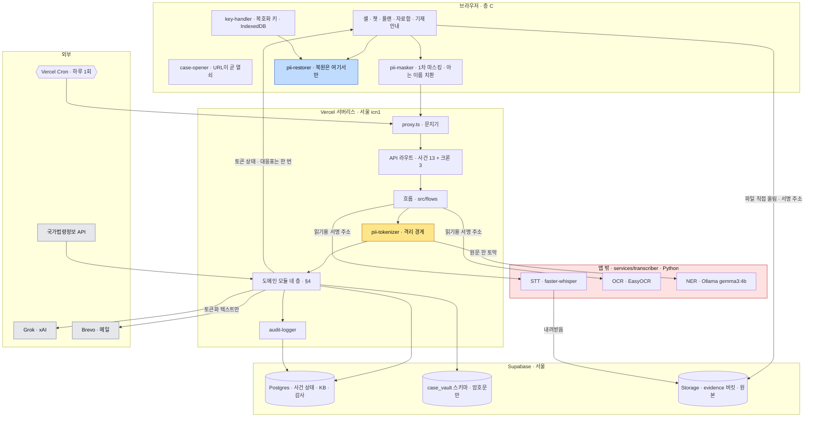
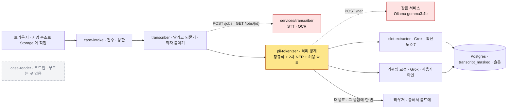
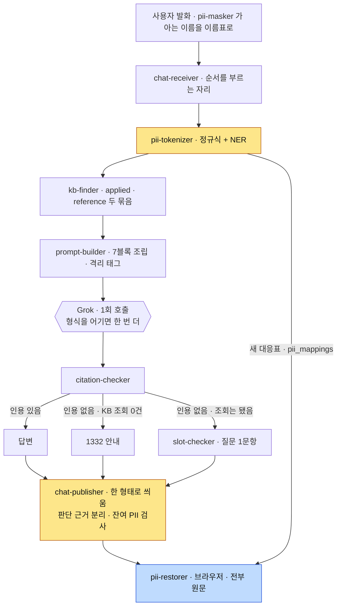
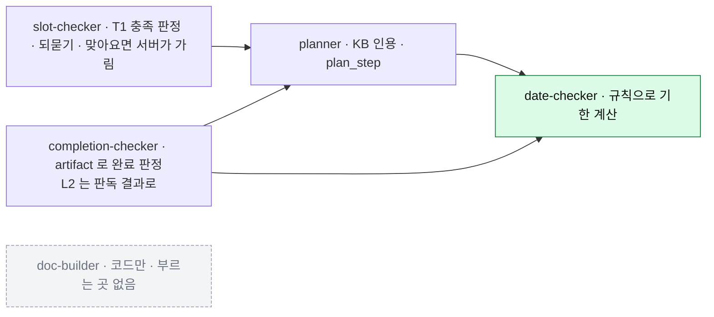
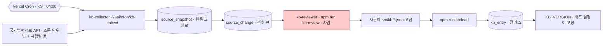
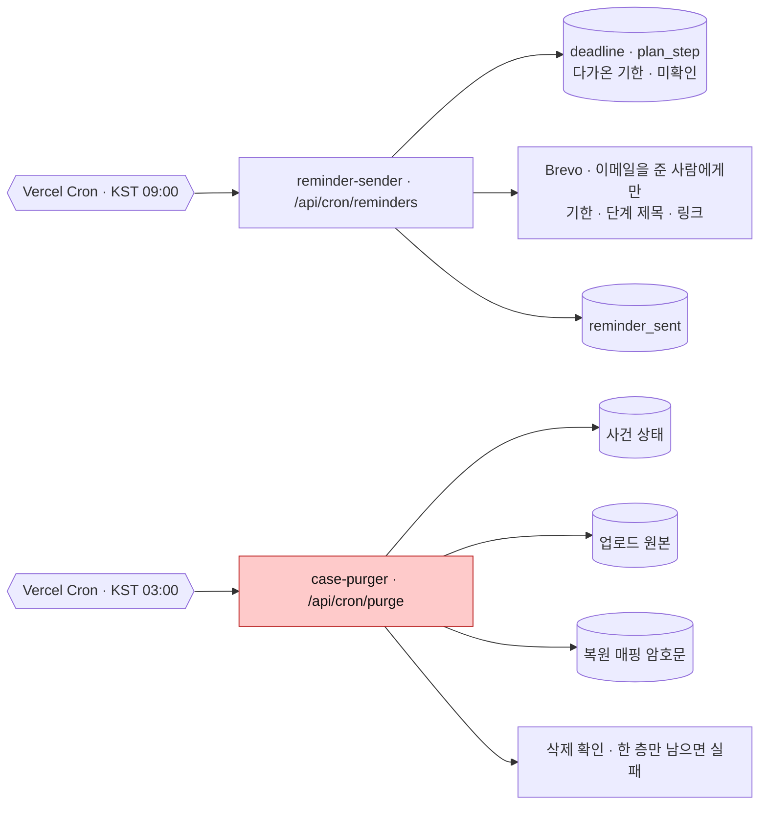
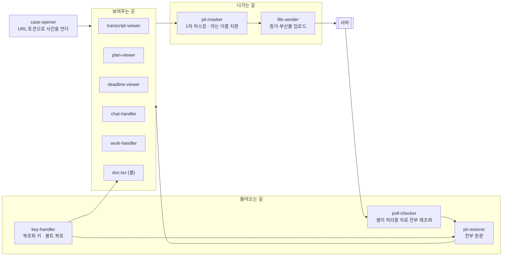
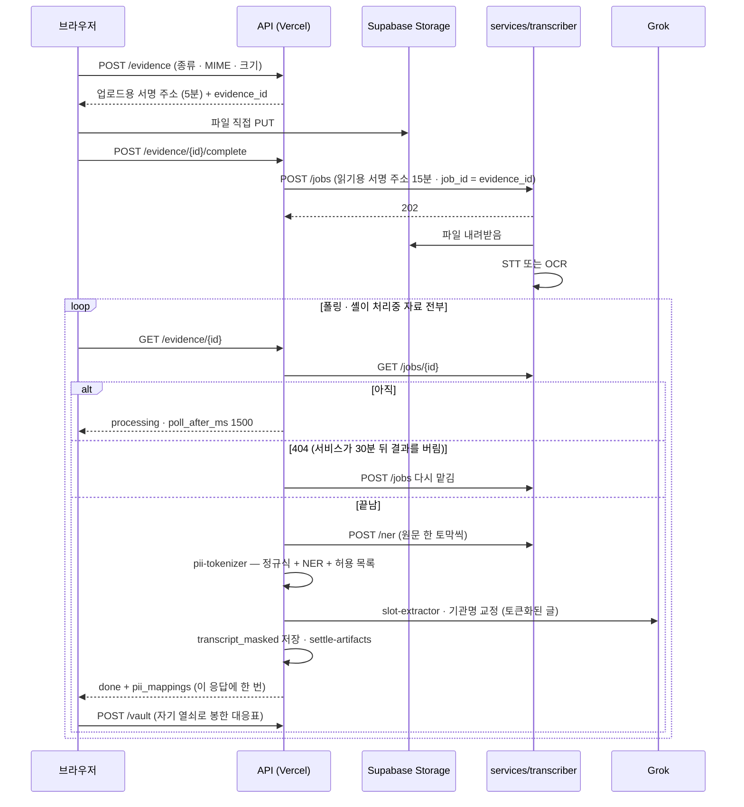
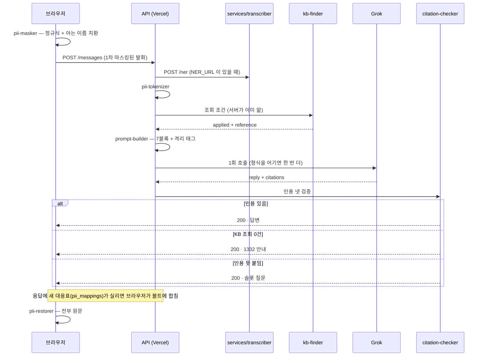

# 아키텍처 — FinAlly가 어떻게 구성되는가

> **2026-09-06 · `main` 기준으로 다시 썼습니다.** 각 절이 지금 실제로 도는 것을 가리킵니다 —
> 코드는 `src/`(Next.js · TypeScript) 하나이고, **모델을 돌리는 일만 앱 밖 Python 서비스**
> (`services/transcriber/`)가 맡습니다 → [ADR-028](decisions/028-runtime-and-module-shape.md) ·
> [RFC-001 「services/」](rfc/001-repo-structure.md) · [ADR-043](decisions/043-gpu-hosting.md).
> 무엇이 아직 안 붙었는지는 그 자리에 적습니다 — 미결 목록을 따로 두지 않습니다.

## 이 문서의 자리

| 문서 | 답하는 질문 |
| --- | --- |
| **`ARCHITECTURE.md`** (여기) | **무엇이 어디서 어떻게 도는가** — 기술 선택·모듈 배치·저장소·배포 |
| [`spec/`](spec/) | 제품이 **무엇을 만족해야 하는가** (계약) |
| [`rfc/`](rfc/) | 파일을 **어디에 두는가** (작업 규약) |
| [`decisions/`](decisions/) | **왜 그렇게 정했나** (이력) |
| [`deploy/README.md`](deploy/README.md) | **지금 무엇이 올라가 있나** — 릴리스·켜진 스위치·주소 |

**spec에 있는 것을 여기 다시 적지 마세요.** 계약은 spec이 정본이고, 여기는 그 계약을 **무엇으로 구현하는가**입니다.
어긋나면 spec이 이깁니다. 구조를 바꾸는 결정을 내렸다면 `decisions/`에 ADR을 남기고 여기를 고칩니다.
**배포본의 그 순간 상태**(어느 KB 릴리스인지 · 2차 탐지가 켜졌는지 · 팟이 떠 있는지)는 여기가 아니라
`deploy/README.md` 「지금 올라가 있는 것」에 있습니다 — 그 값은 날마다 바뀝니다.

**먼저 읽을 것** — [모듈 명칭](spec/common/08-16-module-names.md)(이름의 정본·네 층) ·
[모듈 경계](spec/common/08-16-module-boundaries.md)(책임·금지) ·
[PII 격리 경계](spec/common/08-14-pii-boundary.md)(협상 대상 아님).

---

## 1. 한눈에



**노란 칸이 격리 경계입니다.** 여기를 지나지 않은 텍스트가 외부 언어모델로 나가면
[PII 격리 경계](spec/common/08-14-pii-boundary.md) 위반입니다. 경계는 `pii-tokenizer` 하나이고,
2차 탐지 모델(NER)은 그 모듈이 **부르는 도구**이지 두 번째 경계가 아닙니다.

**빨간 상자에는 원문이 흐릅니다.** 녹음·캡처를 글로 옮기는 일과 그 글에서 이름을 찾는 일은
토큰화 **이전**이라, 이 서비스가 어디에 떠 있느냐가 곧 개인정보가 어디를 지나느냐입니다 → §6.

**파란 칸은 서버에 없습니다.** 복원은 브라우저에서만 일어납니다 — 서버에는 복호화 키가 없어
복원 자체가 **구조적으로 불가능**합니다 → [ADR-009](decisions/009-restore-mapping-location.md).
서버가 만든 토큰↔원문 대응표는 **그것을 만든 응답에 한 번** 실려 브라우저로 가고, 브라우저가
자기 열쇠로 봉해 볼트에 맡깁니다 → [ADR-062](decisions/062-transcript-mapping-handover.md) ·
[ADR-075](decisions/075-chat-mapping-handover.md).

## 2. 기술 스택

| 영역 | 선택 | 정본 |
| --- | --- | --- |
| **언어** | **TypeScript** — 화면·API·도메인 모듈 전부. **Python** 은 모델을 돌리는 서비스 하나뿐 | [ADR-028](decisions/028-runtime-and-module-shape.md) · [RFC-001](rfc/001-repo-structure.md) |
| 프론트 | Next.js 16 (App Router) · React 19 · Tailwind v4 · shadcn/ui · Pretendard | `src/package.json` |
| 디자인 토큰 | FinAlly 도메인 토큰 | `src/app/globals.css` · [design-system](spec/frontend/design-system/) |
| 백엔드 런타임 | **Vercel 서버리스 함수** · 리전 `icn1`(서울) · Hobby 플랜 | `src/vercel.json` · [API 계약](spec/common/08-14-api.md) |
| 관계형 DB | **Supabase Postgres** (`ap-northeast-2` 서울) — 사건 상태·KB·감사·수집. 드라이버는 `postgres.js`, **ORM 없음** | [ADR-016](decisions/016-retention-and-datastore.md) · `src/lib/db.ts` |
| 볼트 | **같은 Postgres 의 `case_vault` 스키마** — 복원 대응표 암호문만 | [ADR-049](decisions/049-vault-in-postgres.md) |
| 객체 저장소 | **Supabase Storage** `evidence` 버킷(비공개) — 업로드 원본. 서명 주소로만 올리고 읽음 | [ADR-016](decisions/016-retention-and-datastore.md) · `src/lib/storage.ts` |
| 언어모델 | **Grok (xAI) `grok-4.5`** — OpenAI 호환 `/chat/completions` 하나. SDK 없음 · **도구 호출 안 씀**. `LLM_*` 셋으로 갈아끼움 | `src/lib/llm.ts` · [챗 컨텍스트](spec/backend/08-16-chat-context.md) |
| STT · OCR · NER | **`services/transcriber`** (FastAPI) — faster-whisper `large-v3`(GPU) / `medium` int8(CPU) · EasyOCR · Ollama `gemma3:4b` | [ADR-052](decisions/052-stt-configuration.md) · [research/09](docs/research/09-로컬모델-PII인식-실측.md) |
| KB 검색 | **조건 조회** — 벡터 유사도 아님 | [ADR-012](decisions/012-kb-collection.md) |
| 주기 실행 | **Vercel Cron 셋** — 알림·파기·법령 수집. 앱의 API 라우트를 깨움 | [ADR-025](decisions/025-scheduled-jobs.md) · `src/vercel.json` |
| 메일 | **Brevo** (transactional REST) | `src/lib/mailer.ts` |
| 공휴일 | **코드 안의 표** `src/lib/holidays-table.ts` — 특일 API 키가 없어 임시공휴일은 안 들어옴 | [기한 계산 규칙](spec/common/08-16-deadline-rules.md) |
| 속도 제한 | **프로세스 메모리** — 공유 저장소 없음. 인스턴스가 늘면 실효 상한이 그만큼 느슨해짐 | `src/lib/rate-limit.ts` · [API](spec/common/08-14-api.md) §1.3 |
| 배포 | **GitHub Actions** — `main` 머지가 곧 배포. 배포 뒤 Playwright 스모크 | [ADR-053](decisions/053-deploy-on-merge.md) · §8 |

**서버리스라는 선택이 여러 계약을 이미 결정했습니다.** 함수의 본문 크기·실행 시간 제한 때문입니다.

| 계약 | 왜 그렇게 됐나 |
| --- | --- |
| 업로드는 **서명 주소로 저장소에 직접** | 녹음이 수십 MB라 API 함수를 통과시키면 본문 한계에 걸립니다 |
| 전사·판독은 **맡기고 폴링** | 몇 분 걸리는 일을 함수 안에서 기다릴 수 없습니다. 서비스 왕복 한 번은 8초 안에 끝냅니다(`src/lib/inference.ts`) |
| 챗은 **스트리밍 없이 응답 1회** | 챗 라우트만 `maxDuration = 60`, 모델 호출은 55초에서 우리가 먼저 끊습니다(`src/lib/llm.ts`) |
| 2차 탐지는 **동기 호출** | 발화 한 토막이라 GPU 에서 1초 안팎. 기본 12초, CPU 서버면 `NER_TIMEOUT_MS` 로 늘립니다 |
| 모델 재시도는 **형식을 어겼을 때 한 번** | `retry-checker` 가 `retryable` 하나만 봅니다 → [에러 계약](spec/backend/08-16-errors.md) §2 |
| 크론은 **하루 1회** | Hobby 플랜이 그 이상을 허용하지 않습니다 → [ADR-078](decisions/078-shell-polls-all-processing-evidence.md) |

## 3. 데이터 저장소

**셋으로 나눈 이유는 한 번의 유출로 암호문과 사건 구조가 함께 나가지 않게 하기 위해서입니다** → [ADR-010](decisions/010-case-store.md).

| 저장소 | 담는 것 | 원문 PII |
| --- | --- | :---: |
| Postgres 공개 스키마 | 사건 상태 — 슬롯·플랜·부산물·기한·대화·감사 · KB · 법령 스냅샷 | **없음** |
| Postgres `case_vault` 스키마 | 토큰↔원문 대응 (브라우저가 봉한 암호문) | 있음 — **서버는 키 없음** |
| Supabase Storage `evidence` | 업로드된 증거 원본 | 있음 — 비공개 버킷 · 짧은 서명 주소 · 사건과 함께 파기 |

> **앱은 Vercel, 데이터는 Supabase입니다.** `Vercel Postgres`는 2024-12 폐지돼 Neon으로 이관됐고
> Neon에는 서울 리전이 없습니다 → [ADR-016](decisions/016-retention-and-datastore.md).
> **볼트를 같은 Postgres 에 둔 이유** — 분리 원칙이 막으려던 사고는 「키와 암호문이 함께 새는 것」인데,
> 키가 서버에 없어 같은 인스턴스여도 그 사고가 일어나지 않습니다 → [ADR-049](decisions/049-vault-in-postgres.md).

- **DDL 정본** — [데이터 모델](spec/backend/08-16-data-model.md). **실행 사본**은 [`src/migrations/`](src/migrations/)
  `0001`~`0010` — 공개 스키마 표 17개(`schema_migrations` 포함) + `case_vault.restore_mapping` 하나.
  둘은 같은 커밋에 옵니다 → [ADR-019](decisions/019-module-code-sync.md). CI 의 `schema-names` 가 마이그레이션에
  없는 표·칸 이름으로 SQL 을 쓰는 자리를 막습니다
- **적용 방법** — `npm run migrate`(앱 드라이버로 순번 SQL 을 돌림 · `psql` 불필요). 적용 이력은
  `schema_migrations`. **공유 DB 에 열 개 다 적용돼 있습니다** — `0010`(법령 수집 표 셋)이 2026-09-06 마지막
- **ORM 을 안 쓰는 이유** — DDL 이 두 곳에 생깁니다. 정본이 이미 PostgreSQL 방언으로 쓰여 있어
  ORM 스키마와 갈라지면 어느 쪽이 맞는지 알 수 없게 됩니다
- **접속 문자열이 둘** — 앱은 트랜잭션 풀러(`DATABASE_URL`, 6543 · `prepare: false`), 마이그레이션은
  세션 풀러(`DIRECT_URL`, 5432). DDL 은 트랜잭션 풀러로 못 갑니다. Supabase 의 직접 연결(`db.{ref}…`)은
  IPv6 전용이라 IPv4 환경에서 안 붙습니다
- **Storage 는 서명 주소로만 닿습니다** — 올릴 때 5분, 읽을 때 15분(`src/lib/storage.ts`). SDK 없이 REST 를
  직접 부릅니다. ⚠️ spec 이 적은 **「저장 시 암호화 + 사건별 키」는 코드에 없습니다** — 지금 지키는 것은
  비공개 버킷·짧은 서명 주소·사건과 함께하는 파기입니다
- **보존·파기** — `case.purge_after` **마지막 활동일부터 180일**(`CASE_PURGE_DAYS`). 세 저장소가
  **같은 날 함께** 죽습니다 → [ADR-016](decisions/016-retention-and-datastore.md)
  - 표준 트랙만 D+100이고(공고 2개월 + 환급금 결정 14일), 이의제기가 붙으면 D+160입니다 →
    [research/06](docs/research/06-경로별-실측조사.md) §5
  - 기산이 생성일이 아니라 **마지막 활동일**입니다. 공고 후에 피해를 알고 들어온 사람은 진입 시점에 이미 두 달이 지나 있습니다
  - **실제로 지웁니다** — `GET /api/cron/purge` 를 Vercel Cron 이 하루 1회(UTC 18:00 = KST 03:00) 깨우고,
    `case-purger` 가 Postgres·Storage·볼트를 지운 뒤 **실제로 지워졌는지 확인**합니다. Storage 에는 네이티브
    만료가 없어 직접 지워야 하고, 세 저장소를 한 코드에서 다루려고 앱 안을 골랐습니다 → [ADR-025](decisions/025-scheduled-jobs.md)

> **DDL을 쓰기 전에** [저장 경계 표](spec/common/08-16-domain-model.md)를 확인하세요.
> 복원 매핑 원문·복호화 키를 담는 컬럼은 어떤 이유로도 만들지 않습니다.

## 4. 모듈

**이름의 정본은 [모듈 명칭](spec/common/08-16-module-names.md)이고, 책임과 금지는 [모듈 경계](spec/common/08-16-module-boundaries.md)입니다.**
여기에는 그 이름들이 **서로 어떻게 이어지는지**를 그립니다. 서른둘 전부 코드가 있고, 그중 둘은 아직
아무 데서도 부르지 않습니다 — 아래 층 1·층 3 에 표시했습니다([`src/modules/README.md`](src/modules/README.md) 「조립」 열).

가르는 기준은 **언제 도는가**입니다 → [ADR-014](decisions/014-module-names.md).
**층 경계가 코드에 있습니다** — 서버 모듈의 `index.ts` 는 `import "server-only"`, 브라우저 모듈은
`import "client-only"` 로 시작해, 반대쪽에서 가져오면 빌드가 막힙니다.

### 층 1 · 증거가 들어올 때 (한 번)



**판단은 앱에, 모델은 서비스에.** 「먼저 말한 쪽이 A」·「말풍선 좌우로 화자를 가른다」 같은 판단은
`transcriber` 모듈(TypeScript)이 하고, Python 서비스는 글로 옮기기만 합니다. 모델을 갈아끼워도 모듈은
안 바뀝니다 → [`services/transcriber/README.md`](services/transcriber/README.md).

**2차 탐지는 `pii-tokenizer` 안에서 돕니다.** 1차 정규식이 계좌·주민번호·카드·전화를 잡고, `NER_URL` 이
있으면 같은 Python 서비스의 `/ner` 이 이름을 찾고, 기관명 허용 목록(`src/lib/allowed-terms.ts`)이
경유 서비스 이름을 지킵니다. `NER_URL` 이 비면 1차만 돌고 **이름이 안 가려지며**, 그 사실이 응답의
`nerApplied` 와 설정 현황에 드러납니다. 채웠는데 서비스가 죽으면 슬롯·챗·부산물 쓰기가 `503` 으로
멈춥니다 — 못 가리면 안 내보내는 것이 설계입니다.

**전사·판독이 끝난 뒤 언어모델이 두 번 더 갑니다** — 슬롯 값 추출([ADR-069](decisions/069-evidence-slot-extraction.md))과
기관명 교정([ADR-056](decisions/056-transcript-org-normalization.md)). 둘 다 토큰화 **뒤**이고, 확정은 사용자가 한 번의 탭으로 합니다.

**`case-reader`는 코드만 있습니다.** 산출물을 쓰던 관리자 조회가 폐기돼([ADR-068](decisions/068-no-admin-screen.md))
부르는 곳이 없습니다. 어차피 절차 분기에는 쓰이지 않습니다 — 분기축은 경유 서비스 하나입니다 →
[채널 매트릭스](spec/backend/08-14-channel-matrix.md).

### 층 2 · 사용자가 말할 때마다 (매 턴)



**세 갈래가 `chat-publisher` 하나로 모여 같은 껍데기로 나갑니다** — 화면이 갈래를 분기하지 않습니다
→ [ADR-022](decisions/022-chat-turn-boundaries.md). `chat-receiver`는 **부르기만 하고 판정하지 않습니다.**
이 순서를 모으는 것은 흐름 `src/flows/chat-turn.ts` 이고, 감사 기록(`chat.context_built` · `llm.called` ·
`llm.failed`)도 거기서 남깁니다.

**이 층에서 에러가 나가지 않는 경로가 둘입니다.** 근거를 못 찾으면 실패가 아니라
**되묻기**로 갑니다 → [ADR-015](decisions/015-citation-and-reask.md) · `CLAUDE.md` 불변 규칙 5.

**서버는 조회 조건을 전부 알고 있어 모델에게 묻지 않습니다** — `track`·`channel_id`·`org_id`·오늘 날짜·현재 KB 버전.
그래서 모델이 필터를 우회할 방법이 없습니다 → [데이터 모델](spec/backend/08-16-data-model.md) §11.2.

**이름은 양쪽에서 같은 번호를 씁니다.** 브라우저는 이미 아는 이름을 보내기 전에 그 이름표로 바꾸고
([ADR-079](decisions/079-known-name-reuse.md)), 서버 2차가 새로 찾은 이름의 대응표는 그 응답의
`pii_mappings` 로 돌려줘 브라우저가 볼트에 합칩니다([ADR-075](decisions/075-chat-mapping-handover.md)).
서버는 그 대응표를 보관하지 않습니다.

### 층 3 · 사건 상태가 바뀔 때



**초록 칸에 LLM을 쓰지 않습니다.** 3영업일·14일 유예·2개월 공고·5영업일은 전부 코드의 규칙입니다 →
`CLAUDE.md` 불변 규칙 7 · [기한 계산 규칙](spec/common/08-16-deadline-rules.md). 공휴일은 코드 안의 표로
답합니다 — 표 밖의 연도는 「공휴일 아님」이 아니라 **던집니다**(`src/lib/holidays.ts`).

**`planner`는 근거 없는 단계를 저장할 수 없습니다.** `kb_entry_id`·`kb_version`·`source_url`·`effective_from`이
비면 적재가 거부됩니다 — 불변 규칙 1을 **스키마로** 강제하는 자리입니다.

**이 층을 부르는 흐름이 `src/flows/` 에 있습니다** — 슬롯 답(`answer-slot`) · 플랜 재생성(`regenerate-plan`) ·
기한 계산(`compute-deadlines`) · 부산물 판정 마무리(`settle-artifacts`) · 통지문에서 기산일 뽑기(`anchor-from-artifact`).
라우트는 이 흐름을 부르고, 흐름이 모듈을 순서대로 부릅니다.

**`completion-checker` 는 올린 파일을 증빙으로 치지 않습니다.** L2 는 판독 결과에 접수번호 자리나
공공기관 이름이 있을 때만 통과하고, 판독이 아직이면 `reading_pending` 으로 두었다가 `settle-artifacts` 가
마칩니다 → [ADR-077](decisions/077-upload-is-not-proof.md).

**`doc-builder`는 코드만 있습니다.** 기재 안내 화면(S-10)은 셸 `src/app/c/[token]/doc.tsx` 가 서버 계약 없이
맡고([ADR-064](decisions/064-doc-filler-retired.md)), 서식 칸 정의가 KB 에 없어(U-17·U-25) 부를 자리가 없습니다.

### 층 4 · 하루 1회



**수집원은 하나입니다.** `src/lib/law-fetcher.ts` 가 국가법령정보 Open API 를 **조문 단위**로 가져오고,
등록된 소스는 통신사기피해환급법과 그 시행령 둘입니다(`0010` 마이그레이션). `source_registry` 의
`watch_method` 에 `rss`·`board`·`human` 값이 있지만 그것을 읽는 수집원은 아직 없습니다 →
[ADR-072](decisions/072-law-collection-wired.md). 사용자 ID `LAW_API_OC` 가 비면 그 소스만 「오류」로 남고 앱은 그대로 돕니다.

**빨간 칸을 건너뛰는 경로를 만들지 않습니다.** 수집기가 `kb_entry`를 직접 쓰지 않고, 검수의 승인도
반영이 아닙니다 — `kb_entry` 에 쓰는 길은 `npm run kb:load` 하나이고, 앱이 인용하는 릴리스는
`KB_VERSION` 이 고정합니다 → [RFC-002](rfc/002-kb-authoring.md) · [ADR-045](decisions/045-kb-release-pin.md).
관리자 화면이 없으므로 검수의 자리는 명령줄입니다([ADR-068](decisions/068-no-admin-screen.md)).

**변경 감지에 별도 비교 로직이 없습니다.** `source_snapshot`의 `(source_key, content_hash)` 유일 제약에
삽입이 성공하면 그것이 곧 변경입니다.

**같은 층에 사건을 건드리는 잡이 둘 더 있습니다.** KB 운영과 달리 **사용자 데이터를 읽고 지웁니다.**



**셋 다 앱의 API 라우트로 돌고 Vercel Cron이 깨웁니다** → [ADR-025](decisions/025-scheduled-jobs.md).
크론 요청은 `Authorization: Bearer <CRON_SECRET>` 하나로 가리고, 비밀값이 비어 있으면 **무조건 막습니다**
(`src/lib/cron-call.ts`). 메일에는 이름·계좌가 실리지 않습니다 — 볼트 밖으로 나올 수 없기 때문입니다.
문구는 `src/lib/mailer.ts` 한 곳에 모여 있고 아직 임시입니다.

### 층 없음 · 항상

| 이름 | 맡는 일 |
| --- | --- |
| `audit-logger` | 모델 호출·사건 생성·파기·슬롯 확정을 토큰화 텍스트 기준으로 기록. 해시 사슬로 사후 조작 검출 → §9 |
| `retry-checker` | 예외의 `retryable` 하나만 보고 재시도 판단. 예외 종류를 분기하지 않음 |

### 층 C · 브라우저 (서버가 대신할 수 없는 것)

**시간축이 아니라 「무엇을 책임지는가」로 묶입니다** → [ADR-023](decisions/023-frontend-module-names.md).
화면이 열려 있는 동안 여러 가지가 동시에 돌아 시간축으로는 갈라지지 않습니다.



| 이름 | 맡는 일 | 절대 하지 않는 것 |
| --- | --- | --- |
| `case-opener` | URL 토큰으로 사건을 열고 복사·공유를 제공 | 잃은 링크를 복구해 주는 척하기 |
| `pii-masker` | 나가기 전 정규식 1차 마스킹 + 이미 아는 이름을 그 이름표로 치환([ADR-079](decisions/079-known-name-reuse.md)) | 마스킹 전 원문을 네트워크로 보내기 · 이름을 새로 찾기 |
| `key-handler` | 복호화 키 보관(IndexedDB · 꺼낼 수 없는 형태) · 볼트 암호문 복호 | 키를 서버·로그·DB로 보내기 |
| `poll-checker` | `poll_after_ms` 로 재조회 · 재시도 판단. 셸(`page.tsx`)이 **처리중인 자료 전부**를 어느 화면에서든 묻습니다([ADR-078](decisions/078-shell-polls-all-processing-evidence.md)) | 스트리밍·웹소켓 쓰기 |
| `file-sender` | 증거·부산물 업로드와 상태 추적 | `pii-masker` 를 건너뛴 경로 만들기 |
| `transcript-viewer` | 전사 표시 · 기계가 읽은 값을 사용자가 확인하는 자리 | 복원된 원문을 서버로 되돌리기 |
| `plan-viewer` | 타임라인·단계·배지 · T0 상시 노출 · 어휘의 정본 | 체크만으로 완료 표시 · T0 를 종속시키기 |
| `deadline-viewer` | 기한 표시 (`primary`·`grace`·`info`) | **날짜를 계산하기** |
| `chat-handler` | 발화 전송 · 응답·슬롯 질문 표시 | 인용 번호·판단 근거를 화면에 쓰기 |
| `work-handler` | 작업 차례 판정 + 유형별 패널 렌더 | 판정을 렌더 안에 섞기 |
| `pii-restorer` | 토큰을 원문으로 — **브라우저가 그리는 자리는 전부**([ADR-034](decisions/034-browser-shows-plaintext.md)) | 서버에 복원 함수 두기 |
| 기재 안내 셸 화면(`doc.tsx`) | 서식 칸에 원문을 채워 보여줌 ([ADR-064](decisions/064-doc-filler-retired.md)) | 서버가 만든 완성 문서를 그대로 받기 |

**`pii-masker` 가 1차, 서버의 `pii-tokenizer` 가 2차입니다.** 둘 다 지나야 외부 LLM에 닿습니다.
브라우저는 원문을 보고, 토큰은 경계 밖으로 나갈 때만 씁니다.

### 물리 배치

**앱은 Next.js 하나이고, 모델은 그 밖에서 돕니다** → [ADR-028](decisions/028-runtime-and-module-shape.md) · [RFC-001](rfc/001-repo-structure.md).

| 무엇 | 어디 | 어디서 도나 |
| --- | --- | --- |
| 화면 | `src/app/page.tsx`(랜딩) · `src/app/start/`(진입·동의·첫 문항) · `src/app/c/[token]/`(사건 화면 셸 — 챗·플랜·자료함·기재 안내·안전 절차) | 브라우저 |
| 문지기 | `src/proxy.ts` — `/api/admin/*` 은 늘 401, `/api/cron/*` 은 Bearer 비밀값 확인 (Next 16 의 `middleware` 후신) | 서버 · 라우트 앞 |
| API 진입점 | `src/app/api/**/route.ts` — 사건 13 + 크론 3. 전부 `handleRoute` 껍데기를 지납니다(CI `route-contract`) | 서버 (Vercel 함수) |
| 흐름 | `src/flows/` — 라우트 하나가 모듈 여럿을 순서대로 부르는 자리. 경계를 지나는 순서가 여기 한 번만 적힙니다 | 서버 |
| 도메인 모듈 | `src/modules/{이름}/` — 층 1·2·3·4 는 `server-only`, 층 C 는 `client-only` | 서버 / 브라우저 |
| 자원 접근 구현 | `src/lib/` — `db` · `storage` · `llm` · `inference`(전사 서비스) · `ner` · `mailer` · `holidays` · `rate-limit` · `law-fetcher` | 서버 |
| 조립 | `src/lib/container.ts` 가 포트에 구현을 꽂고, `src/lib/wire.ts` 가 **프로세스에 하나만** 둡니다(`globalThis`) | 서버 |
| 명령줄 | `src/scripts/` — `npm run migrate` · `kb:load` · `kb:collect` · `kb:review` · `config:report` · `probe:llm` · `probe:org`. `server-only` 때문에 **`npm run` 으로만** 부릅니다 | 소유자 기기 |
| KB 원본 | `src/kb/*.json` — 공통·유형별 여덟·통장묶기·기관·공공기관 | 적재기가 읽음 |
| 마이그레이션 | `src/migrations/0001~0010` | `npm run migrate` |
| 스모크 | `src/smoke/smoke.spec.ts` (Playwright) — 배포 뒤 실제 주소에서 한 바퀴 | GitHub Actions |
| **모델 서비스** | `services/transcriber/` — FastAPI · `POST /jobs` · `GET /jobs/{id}` · `POST /ner` · `/health`. 엔진은 `engines/` 에 하나씩 | **앱 밖** · §6 |
| 서버 준비 | `deploy/` — `oci-provision.py`(상시 서버) · `runpod-pod.py`(시연 팟) · 절차는 `README.md`·`runpod-bench.md` | 사람이 돌림 |

**진입점은 HTTP만 알고 판단은 모듈이 합니다.** `handleRoute` 가 맡는 것은 요청 파싱·링크 토큰 풀기·크론 비밀값·
속도 제한·상태 코드·계측 헤더 넷까지이고, 도메인 모듈은 **자기가 HTTP로 불렸는지 모릅니다.**
그래서 크론과 명령줄이 같은 모듈을 같은 조립본으로 부릅니다.

**각 모듈은 필요한 외부 자원을 인터페이스로 선언하고 구현을 주입받습니다.** 붙지 않은 자원은 「부르면
무엇이 왜 없는지 말하며 멈추는 대역」이 채웁니다(`src/lib/not-configured.ts`) — 속도 제한만 예외로,
모든 요청이 지나는 길목이라 메모리 카운터로 조용히 돕니다.
**저장소 접근과 LLM 호출에는 모듈 이름을 만들지 않습니다** — 도메인 판단을 하지 않는 자원 접근입니다.

위 이름들은 **책임의 단위이지 서버의 개수가 아닙니다** → [모듈 경계](spec/common/08-16-module-boundaries.md).

## 5. 데이터 흐름

### 증거 업로드와 판독 — 원본이 API를 통과하지 않습니다



**서버가 스스로 결과를 받아 오지 않습니다.** 팟에서 서버로 결과가 건너오는 길은 브라우저의 폴링 하나입니다 —
대응표를 받을 브라우저가 없으면 토큰화가 헛돕니다([ADR-062](decisions/062-transcript-mapping-handover.md)).
그래서 셸이 **처리중인 자료 전부**를 어느 화면에서든 묻고, 서비스가 결과를 버렸으면 같은 번호로 다시 맡깁니다
([ADR-078](decisions/078-shell-polls-all-processing-evidence.md)). 접수는 멱등이라 두 번 와도 모델을 두 번 돌리지
않습니다([ADR-051](decisions/051-idempotent-ingest.md)). 글로 올린 증거(`kind: text`)는 맡길 것이 없어
바로 토큰화합니다.

### 챗 한 턴 — 모델 호출은 한 번뿐입니다



**어느 갈래로도 에러가 나가지 않습니다.** 셋 다 200입니다 → [에러 계약](spec/backend/08-16-errors.md) §4.
모델이 인용 형식을 두 번 다 어기면 `502 KB_CITATION_MISSING` 으로 **멈춥니다** — 근거 없이 답하느니 안 답합니다.

### 사건 상태가 바뀌는 길 — 그림 없이

- **슬롯 답** `PATCH /slots/{key}` → `answer-slot` 흐름 → `pii-tokenizer`(되묻기에 「맞아요」면 서버가 가림 ·
  [ADR-067](decisions/067-pii-confirm-server-masks.md)) → `slot-checker` → `regenerate-plan` → `planner` →
  `compute-deadlines` → `date-checker`. 사건과 플랜은 한 트랜잭션에 함께 저장됩니다([ADR-046](decisions/046-case-and-plan-together.md)).
- **부산물** `POST /steps/{id}/artifacts` → `completion-checker`(L1 접수번호 · L2 판독 결과 · L3 자기 신고는 `unconfirmed`) →
  끝난 단계의 기한은 `met` 으로 닫힘 → 필요하면 `anchor-from-artifact` 가 통지문에서 기산일을 뽑아 확인 탭으로.
- **재진입** `GET /cases/{token}` · `/plan` · `/deadlines` · `/messages` · `/vault` — 서버는 토큰 상태 그대로 내리고,
  브라우저가 볼트를 열어 원문으로 그립니다([ADR-050](decisions/050-history-and-vault-read.md)).

## 6. 외부 의존

| 무엇 | 쓰임 | 선택 | 경계 |
| --- | --- | --- | :---: |
| LLM API | 챗 · 슬롯 값 추출 · 기관명 교정 | **Grok (xAI) `grok-4.5`** — 인용 계약을 3/3 지킨 유일한 xAI 모델(2026-08-28 실측). `LLM_BASE_URL`·`LLM_MODEL`·`LLM_API_KEY` 셋을 채우면 다른 OpenAI 호환 제공자로 감 | 지남 — 토큰화 텍스트만 |
| STT | 녹음 전사 | **faster-whisper `large-v3`** (GPU · float16) → [ADR-052](decisions/052-stt-configuration.md). 상시 CPU 서버는 `medium` int8(음성 길이의 3.7배) | **경계 이전** ⚠️ |
| OCR | 이미지 → 텍스트 | **EasyOCR** ko/en + 좌표 행 복원 → [research/11](docs/research/11-로컬OCR-PII인식-실측.md) | **경계 이전** ⚠️ |
| NER | 2차 이름 탐지 | **Ollama `gemma3:4b`** — 같은 서비스의 `/ner`. 깨끗한 텍스트에서 누출 0%·과차단 0% → [research/09](docs/research/09-로컬모델-PII인식-실측.md) R-1 | 경계 그 자체 |
| 법령 수집 | KB 파이프라인 | **국가법령정보 Open API** `lawService.do` · 조문 단위 · 사용자 ID `LAW_API_OC` | 해당 없음 |
| 메일 | 기한 알림 | **Brevo** — 무료 300통/일 · 도메인 없이 발신자 인증만으로. 실리는 것은 기한·단계 제목·링크뿐 | PII 없음 |
| 공휴일 | 영업일 계산 | **코드 안의 표** — 정본이 정한 특일 API(공공데이터포털)는 키가 없어 안 붙음 | 해당 없음 |
| 크론 | 하루 1회 트리거 | **Vercel Cron** · Bearer `CRON_SECRET` | 해당 없음 |

> ⚠️ **STT·OCR·NER 은 `pii-tokenizer` 이전 단계라 이 서비스가 어디 있느냐가 곧 원문이 어디를 지나느냐입니다.**
> 앱은 그 서비스를 `TRANSCRIBER_URL`·`NER_URL` 로만 알고, 그 주소가 **설정이 아니라 정책**입니다 →
> [경계 정의](spec/common/08-14-pii-boundary.md) · `CLAUDE.md` 불변 규칙 2.

**모델 서비스가 뜨는 자리는 둘입니다** → [ADR-043](decisions/043-gpu-hosting.md).

| | 상시 | 시연 |
| --- | --- | --- |
| 어디 | OCI `A1.Flex` 2코어 ARM · **미국 버지니아**(`us-ashburn-1`) · 예약 IP · sslip.io 도메인 · Caddy HTTPS | RunPod RTX 4090 팟 — STT·OCR·NER 을 한 팟에. 시간당 과금 · **끝나면 terminate** |
| 세우는 도구 | `deploy/oci-provision.py` · `services/transcriber/bootstrap.sh` · `compose.yaml` | `deploy/runpod-pod.py` · `runpod-provision.sh` · 순서는 [`runpod-bench.md`](deploy/runpod-bench.md) |
| NER | 켤 수 있으나 한 발화 10.7~12.3초(CPU) — `NER_TIMEOUT_MS` 25초쯤 필요 | 0.3초 안팎 |
| 인증 | 공유 비밀값 `FINALLY_TOKEN` = 앱의 `TRANSCRIBER_TOKEN`·`NER_TOKEN` | 같음 |

**둘 다 국외입니다.** ADR-043 이 정한 것은 「개발·시연은 해외 대여 + **합성 데이터만**, 운영은 국내」이고,
발표에서 「운영은 토큰화 이전 단계를 국내에서만 돌린다」를 명시합니다. 국내로 옮길 때 앱에서 바꾸는 것은
주소 두 줄입니다. 지금 배포본이 어느 쪽을 가리키는지는 `deploy/README.md` 「지금 올라가 있는 것」.

**서비스의 내부** — `POST /jobs` 는 서명 주소를 받아 파일을 내려받고 202 로 답한 뒤 백그라운드에서 돕니다.
끝난 작업은 30분 뒤 버립니다(`jobs.py`). 엔진은 `FINALLY_ENGINE`(기본 `echo` — 모델 없이 흐름만) ·
`FINALLY_DEVICE` · `FINALLY_STT` · `FINALLY_COMPUTE` 환경변수로 갈아끼웁니다. 시험은 CI 의 `services-check` 가
표준 라이브러리 범위에서 돌립니다.

**국가법령정보 API는 `efYd`(시행일) 파라미터로 과거 시점 조문을 재현합니다.** 조문마다 시행일이 따로 있어
`CH-crypto`의 2026-10-01 분기가 **배포 없이** 동작합니다 → [ADR-012](decisions/012-kb-collection.md).

## 7. 환경과 시크릿

**이름의 정본은 `src/lib/env.ts` 의 `ENV_KEYS` 이고, 뜻은 [API 계약](spec/common/08-14-api.md) §1.2 입니다.**
여기서는 다시 베끼지 않고 **어느 묶음이 무엇을 켜는지**만 적습니다.

| 묶음 | 변수 | 비면 |
| --- | --- | --- |
| 관계형 DB | `DATABASE_URL`(풀러 6543) · `DIRECT_URL`(세션 풀러 5432 · 마이그레이션만) | 사건을 못 만듭니다. **볼트도 여기입니다** |
| 객체 저장소 | `SUPABASE_URL` · `SUPABASE_SERVICE_ROLE_KEY` | 파일을 못 올립니다 |
| 언어모델 | `XAI_API_KEY` · 갈아끼우기 `LLM_BASE_URL`·`LLM_MODEL`·`LLM_API_KEY` | 챗 한 턴이 통째로 500 |
| KB 릴리스 | `KB_VERSION` | 안내를 만들지 않습니다 → [ADR-045](decisions/045-kb-release-pin.md) |
| 크론 | `CRON_SECRET` | 크론 경로가 **무조건 막힙니다** |
| 전사·판독 | `TRANSCRIBER_URL` · `TRANSCRIBER_TOKEN` | 녹음·캡처가 글로 안 옮겨지고 **사건 진행은 그대로** |
| 2차 탐지 | `NER_URL` · `NER_TOKEN` · `NER_MODEL` · `NER_TIMEOUT_MS` | 1차 정규식만 · 이름이 안 가려짐. **채웠는데 서비스가 죽으면 진행이 멈춤** |
| 메일 | `MAILER_API_KEY`(또는 `BREVO_API_KEY`) · `MAILER_FROM` · `APP_ORIGIN` | 셋 중 하나라도 비면 발송이 정직하게 꺼짐 |
| 법령 수집 | `LAW_API_OC` | 그 소스만 「오류」 · 앱은 그대로 |
| 보존 | `CASE_PURGE_DAYS` (기본 180) | — |
| 시연 | `NEXT_PUBLIC_DEMO_MOCK` (빌드에 구워짐 · `1` 이면 「Mock 파일로 실행」 칩) | 칩이 안 보임 (`?demo` 로는 보임) |
| 잠든 것 | `ADMIN_PASSWORD_HASH` — 관리자 화면 폐기([ADR-068](decisions/068-no-admin-screen.md)). 비워 둡니다 | — |

- **볼트를 여는 키는 이 표에 없습니다.** 복호화 키는 브라우저에만 있고 서버는 암호문을
  보관만 합니다 → [ADR-049](decisions/049-vault-in-postgres.md) · [ADR-027](decisions/027-session-key-storage.md)
- **값의 정본은 Vercel env 입니다.** 저장소가 공개라 `.env.local` 은 git 에 없고, 로컬 값은 소유자에게
  직접 받습니다 → [ADR-059](decisions/059-public-repo-secrets-out.md). 배포 값을 넣는 길은 소유자의 `vercel` CLI
  또는 **`vercel-env` 워크플로**(Vercel REST API upsert · 빈 입력은 안 건드림 · 끝나면 재배포) 둘입니다
- **GitHub 저장소 시크릿**은 `VERCEL_TOKEN`·`VERCEL_ORG_ID`·`VERCEL_PROJECT_ID`(배포)와
  `MAILER_API_KEY`·`NER_TOKEN`(워크플로가 Vercel 에 옮기는 열쇠)입니다
- **평문 비밀번호는 환경변수에도 넣지 않습니다**
- **타임존은 `Asia/Seoul` 고정** → [기한 계산 규칙](spec/common/08-16-deadline-rules.md).
  DB는 `TIMESTAMPTZ`로 UTC 저장하고 세션 타임존으로 렌더합니다
- **Supabase 가 키 이름을 바꿨습니다** — `anon` → Publishable, `service_role` → Secret.
  값은 새 이름(`sb_secret_…`)이고 변수 이름은 정본(`SUPABASE_SERVICE_ROLE_KEY`)을 씁니다
- **지금 무엇이 켜져 있는지**는 `npm run config:report` 가 소유자 기기에서 답하고, 배포본은
  `deploy/README.md` 「지금 올라가 있는 것」이 적습니다

## 8. 배포

- **배포 대상: Vercel.** 프로젝트 `finai/fin-ally` · 루트 디렉터리 `src` · 리전 `icn1`. 여는 주소는
  `https://fin-ally-khaki.vercel.app` (대회 배포 URL 요건 → [용어와 전제](spec/common/08-14-glossary.md) §9)
- **데이터는 Supabase(서울)입니다.** 앱·DB·저장소가 같은 리전이어야 요청마다 대륙을 건너지 않습니다 →
  [ADR-016](decisions/016-retention-and-datastore.md)
- **올리는 것은 GitHub Actions 입니다** → [ADR-053](decisions/053-deploy-on-merge.md) · [`deploy/README.md`](deploy/README.md)

```
main 에 src/** 가 푸시됨
  → 그 순간의 main 끝을 받음         (실행에 박힌 커밋이 아님 — 밀린 실행이 살아나도 옛 커밋으로 안 돌아감)
  → npm run typecheck · npm test    (브랜치 보호가 없어 배포 잡 안에서 다시 봄)
  → git archive 로 .git 없는 사본을 vercel deploy --prod   (Hobby 팀의 커밋 작성자 제한을 피함)
  → smoke 워크플로가 이어서 실제 주소에서 한 바퀴          (Playwright · 모델은 안 부름)
```

- **환경은 Production 하나입니다.** PR 미리보기는 **일부러 안 만듭니다** — `service_role` 키가 미리보기
  주소로 열립니다. 환경변수만 바꿨을 때는 Actions 탭에서 `deploy` 를 다시 겁니다(값은 다시 빌드해야 반영)
- **시연 자료** — 합성 자료 셋 [`assets/demo/09-01-mock-evidence/`](assets/demo/09-01-mock-evidence/) 을
  시작 화면의 「Mock 파일로 실행」 칩(`src/app/start/mock.ts`)이 한 번에 담습니다. 담긴 뒤로는 사람이 고른
  파일과 같은 길로 올라가고 전사되고 가려집니다. 칩은 `NEXT_PUBLIC_DEMO_MOCK=1` 빌드에서만 보입니다 —
  대회 기간에만. 한국어 공개 데이터가 0건이라 **합성이 불가피합니다** → [용어와 전제](spec/common/08-14-glossary.md)
- **저장소는 공개입니다.** 비밀은 Vercel env 에만 두고, 이력에 남았던 값은 새 저장소로 옮기며 지웠습니다 →
  [ADR-059](decisions/059-public-repo-secrets-out.md)

**CI 가 막는 것** — 사람이 손으로 돌리는 명령과 같은 스크립트입니다 → [RFC-001 「CI가 강제합니다」](rfc/001-repo-structure.md).

| 워크플로 | 무엇을 보나 | 언제 |
| --- | --- | --- |
| `code-check` | `src/` typecheck · vitest · build | PR · `main` (`src/**`) |
| `services-check` | `services/transcriber` unittest (표준 라이브러리 범위) | PR · `main` (`services/**`) |
| `route-contract` | 모든 라우트가 `handleRoute` 를 지나는가 | `src/app/api/**` |
| `schema-names` | 마이그레이션에 없는 표·칸 이름으로 SQL 을 쓰는가 | `src/**` |
| `module-sync` | 모듈 폴더 ↔ 명칭 정본 ↔ 마이그레이션 | PR · `main` |
| `doc-integrity` | 링크·앵커·ID·파일명·번호·ADR 불변성 | PR · `main` |
| `repo-structure-gate` | 폴더가 바뀌면 `rfc/` 수정이 함께 왔는가 | PR · `main` |
| `deploy` → `smoke` | 위 배포 흐름 | `main` (`src/**`) · 수동 |
| `vercel-env` | 배포 환경변수 upsert 후 재배포 | 수동 |

**DB 통합시험(`npm run test:db`)만 CI 밖입니다** — 실제 Postgres 가 있어야 돌아서 소유자 기기에서 돌립니다.

## 9. 관측

- **감사 로그** — `audit_log` 표. `case.opened` · `slot.confirmed` · `chat.context_built` · `llm.called` ·
  `llm.failed` · `case.purged` 를 토큰화 텍스트 기준으로 남기고, `prev_hash ‖ audit_id ‖ event_type ‖ detail ‖ created_at`
  의 SHA-256 사슬로 사후 조작을 검출합니다(`src/modules/audit-logger/audit.ts`) →
  [데이터 모델](spec/backend/08-16-data-model.md) §10. **사건이 파기돼도 남습니다** — PII가 없으므로
- **응답 헤더 넷이 모든 응답에 붙습니다** — `X-Pii-Token-Count` · `X-Pii-Egress-Residual` · `X-Kb-Version` ·
  `X-Audit-Id`. 담을 것이 없으면 빈 값이 아니라 없다는 뜻의 값(`none` · 잔여 건수는 `0`)을 찍습니다 — 빈 문자열은
  문지기가 낸 응답에서 사라집니다(`src/lib/telemetry.ts`). 「보호가 작동한다」를 응답 자체가 보여 주는 자리입니다 → [API](spec/common/08-14-api.md) §1.1
- **설정 현황** — `npm run config:report` 가 무엇이 붙었고 무엇이 대역인지(2차 탐지 · 메일 · 공휴일 출처 ·
  속도 제한 저장소 · KB 릴리스)를 한 장으로 냅니다
- **수집기 생존 확인** — `source_registry.last_success_at` 이 주기의 두 배를 넘으면 크론 응답의 `stale` 에
  실리고 함수 로그에 경고가 남습니다(`src/modules/kb-collector/collect.ts`). 조용히 멈춘 수집기가 가장 위험합니다
- **모델 호출 시간** — `src/lib/llm.ts` 가 시도마다 실제 소요를 로그에 남깁니다. 배포 환경은 이 컴퓨터보다
  느립니다(2026-08-27 실측 4~7초 대 14~31초)
- **애플리케이션 로그는 Vercel 함수의 콘솔 로그가 전부입니다.** 구조화 로그·외부 수집기는 없습니다
- **배포 뒤 확인**은 `smoke` 워크플로(랜딩 · 사건 생성 · 링크 재진입 · 플랜과 근거 · 404/400 · 볼트 왕복)이고,
  모델은 부르지 않으니 챗은 서버 로그로 따로 봅니다 → [`deploy/README.md`](deploy/README.md) 「올린 뒤」
