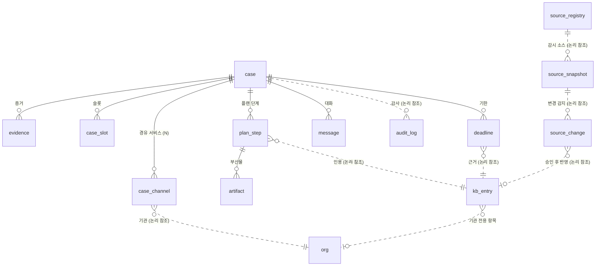

# FinAlly

금융보안원(FSI) 주관 **2026 금융 AI Challenge** 출품작 개발 저장소입니다.

> **FinAlly** — Fin(금융) + Ally(동행자), 그리고 *Finally*(마침내).
> 보이스피싱 피해자가 진술만 하면 **자기 사건에 맞는 절차를 찾아주고, 기한과 서류를 몇 달에 걸쳐 대신 관리**하는 웹 서비스.
> 112를 대체하지 않습니다 — **신고 이후를 맡습니다.**

출전 주제 확정([ADR-001](decisions/001-topic-selection.md)) · 이름 확정([ADR-002](decisions/002-project-name.md)).
현재 단계: **백엔드 모듈 설계 중, 구현 착수 전.**

## 왜 이것인가

- 개인 사건에 **기한을 붙여 관리하는 서비스가 0건**입니다. 경찰청은 신고·지급정지까지만, 금감원 안내는 정적 게시물, 1332는 평일 낮에만 엽니다.
- 사기 **탐지**는 정확도 0.97로 포화인데, **사후 절차 판단**은 GPT-4o가 0.43으로 무너집니다. AI가 실제로 필요한 자리입니다.
- 은행 민원이 전체적으로 10% 줄 때 보이스피싱 민원만 **126% 늘었고**, 작년 피해액은 **1조 566억원**입니다.
- 2026년 8월 4일 개정으로 **금융보안원이 정보공유기관으로 지정**됐습니다 — 주최기관이 이 법에 이름을 올렸습니다.

## 구조

| 폴더 | 무엇 | 성격 |
| --- | --- | --- |
| [`CLAUDE.md`](CLAUDE.md) | 에이전트 작업 규약 — 정본 위치, 불변 규칙, ID 체계 | **먼저 읽는 곳** |
| [`ARCHITECTURE.md`](ARCHITECTURE.md) | 시스템이 어떻게 구성되는가 — 기술 선택·모듈 배치·배포 | **뼈대만** ([ADR-007](decisions/007-architecture-doc.md)) |
| [`rfc/`](rfc/) | 규약 — 무엇을 어디에 두고 어떻게 일하는가 | 현행 규칙 |
| [`decisions/`](decisions/) | 판단 근거 — 왜 그렇게 정했나 (ADR) | 이력 |
| [`spec/`](spec/) | 구현이 따라야 할 제품 계약 (Markdown) | **개발 정본** |
| [`docs/`](docs/) | 읽고 고치는 Markdown — 구현 계획·배경 | 문서 |
| [`assets/`](assets/) | 산출물·자산 원본 — 로고·favicon, **HTML 아티팩트** | 원본 |
| [`src/`](src/) | 코드 (Next.js 스캐폴딩) | 착수 전 |

```
결정할 일 → decisions/ (왜)
              ├→ rfc/   그래서 지킬 작업 규칙   (현재형 · 고쳐서 유지)
              ├→ spec/  그래서 만들 제품 계약
              └→ src/   구현
```

새 문서를 만들기 전에 [RFC-001 저장소 구조 규약](rfc/001-repo-structure.md)의 결정 트리를 보세요.

## 데이터 모델

관계형 DB 테이블 **14개**입니다. 아래는 관계만 그린 것이고, **정본은
[`spec/backend/08-16-data-model.md`](spec/backend/08-16-data-model.md)** 입니다 — DDL·제약·허용값·저장 금지 목록이 거기 있습니다.



**실선이 외래키, 점선이 논리 참조입니다.** 세 덩어리로 읽습니다.

| 덩어리 | 테이블 | 무엇 |
| --- | --- | --- |
| **사건** | `case` `evidence` `case_channel` `case_slot` `plan_step` `artifact` `deadline` `message` `audit_log` | 한 사람의 사건 하나가 겪는 전부. 외래키가 `case`로 모입니다 |
| **KB** | `kb_entry` `org` | 절차 지식과 기관 마스터. **릴리스로만 갱신**되므로 외래키를 걸지 않습니다 |
| **수집** | `source_snapshot` `source_change` `source_registry` | `kb_entry` 앞단. 사람 승인 없이는 KB로 넘어가지 않습니다 → [ADR-012](decisions/012-kb-collection.md) |

**원문 개인정보는 이 표들 어디에도 들어가지 않습니다.** 계좌·주민번호·전화·이름은 브라우저에서
토큰으로 바뀐 뒤에야 경계를 넘습니다. 토큰↔원문 대응은 **암호문으로** 볼트에, 증거 원본은 객체
저장소에 따로 삽니다 — **복호화 키는 클라이언트에만 있습니다**
→ [PII 경계](spec/common/08-14-pii-boundary.md) · [ADR-009](decisions/009-restore-mapping-location.md) · [ADR-010](decisions/010-case-store.md).

컬럼·타입·허용값은 아래 인벤토리로 물어봅니다 (`python $I table case_slot`).
**이 그림이 정본과 어긋나면 `--check`가 잡습니다.**

## 개발 도구

설치가 필요 없습니다 — 전부 파이썬 표준 라이브러리만 씁니다. **저장소 루트에서** 실행하세요.

### 인벤토리 — 모듈과 스키마를 물어보는 곳

정본을 읽어 그때그때 렌더링합니다. 목록을 따로 들고 있지 않아 **정본이 바뀌면 출력도 바뀝니다**.

```bash
I=".claude/skills/module-inventory/scripts/inventory.py"

python $I                    # 모듈 전체 + 테이블 목록
python $I module             # 모듈만
python $I table              # 소스 DB 테이블 목록
python $I table case_slot    # 그 테이블의 컬럼·타입·제약·허용값
python $I --find slot        # 모듈·컬럼 동시 검색
python $I --check            # 정본과 실제가 어긋났는지 점검
```

모듈은 **층으로 좁힙니다.** 층은 번호가 아니라 **"언제 도는가"**로 부릅니다.

| 옵션 | 언제 도는 모듈인가 |
| --- | --- |
| `--intake` | 증거가 들어올 때 (층 1) |
| `--chat` | 사용자가 말할 때마다 (층 2) |
| `--plan` | 사건 상태가 바뀔 때 (층 3) |
| `--kb` | 하루 1회 (층 4) |
| `--always` | 어느 층에도 안 묶인 것 |

Claude Code에서는 `/module-inventory`로도 부릅니다 → [ADR-018](decisions/018-inventory-skill.md).

### 검사기 — 커밋 전에 돌려보는 것

CI가 돌리는 것과 **같은 명령**입니다. 게이트를 문지기가 아니라 안전망으로 쓰려면 먼저 돌려보세요.

```bash
python .github/scripts/doc-integrity.py    # 링크·ID·목차·ADR 불변성
python $I --check                          # 모듈 이름·연결구조·ERD·코드·마이그레이션 동기화
```

| 게이트 | 무엇을 막나 | 근거 |
| --- | --- | --- |
| `repo-structure-gate` | 폴더가 바뀌었는데 `rfc/` 수정이 없음 | [ADR-008](decisions/008-structure-gate-ci.md) |
| `doc-integrity` | 깨진 링크·없는 ID·목차 누락·ADR 사후 수정 | [ADR-017](decisions/017-doc-integrity-ci.md) |
| `module-sync` | 정본에 없는 이름의 모듈 폴더, **DDL 에 표가 늘었는데 안 따라온 ERD**, DDL 변경에 빠진 마이그레이션 | [ADR-019](decisions/019-module-code-sync.md) |

## 문서 인덱스

**Markdown은 `docs/`, HTML 아티팩트는 `assets/artifacts/`** 입니다. 가르는 축은 읽는 비용이고,
성격 구분(`plans`·`context`)은 양쪽에서 같은 이름으로 반복됩니다 → [ADR-006](decisions/006-artifacts-and-numbering.md).

- [`docs/plans/08-16-backend-handoff.md`](docs/plans/08-16-backend-handoff.md) — 백엔드 선행 결정 넷. **답을 기다리는 일시 문서**
- [`docs/context/AGENDA.md`](docs/context/AGENDA.md) — 대회 개요·일정·진행 상황

아래는 브라우저로 여는 HTML 아티팩트입니다. 외부 의존성 없이 파일 하나로 완결됩니다.

### 우리가 정한 설계 — `assets/artifacts/plans/`

| 문서 | 내용 |
| --- | --- |
| [08-13-service-plan.html](assets/artifacts/plans/08-13-service-plan.html) | 서비스 기획서 v1.2 — 분석 파이프라인, 슬롯 티어링, PII 격리, 경유 서비스 8유형, KB 운영, 완수 검증, 3-패널 화면, 기능명세 F-01~F-11. ⚠️ **구 명칭(골든30) 시점 문서**이고 포지셔닝이 30분 긴급 대응에 맞춰져 있습니다 — 개정 예정 |

### 확인한 사실 — `assets/artifacts/context/`

| 문서 | 내용 |
| --- | --- |
| [08-13-aftermath-research.html](assets/artifacts/context/08-13-aftermath-research.html) | 절차 지식의 근거. 통신사기피해환급법·경찰청·금감원 기준 사후처리 전 과정 |
| [주최기관-정합성-분석.html](assets/artifacts/context/주최기관-정합성-분석.html) | 금융보안원의 연혁·3대 사업축·2026 중점 어젠다와 2025년 1회 수상작 분석 |

### 아카이브 — `assets/artifacts/archived/`

주제가 FinAlly로 확정되면서([ADR-001](decisions/001-topic-selection.md)) 역할이 끝난 문서들입니다.
**판단 과정 자체는 ADR에 정리돼 있으니**, 아래는 그 근거 원문이 필요할 때만 엽니다. 갱신하지 않습니다.

| 문서 | 내용 |
| --- | --- |
| [candidates/최종후보군-보드.html](assets/artifacts/archived/candidates/최종후보군-보드.html) | 주제 선정의 최종본. 다섯 기준 재평가·신규 후보 14건 검증·탈락 사유. **제도 변경과 법적 경계 부분은 아직 이 문서가 최신**이라 근거로 살아 있습니다 |
| [candidates/주제후보군-보드.html](assets/artifacts/archived/candidates/주제후보군-보드.html) | 초기 후보 9건 보드 v2 |
| [candidates/tier1/](assets/artifacts/archived/candidates/tier1/) | 탈락 후보 컨셉 스펙 — 금융약관 해석기 · 소상공인 매칭 · 보안관제 AI비서 |

## 문서 규칙

- HTML 아티팩트는 **단일 파일**로 작성합니다(외부 CSS/JS/폰트 의존 없음).
- 기획서와 `spec/`이 어긋나면 **기획서가 상위**입니다. 다만 최종 후보 보드([아카이브](assets/artifacts/archived/candidates/최종후보군-보드.html))에서 갱신된 사실(제도 변경 등)은 보드가 최신입니다.
- 문서는 한국어, 코드 식별자는 영문. 이름 표기는 [ADR-002](decisions/002-project-name.md) 참조.
