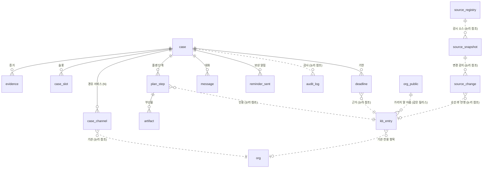
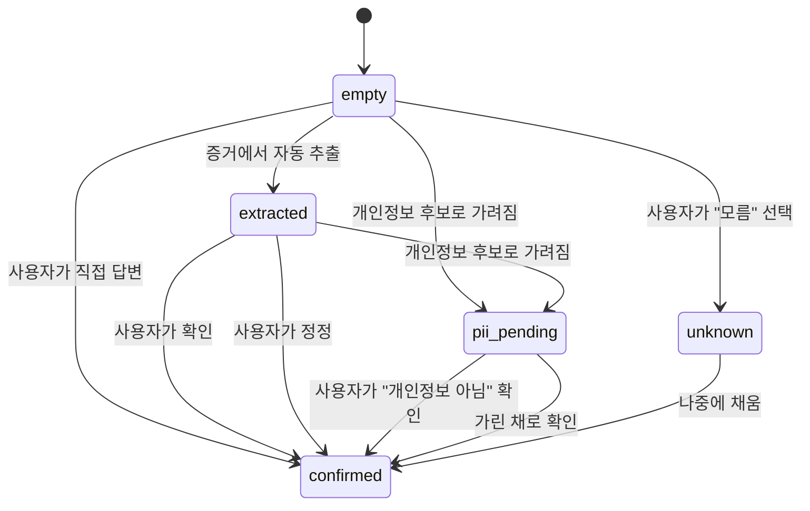

# 09 · 데이터 모델

> **기획서 추출이 아닌 구현 결정입니다.** 기획서 v1.2에 스키마 수준의 정의가 없어 [ADR-010](../../decisions/010-case-store.md)에서 설계했습니다.
> 바꿀 때는 spec을 직접 고치지 말고 RFC → ADR 절차를 거칩니다.

용어와 코드 식별자는 [00-glossary.md](../common/08-14-glossary.md)를 따릅니다. 저장소 선택은 [ADR-010](../../decisions/010-case-store.md).

## SQL 방언 — PostgreSQL

**아래 DDL은 PostgreSQL입니다.** 관계형 DB는 **Supabase Postgres**(`ap-northeast-2` 서울)입니다 →
[ADR-016](../../decisions/016-retention-and-datastore.md).
(2026-08-16 [ADR-010](../../decisions/010-case-store.md)의 `Vercel Postgres`에서 바뀌었습니다 — 그 제품은 2024-12 폐지됐고
후신인 Neon에 서울 리전이 없습니다. **둘 다 PostgreSQL이라 이 DDL은 그대로 섭니다.**)

작성 시 지킬 것 다섯입니다.

| 규칙 | 왜 |
| --- | --- |
| **`case` 는 큰따옴표로 감쌉니다** (`"case"`) | SQL 예약어입니다. 따옴표 없이 쓰면 파싱 오류가 납니다 |
| **열거값은 `TEXT` + `CHECK` 로 씁니다** | 네이티브 `CREATE TYPE … AS ENUM` 은 값을 추가할 때 `ALTER TYPE` 이 필요합니다. 제도가 바뀌면 값이 늘어나는 칼럼이 있어(§4 `channel_id`) 같은 방식으로 통일했습니다 |
| **인덱스 이름은 테이블 이름을 접두로 답니다** (`idx_evidence_case`) | 인덱스 이름이 **스키마 단위로 유일**해야 합니다. 여러 테이블에 `idx_case` 를 쓰면 두 번째 테이블 생성에서 실패합니다 |
| **`updated_at` 갱신은 트리거로 합니다** | `ON UPDATE CURRENT_TIMESTAMP` 절이 없습니다. 아래 §0 의 함수 하나를 네 테이블이 공유합니다 |
| **시각은 `TIMESTAMPTZ`** | 타임존을 `Asia/Seoul` 로 고정합니다 → [기한 계산 규칙](../common/08-16-deadline-rules.md). 저장은 UTC 로 하되 세션 타임존으로 렌더됩니다 |

칼럼 설명은 `COMMENT` 절 대신 `--` 주석으로 답니다. PostgreSQL 은 `COMMENT ON COLUMN` 을 별도 문장으로 받는데, 그러면 스펙 문서에서 정의와 설명이 떨어져 읽기 어려워집니다.

### 0. 공용 트리거 — `updated_at`

```sql
CREATE FUNCTION touch_updated_at() RETURNS trigger AS $$
BEGIN
  NEW.updated_at := now();
  RETURN NEW;
END;
$$ LANGUAGE plpgsql;
```

`case` · `case_slot` · `plan_step` · `deadline` 넷이 이 함수를 씁니다. 각 테이블 DDL 아래에 트리거가 붙어 있습니다.

## 저장소 셋

| 저장소 | 담는 것 | 원문 PII |
| --- | --- | :---: |
| 관계형 DB | 사건 상태 — 슬롯·플랜·부산물·기한·대화·감사 | **없음** |
| 볼트 (`case_vault` 스키마 · [ADR-049](../../decisions/049-vault-in-postgres.md)) | 토큰↔원문 대응 (암호문) | 있음 (서버는 키 없음) |
| 객체 저장소 | 업로드된 증거 원본 | 있음 |

**관계형 DB의 어느 칼럼에도 원문 PII를 넣지 않습니다** → [04-pii-boundary.md](../common/08-14-pii-boundary.md) 규칙 1·2.
**예외는 알림용 이메일 한 칸**(`case.notify_email` · §2)입니다 — [ADR-021](../../decisions/021-reentry-and-identity.md)이
감수하기로 한 결과이고, §13 이 경계를 적습니다.

> 볼트는 [ADR-009](../../decisions/009-restore-mapping-location.md)으로 확정됐습니다. 매핑을 **암호문으로** 서버 볼트에 두고 복호화 키는 클라이언트가 갖습니다.

---

## 1. 테이블 관계



**실선이 외래키, 점선이 논리 참조입니다.** 외래키는 여덟뿐이고 전부 `case` 또는 `plan_step`을 향합니다 — 사건이 죽으면 딸린 것이 함께 죽습니다(`ON DELETE CASCADE`).

`kb_entry`를 향하는 참조는 **논리 참조**입니다. 외래키를 걸지 않습니다. KB는 버전 릴리스로 교체되며([07-kb-operations.md](08-14-kb-operations.md)), 외래키가 있으면 릴리스가 막힙니다. 대신 `deadline.rule_snapshot`이 근거를 자체 보관하므로 참조가 끊겨도 값을 검증할 수 있습니다.

**`audit_log.case_id`에도 외래키가 없습니다.** 사건이 파기돼도(§14) 감사 로그는 남아야 합니다 —
`ON DELETE CASCADE`가 걸려 있으면 파기가 곧 감사 기록의 소멸이 됩니다. 해시 사슬은 그대로 이어집니다.

**위 그림의 마지막 셋은 `kb_entry` 앞단의 수집 파이프라인입니다**(§12). 사건과 이어지지 않고, 셋 사이에도 외래키가
없습니다 — `source_key`로 묶일 뿐입니다.

---

## 2. `case` — 사건

```sql
CREATE TABLE "case" (
  case_id        CHAR(26)      NOT NULL,   -- 내부 식별자(ULID). **URL 에 쓰지 않습니다** → ADR-039
  link_token     CHAR(26)      NOT NULL,   -- 링크 토큰. 128비트 CSPRNG · Crockford Base32
  track          TEXT          NOT NULL DEFAULT 'victim'
                 CHECK (track IN ('victim','frozen_account')),
                                           -- 피해자 / 통장묶기 → 03-channel-matrix.md
  status         TEXT          NOT NULL DEFAULT 'intake'
                 CHECK (status IN ('intake','in_progress','waiting','closed')),
  session_key_id CHAR(26)      NULL,       -- 볼트 세션키 식별자. 키 자체는 저장하지 않는다
  opened_at      TIMESTAMPTZ(3) NOT NULL,
  closed_at      TIMESTAMPTZ(3) NULL,
  purge_after    DATE          NOT NULL,   -- 이 날짜 이후 파기 대상
  notify_email   VARCHAR(254)  NULL,       -- 알림용 이메일. 평문으로 저장되는 유일한 연락처 → ADR-021
  created_at     TIMESTAMPTZ(3) NOT NULL DEFAULT now(),
  updated_at     TIMESTAMPTZ(3) NOT NULL DEFAULT now(),
  PRIMARY KEY (case_id)
);

CREATE UNIQUE INDEX idx_case_link_token ON "case" (link_token);
CREATE INDEX idx_case_status_purge ON "case" (status, purge_after);

CREATE TRIGGER trg_case_touch BEFORE UPDATE ON "case"
  FOR EACH ROW EXECUTE FUNCTION touch_updated_at();
```

| 칼럼 | 규칙 |
| --- | --- |
| `link_token` | **`case_id` 에서 파생하지 않습니다.** 따로 뽑은 128비트 난수입니다 — 아래 |
| `session_key_id` | **키 식별자만** 저장합니다. 키 자체나 키에서 파생된 값을 저장하지 않습니다. 세션키가 DB에 있으면 DB 유출 시 볼트가 함께 뚫려 저장소를 분리한 의미가 없어집니다 |
| `purge_after` | 사건 생성 시점에 채우고, **활동이 있을 때마다 다시 밉니다**(마지막 활동일 + `CASE_PURGE_DAYS`). 파기 시점이 정해지지 않은 데이터가 생기는 것을 막습니다 |
| `track` | 통장묶기는 절차가 완전히 다릅니다 → [03-channel-matrix.md](08-14-channel-matrix.md) 통장묶기 절 |
| `notify_email` | **평문으로 저장되는 유일한 연락처입니다** → [ADR-021](../../decisions/021-reentry-and-identity.md) (2026-09-01 「남은 것 — 저장 위치와 수명」 이행). **검증하지 않습니다** — 오타면 알림이 안 갈 뿐, 사용자를 막지 않습니다. 형식 검사·확인 메일을 넣지 마세요(관문이 됩니다). 상한 254자는 형식이 아니라 칸의 크기입니다. 별도 수명이 없습니다 — **사건 행과 함께 파기됩니다**(§14). LLM 호출 페이로드에 넣지 않고([04](../common/08-14-pii-boundary.md) 규칙 2), **오류 `detail`·감사 로그·응답 본문에 값을 적지 않습니다**(§10.1) |

**`purge_after`는 마지막 활동일부터 180일입니다** (`CASE_PURGE_DAYS`) → [ADR-016](../../decisions/016-retention-and-datastore.md)

#### `link_token` — URL 에 오는 것은 이것뿐입니다

> 2026-08-21 신설 → [ADR-039](../../decisions/039-link-token.md).

계정이 없어 **주소를 아는 사람이 곧 주인**입니다([ADR-021](../../decisions/021-reentry-and-identity.md)).
그래서 이 값이 사실상 비밀번호입니다.

| | |
| --- | --- |
| 생성 | **CSPRNG 128비트** |
| 표기 | **Crockford Base32** — `0-9A-Z` 에서 `I`·`L`·`O`·`U` 를 뺀 32글자 · 26자 |
| 저장 | **평문 + 고유 인덱스.** 해시하지 않습니다 → [ADR-039](../../decisions/039-link-token.md) ③ |

> ⛔ **`case_id` 를 URL 에 쓰지 마세요.** ULID 는 **앞자리가 생성 시각**이라
> 하나를 알면 비슷한 시각의 사건을 좁혀서 찔러볼 수 있습니다.
> **해시를 씌워도 원본이 시간순이면 탐색 공간이 그대로 좁습니다.**
>
> ⚠️ 둘 다 26자라 **겉으로 구분되지 않습니다.** 코드에서 섞지 마세요.

> 2026-08-16 ADR-010의 **90일 · 생성일 기준**에서 바뀌었습니다. 경로 10종을 실측하니 표준 트랙만
> **D+100**이고(공고 2개월 D+86 + 환급금 결정 14일), 명의인이 이의를 제기하면 D+160입니다 →
> [research/06](../../docs/research/06-경로별-실측조사.md) §5.
> 기산을 **마지막 활동일**로 바꾼 이유는, 공고 후에 피해를 알고 들어온 피해자(법 제6조제1항)가
> **진입 시점에 이미 두 달이 지나 있어** 생성일 고정이면 며칠 만에 만료되기 때문입니다.

> **이 값 하나가 사건에 딸린 모든 것의 수명입니다** — 토큰화된 상태, 업로드 원본, 복원 매핑 암호문이 같은 날 함께 사라집니다. 수명이 서로 다른 층을 두면 어느 하나만 남는 상태가 생기고, 그게 무엇인지 아무도 추적하지 못합니다.
>
> `04-pii-boundary.md` 불변 규칙 3이 원래 **24시간**이었으나 2026-08-16 이 값으로 통일됐습니다.

---

## 3. `evidence` — 증거

```sql
CREATE TABLE evidence (
  evidence_id   CHAR(26)      NOT NULL,
  case_id       CHAR(26)      NOT NULL,
  kind          TEXT          NOT NULL CHECK (kind IN ('audio','image','text')),
  object_key    VARCHAR(500)  NULL,       -- 객체 저장소 경로
  mime_type     VARCHAR(100)  NULL,
  byte_size     BIGINT        NULL,
  transcript_masked TEXT      NULL,       -- 토큰화된 전사·OCR 결과. 원문 금지
  ingest_status TEXT          NOT NULL DEFAULT 'pending'
                CHECK (ingest_status IN ('pending','processing','done','failed')),
  ingest_error  VARCHAR(255)  NULL,
  created_at    TIMESTAMPTZ(3) NOT NULL DEFAULT now(),
  PRIMARY KEY (evidence_id),
  CONSTRAINT fk_evidence_case FOREIGN KEY (case_id)
    REFERENCES "case"(case_id) ON DELETE CASCADE
);

CREATE INDEX idx_evidence_case ON evidence (case_id, created_at);
```

**`transcript_masked`에 `pii-tokenizer` 를 통과한 문자열만 저장합니다.** 전사·OCR 원문을 저장하지 않습니다.

**업로드 원본은 사건과 같은 기간 보관합니다** (`case.purge_after`, 마지막 활동일부터 180일).

> ⚠️ **여기 저장되는 「원본」은 주민등록번호가 이미 가려진 사본입니다** → [ADR-026](../../decisions/026-raw-upload-retention.md).
> 가리지 않은 파일은 **사용자 기기를 떠나지 않습니다.** 개인정보 보호법 제24조의2는 **정보주체가 동의해도** 주민등록번호를 처리할 수 없게 하고,
> 180일 보관은 「급박한 이익」 예외로 덮이지 않습니다 → [research/08](../../docs/research/08-업로드-법적요건.md).

즉시 파기하면 저장 공간과 유출 위험이 줄지만, **추출 오류를 되돌릴 수 없습니다.** 전사가 잘못됐거나 판독이 틀렸을 때 원본이 없으면 다시 뽑을 수 없고, 사용자에게 재업로드를 요구해야 합니다. 충격 상태의 사용자에게 그건 큰 부담입니다.

**대신 객체 저장소를 저장 시 암호화하고 사건별 키를 씁니다.** 파기는 §14 절차를 따라 사건과 함께 지웁니다.

---

## 4. `case_channel` — 경유 서비스

```sql
CREATE TABLE case_channel (
  case_channel_id BIGINT       GENERATED BY DEFAULT AS IDENTITY,
  case_id         CHAR(26)     NOT NULL,
  channel_id      VARCHAR(32)  NOT NULL,
                  -- CH-bank | CH-neobank | CH-securities | CH-easypay
                  -- CH-crypto | CH-facetoface | CH-giftcard | CH-carrier
                  -- 목록 검증은 코드가 합니다. CHECK 로 굳히지 않는 이유는 §4 참조
  org_id          VARCHAR(32)  NULL,       -- 기관 식별자. org 테이블 논리 참조. §4.1
  org_name_raw    VARCHAR(100) NULL,       -- 사용자·증거에 나온 표기 그대로.
                                           -- 토큰화 대상 아님 → ADR-011
  amount          NUMERIC(15,0) NULL,      -- 원 단위
  occurred_at     TIMESTAMPTZ(3) NULL,
  confidence      NUMERIC(3,2) NULL,       -- 판별 확신도 0.00~1.00
  source          TEXT         NOT NULL CHECK (source IN ('auto','user')),
                                           -- 자동 추출 / 문진 응답
  created_at      TIMESTAMPTZ(3) NOT NULL DEFAULT now(),
  PRIMARY KEY (case_channel_id),
  CONSTRAINT fk_channel_case FOREIGN KEY (case_id)
    REFERENCES "case"(case_id) ON DELETE CASCADE
);

CREATE INDEX idx_case_channel_case ON case_channel (case_id);
```

**한 사건에 여러 행을 허용합니다.** `case` 테이블에 유형 칼럼을 두지 않습니다.

실제 사건은 방식이 섞입니다. 계좌로 보낸 뒤 추가로 상품권을 산 경우 앞부분은 `CH-bank`(환급법 적용)이고 뒷부분은 `CH-giftcard`(사각지대)입니다. 하나로 강제하면 둘 중 하나를 놓칩니다.

### 4.1 기관을 유형과 따로 두는 이유

**절차는 유형(8종)으로 갈리지만, 실제 안내 내용은 기관으로 갈립니다.**

| 갈리는 것 | 단위 | 예 |
| --- | --- | --- |
| 지급정지 요청 주체·순서 | **유형** | `CH-bank`는 본인이, `CH-facetoface`는 수사기관이 |
| 환급법 적용 여부 | **유형** | `CH-giftcard`는 사각지대 |
| 신청 기한 | **유형** | 3영업일·14일 유예 |
| **콜센터 번호** | **기관** | 은행마다 다름 |
| **앱 내 신고 경로** | **기관** | 은행마다 다름 |
| **요청처 자체** | **기관** | `CH-easypay`는 "어느 페이인지"가 요청처를 결정 |

`03-channel-matrix.md`가 `CH-easypay`에 대해 이렇게 적었습니다.

> **"어느 페이로 보냈는지"를 문진에서 특정해야** 정확한 요청처가 나옴

**유형만으로는 이 요구를 만족할 수 없습니다.** 그래서 기관을 별도 축으로 둡니다.

`org_id`와 `org_name_raw`를 나눈 이유는 표기가 흔들리기 때문입니다. 사용자는 "국민", "KB국민은행", "국민은행"을 다 씁니다. `org_name_raw`에 들어온 그대로를 남기고, 정규화된 `org_id`로 지식베이스 항목을 찾습니다.

> `org_id`를 못 찾아도 진행합니다. `channel_id`만으로 유형 기본 절차를 안내합니다 → §11.2 조회 우선순위. [02-slot-tiering.md](08-14-slot-tiering.md)의 "멈추지 않는다" 원칙입니다.

---

## 5. `case_slot` — 슬롯

```sql
CREATE TABLE case_slot (
  case_slot_id BIGINT        GENERATED BY DEFAULT AS IDENTITY,
  case_id      CHAR(26)      NOT NULL,
  slot_key     VARCHAR(64)   NOT NULL,   -- §5.1 목록의 이름만
  tier         TEXT          NOT NULL CHECK (tier IN ('T0','T1','T2')),
  value_masked TEXT          NULL,       -- 토큰화된 값. 원문 금지
  value_type   TEXT          NOT NULL
               CHECK (value_type IN ('datetime','decimal','string','enum','bool')),
  state        TEXT          NOT NULL DEFAULT 'empty'
               CHECK (state IN ('empty','extracted','pii_pending','confirmed','unknown')),
  source       TEXT          NULL CHECK (source IN ('auto','user','system')),
  source_ref   CHAR(26)      NULL,       -- 어느 evidence 에서 나왔는가
  confidence   NUMERIC(3,2)  NULL,
  created_at   TIMESTAMPTZ(3) NOT NULL DEFAULT now(),
  updated_at   TIMESTAMPTZ(3) NOT NULL DEFAULT now(),
  PRIMARY KEY (case_slot_id),
  CONSTRAINT uk_case_slot UNIQUE (case_id, slot_key),
  CONSTRAINT fk_slot_case FOREIGN KEY (case_id)
    REFERENCES "case"(case_id) ON DELETE CASCADE
);

CREATE INDEX idx_case_slot_state ON case_slot (case_id, state);

CREATE TRIGGER trg_case_slot_touch BEFORE UPDATE ON case_slot
  FOR EACH ROW EXECUTE FUNCTION touch_updated_at();
```

### 5.1 슬롯 이름

[02-slot-tiering.md](08-14-slot-tiering.md)의 티어와 대응합니다. **목록에 없는 이름을 쓰면 적재를 거부합니다.** 이름이 자유 문자열이면 오타 하나로 슬롯이 안 채워지고, 그 사실이 조용히 넘어갑니다.

| `slot_key` | 티어 | 뜻 | `value_type` |
| --- | --- | --- | --- |
| `transferred` | T1 | 송금 여부 | `bool` |
| `channel` | T1 | 송금 수단 (8유형) | `enum` |
| `org_name` | T2 | 기관명 | `string` |
| `amount` | T2 | 금액 | `decimal` |
| **`amount_hint`** | T2 | **금액 구간. `amount`를 「모름」으로 답했을 때만 묻습니다** | `string` |
| `occurred_at` | T2 | 시각 | `datetime` |
| `elapsed_hint` | T2 | 경과 시간 (사용자 진술) | `string` |
| `contact_method` | T2 | 상대 연락 수단 | `string` |
| `counterpart_account` | T2 | 상대 계좌 (토큰) | `string` |
| `impersonated_org` | T2 | 사칭 기관 | `string` |
| `freeze_requested_at` | T2 | 지급정지 요청 시각 | `datetime` |
| **`relief_applied_at`** | T2 | **피해구제를 신청한 시각. 3영업일 기한의 기산점** | `datetime` |
| `report_filed_at` | T2 | 신고 접수 시각 | `datetime` |
| `objection_submitted_at` | T2 | 이의제기 제출 시각 (통장묶기) | `datetime` |
| **`notice_started_at`** | T2 | **채권소멸공고가 시작된 날. 2개월 기한의 기산점** | `datetime` |

**T0에는 슬롯이 없습니다.** 진입 자체로 충분합니다 → [02-slot-tiering.md](08-14-slot-tiering.md).

**정확한 값과 대략의 값을 한 슬롯에 겹쳐 담지 않습니다.** `uk_case_slot`이 사건 하나에
이름당 한 행만 허용하는데, 정확한 값과 어림값은 `value_type`이 서로 다릅니다.
그래서 짝을 이루는 슬롯을 따로 둡니다 — `occurred_at`(`datetime`)과
`elapsed_hint`(`string`), `amount`(`decimal`)와 `amount_hint`(`string`)입니다.

**어림값 쪽은 정확한 값을 못 얻었을 때만 채웁니다.** `amount_hint`는 사용자가
`amount`를 「모름」으로 답한 경우에만 묻습니다 — 이체내역에서 금액을 뽑았거나
사용자가 숫자를 적었으면 묻지 않습니다. 아는 것을 두 번 묻지 않기 위한 것이고,
판정은 [02-slot-tiering.md](08-14-slot-tiering.md)의 최소 질문 원칙에 따라
`slot-checker`가 합니다.

### 5.2 슬롯 상태



| 상태 | 뜻 | 기한 계산에 사용 |
| --- | --- | :---: |
| `empty` | 아직 없음 | ✗ |
| `extracted` | LLM이 뽑았고 확인 전 | ✗ |
| **`pii_pending`** | **개인정보 후보로 가려졌고, 사용자 확인 전** | ✗ |
| `confirmed` | 사용자가 확인·입력함 | **✓** |
| `unknown` | 사용자가 "모름" 선택 | ✗ |

**`unknown`은 실패가 아니라 정상 상태입니다** → [02-slot-tiering.md](08-14-slot-tiering.md). 슈퍼셋 플랜으로 진행합니다.

**기한 계산은 `confirmed` 상태만 씁니다.** LLM이 잘못 읽은 값으로 법정 기한을 계산하면 사용자가 실제로 권리를 잃습니다 → `CLAUDE.md` 불변 규칙 7.

#### `pii_pending` — `extracted` 와 무엇이 다른가

> 2026-08-21 신설 → [ADR-041](../../decisions/041-pii-confirm-with-user.md).

**둘 다 「확인 전」이지만 묻는 것이 다릅니다.**

| | 묻는 것 |
| --- | --- |
| `extracted` | **이 값이 맞나요?** — 기계가 잘못 읽었을 수 있습니다 |
| **`pii_pending`** | **이건 개인정보인가요?** — 가렸는데 아닐 수 있습니다 |

**두 축은 독립입니다.** 실측에서 `3333-01-2345678` 이 「3333년 1월 23일」로 전사됐는데,
**자연스러운 날짜라 신뢰도가 낮게 나올 이유가 없습니다** — `extracted` 로는 안 잡힙니다.

**`pii_pending` 인 값은 절차 선택에 쓰이지 않습니다.** `confirmed` 가 아니므로
기한 계산에도, 슬롯 충족 판정에도 안 들어갑니다 — **확인 전에는 없는 값과 같습니다.**

> **그래도 플랜은 나갑니다.** T0 와 유형 기본은 슬롯과 무관합니다
> → [ADR-041](../../decisions/041-pii-confirm-with-user.md) ②.

---

## 6. `plan_step` — 플랜 단계

```sql
CREATE TABLE plan_step (
  plan_step_id  CHAR(26)      NOT NULL,
  case_id       CHAR(26)      NOT NULL,
  seq           INT           NOT NULL,   -- 표시 순서
  step_key      VARCHAR(64)   NOT NULL,   -- KB 절차 항목 식별자
  title         VARCHAR(255)  NOT NULL,
  actor         TEXT          NOT NULL
                CHECK (actor IN ('victim','police','bank','prosecutor','carrier',
                                 'issuer','agency')),
  body          JSONB         NOT NULL,   -- 단계 본문(설명·연락처·채널)
  conditional   VARCHAR(255)  NULL,       -- 슈퍼셋 플랜의 조건 라벨.
                                          -- 예: "카카오페이로 보냈다면"
  state         TEXT          NOT NULL DEFAULT 'not_started'
                CHECK (state IN ('not_started','in_progress','done_verified',
                                 'unconfirmed','skipped')),
  kb_entry_id   VARCHAR(64)   NOT NULL,   -- 논리 참조
  kb_version    VARCHAR(32)   NOT NULL,   -- 인용한 KB 버전
  source_url    VARCHAR(500)  NOT NULL,   -- 근거 링크. 비면 적재 거부
  effective_from DATE         NOT NULL,   -- 시행일. 비면 적재 거부
  generated_at  TIMESTAMPTZ(3) NOT NULL,
  done_at       TIMESTAMPTZ(3) NULL,
  created_at    TIMESTAMPTZ(3) NOT NULL DEFAULT now(),
  updated_at    TIMESTAMPTZ(3) NOT NULL DEFAULT now(),
  PRIMARY KEY (plan_step_id),
  CONSTRAINT uk_case_step UNIQUE (case_id, step_key),
  CONSTRAINT fk_step_case FOREIGN KEY (case_id)
    REFERENCES "case"(case_id) ON DELETE CASCADE
);

CREATE INDEX idx_plan_step_state ON plan_step (case_id, state);

CREATE TRIGGER trg_plan_step_touch BEFORE UPDATE ON plan_step
  FOR EACH ROW EXECUTE FUNCTION touch_updated_at();
```

**`kb_entry_id`·`kb_version`·`source_url`·`effective_from`이 비면 저장을 거부합니다.**

`CLAUDE.md` 불변 규칙 1이 "LLM은 절차를 창작하지 않는다. 전부 버전드 KB에서 인용하며 답변에는 근거와 시행일이 붙는다"입니다. **근거 없는 단계가 저장될 수 있으면 이 규칙이 강제되지 않습니다.**

> **`agency`는 2026-08-26에 더했습니다** ([0006](../../src/migrations/0006_plan_step_actor_agency.sql)).
> 채권소멸공고를 내고 2개월을 세는 주체는 금융감독원인데(통신사기피해환급법 제5조제2항·제9조제1항),
> 여섯 값 중 어느 것도 아니어서 `bank`로 대신 적고 있었습니다. **[§11.4.2](#1142-기한의-주인을-명시합니다)의
> `deadline.owner`에는 처음부터 `agency`가 있었고**, 그 기한이 `kind: "info"`로 가는 근거가 바로
> 그것입니다 — 같은 주체를 단계 쪽에서만 못 적던 것을 맞춘 것입니다.

### 6.1 재생성 시 보존

[02-slot-tiering.md](08-14-slot-tiering.md)가 "슬롯이 나중에 채워지면 플랜을 다시 만든다. 이때 **이미 완료된 단계의 상태(부산물 포함)는 보존**해야 한다"고 정합니다.

**재생성은 삭제 후 삽입이 아니라 `step_key` 기준 병합입니다.**

| 기존 상태 | 재생성 시 |
| --- | --- |
| `not_started` | 새 내용으로 교체 |
| `in_progress` | 새 내용으로 교체, 상태 유지 |
| `done_verified` | **교체하지 않음.** 부산물과 함께 보존 |
| `unconfirmed` | **교체하지 않음.** 리마인더 추적 유지 |
| 새 플랜에 없는 단계 | `skipped` 로 표시. 삭제하지 않음 |
| `skipped` 인데 **다시 플랜에 들어옴** | 새 내용으로 교체하고 **`not_started` 로 되돌림** |

> **마지막 행이 2026-08-26에 들어갔습니다.** 지우지 않고 `skipped` 로 두는 이유가
> 「조건이 다시 맞으면 되살아나야 하기 때문」인데 **되살리는 규칙이 없었습니다.**
>
> 대면편취에서 실제로 그랬습니다. 사건을 열 때는 선행이 없는 공통 「지급정지를 요청합니다」가
> 서고, 경유 서비스가 정해지면 그 유형의 것으로 바뀌는데 그쪽은 `after: ["report-112"]`라
> 112를 끝내기 전에는 활성이 아닙니다 — 그 재생성에서 `skipped`가 됩니다. 112를 끝내면
> 내용은 제대로 바뀌는데(`actor: "police"`) **상태가 `skipped`에 남아 화면이 「해당 없음」으로
> 그렸습니다.** 대면편취에서도 지급정지는 걸립니다 — 수사기관이 계좌를 특정한 뒤에.

---

## 7. `artifact` — 부산물

```sql
CREATE TABLE artifact (
  artifact_id   CHAR(26)      NOT NULL,
  plan_step_id  CHAR(26)      NOT NULL,
  case_id       CHAR(26)      NOT NULL,   -- 조회 편의를 위한 비정규화
  kind          TEXT          NOT NULL
                CHECK (kind IN ('receipt_no','sms_capture','receipt_doc','other')),
  value_masked  VARCHAR(255)  NULL,       -- 접수번호 등. 토큰화 후 저장
  object_key    VARCHAR(500)  NULL,       -- 업로드 캡처·서류의 객체 저장소 경로
  verify_level  TEXT          NOT NULL CHECK (verify_level IN ('L1','L2','L3')),
  verify_result TEXT          NOT NULL
                CHECK (verify_result IN ('passed','failed','not_applicable')),
  verify_detail JSONB         NULL,       -- 포맷 체크·OCR 대조 결과. PII 금지
  created_at    TIMESTAMPTZ(3) NOT NULL DEFAULT now(),
  PRIMARY KEY (artifact_id),
  CONSTRAINT fk_artifact_step FOREIGN KEY (plan_step_id)
    REFERENCES plan_step(plan_step_id) ON DELETE CASCADE
);

CREATE INDEX idx_artifact_step ON artifact (plan_step_id);
CREATE INDEX idx_artifact_case ON artifact (case_id);
```

[05-completion-hook.md](08-14-completion-hook.md)의 검증 3단계와 대응합니다.

| `verify_level` | 방식 | `plan_step.state` 결과 |
| --- | --- | --- |
| `L1` | 접수번호 포맷 체크 + 접수증 OCR 대조 | `done_verified` |
| `L2` | 캡처·서류 업로드 (`pii-tokenizer` 통과) | `done_verified` |
| `L3` | 자기 신고 | **`unconfirmed`** |

**`L3`만으로 `done_verified`가 되는 경로를 만들지 않습니다.** 이 기능의 존재 이유가 사라집니다 → [05-completion-hook.md](08-14-completion-hook.md) 구현 주의.

**`unconfirmed`는 종결 상태가 아닙니다.** 리마인더 추적 대상으로 남습니다.

### 7.1 부산물이 다음 단계의 입력이 된다

[05-completion-hook.md](08-14-completion-hook.md)의 증거 연쇄입니다. **부산물이 없으면 다음 산출물이 물리적으로 완성되지 않습니다.**

| 부산물 | 다음 단계에서의 쓰임 |
| --- | --- |
| 112 사건접수번호 | 피해구제신청서의 필수 필드 |
| 은행 접수 문자 캡처 | 진행 상태 근거 |
| 접수증 | 환급 타임라인의 기산점 (`deadline.computed_from`) |

---

## 8. `deadline` — 기한

```sql
CREATE TABLE deadline (
  deadline_id   CHAR(26)      NOT NULL,
  case_id       CHAR(26)      NOT NULL,
  plan_step_id  CHAR(26)      NULL,       -- 어느 단계의 기한인가
  kind          TEXT          NOT NULL CHECK (kind IN ('primary','grace','info')),
                                          -- 본 기한 / 유예 / 안내용(공고 2개월 등)
  due_at        TIMESTAMPTZ(3) NOT NULL,
  computed_from VARCHAR(64)   NOT NULL,   -- 기산점이 된 slot_key 또는 artifact
  computed_at   TIMESTAMPTZ(3) NOT NULL,
  rule_snapshot JSONB         NOT NULL,   -- 계산에 쓴 KB 항목 전체 + 반영한 공휴일
  kb_version    VARCHAR(32)   NOT NULL,
  status        TEXT          NOT NULL DEFAULT 'open'
                CHECK (status IN ('open','met','missed','void')),
  created_at    TIMESTAMPTZ(3) NOT NULL DEFAULT now(),
  updated_at    TIMESTAMPTZ(3) NOT NULL DEFAULT now(),
  PRIMARY KEY (deadline_id),
  CONSTRAINT fk_deadline_case FOREIGN KEY (case_id)
    REFERENCES "case"(case_id) ON DELETE CASCADE
);

CREATE INDEX idx_deadline_case ON deadline (case_id);
CREATE INDEX idx_deadline_due  ON deadline (status, due_at);

CREATE TRIGGER trg_deadline_touch BEFORE UPDATE ON deadline
  FOR EACH ROW EXECUTE FUNCTION touch_updated_at();
```

### 8.0 기산점은 「피해구제를 신청한 날」입니다

**지급정지 요청 시각이 아닙니다.** 시행령 원문입니다.

> ① … 피해구제신청서에 피해자의 신분증 사본을 첨부하여 해당 금융회사에 제출하여야 한다. **다만, 긴급하거나 부득이한 사유가 있는 경우에는 전화 또는 구술로 신청할 수 있다.**
>
> ② … **피해구제를 신청한 피해자는 그 신청한 날부터 3영업일 이내에** 제1항 본문에 따른 신청서류를 해당 금융회사에 제출하여야 한다.

**기산점 슬롯은 `relief_applied_at`입니다.** `freeze_requested_at`이 아닙니다.

실무에서는 전화 한 통으로 지급정지와 피해구제를 같이 신청해 같은 날이 되는 경우가 많지만, **법적으로는 다른 사건입니다.** 지급정지만 걸고 피해구제 신청을 안 했으면 3영업일이 아직 시작되지 않았을 수 있습니다.

> 출처: 통신사기피해환급법 시행령 제3조 (국가법령정보 API 원문, 확인 2026-08-16)
> 자세한 내용은 [research/01-환급절차-기한.md](../../docs/research/01-환급절차-기한.md)

### 8.1 본 기한과 유예를 별도 행으로

[03-channel-matrix.md](08-14-channel-matrix.md)의 `CH-bank` 표준 절차입니다.

> **피해구제 신청** — **3영업일 이내**, 넘기면 금융회사가 **14일을 추가로 주고** 그때도 안 내면 무효

**두 시점입니다.** 한 행에 넣으면 사용자에게 둘 다 안내할 수 없습니다.

본 기한만 알리면 사용자가 이미 늦었다고 포기하고, 유예만 알리면 본 기한을 넘겨도 되는 것으로 오해합니다.

### 8.2 `rule_snapshot`

```json
{
  "kb_entry_id": "relief-application-deadline",
  "kb_version": "2026.08.1",
  "rule": {
    "kind": "business_days",
    "amount": 3,
    "from": "freeze_requested_at",
    "grace": { "kind": "calendar_days", "amount": 14 }
  },
  "legal_basis": "통신사기피해환급법 시행령 제3조 제2항·제3항",
  "source_url": "https://www.law.go.kr/...",
  "effective_from": "2026-07-01",
  "holidays_used": ["2026-08-17"]
}
```

**계산 시점의 KB 항목 전체를 저장합니다. 참조만 남기지 않습니다.**

KB는 릴리스로 교체되므로([07-kb-operations.md](08-14-kb-operations.md)), 나중에 개정되면 이 기한이 왜 이 날짜인지 확인할 방법이 없어집니다. `holidays_used`는 공휴일 데이터가 바뀌어도 과거 계산을 재현하기 위한 것입니다.

### 8.3 `info` 종류

사용자가 지켜야 할 기한이 아니라 **안내용 시점**입니다.

| 예 | 왜 `info` 인가 |
| --- | --- |
| 채권소멸공고 2개월 | 금감원이 하는 일 |
| 환급금 지급 14일 | 금감원·은행이 하는 일 |
| 통장묶기 결과 통보 5영업일 | **은행이 지켜야 할 기한** |

**통장묶기 5영업일을 사용자 기한으로 오인시키면 안 됩니다.** 이 서비스는 충격 상태의 사용자를 상대합니다.

### 8.4 `reminder_sent` — 보낸 알림

> 2026-09-01 신설 → [ADR-021](../../decisions/021-reentry-and-identity.md) 「남은 것」 ·
> [ADR-025](../../decisions/025-scheduled-jobs.md). `reminder-sender` 가 「이미 보낸 건 아닌가」를
> 판단해야 하는데 **발송 이력이 놓일 자리가 스키마에 없었습니다** — 그 모듈의 `SentLog`
> 인터페이스가 기다리던 자리입니다.

```sql
CREATE TABLE reminder_sent (
  dedupe_key  TEXT           NOT NULL,   -- 무엇을 알렸는지의 열쇠. reminder-sender 가 만든다
  case_id     CHAR(26)       NOT NULL,
  sent_at     TIMESTAMPTZ(3) NOT NULL DEFAULT now(),
  PRIMARY KEY (dedupe_key),
  CONSTRAINT fk_reminder_sent_case FOREIGN KEY (case_id)
    REFERENCES "case"(case_id) ON DELETE CASCADE
);

CREATE INDEX idx_reminder_sent_case ON reminder_sent (case_id);
```

| 칼럼 | 규칙 |
| --- | --- |
| `dedupe_key` | **무엇을 알렸는지가 곧 열쇠입니다.** 알릴 것이 늘면 열쇠가 바뀌어 새 메일이 나가고, 그대로면 안 나갑니다. **형식의 정본은 `reminder-sender` 코드입니다** — 여기 다시 적으면 두 곳이 어긋납니다. 가변 길이라 `TEXT` 입니다 |
| `case_id` | `ON DELETE CASCADE` — **파기 연쇄를 위한 것입니다.** 사건이 파기되면(§14) 발송 이력도 함께 사라져, 파기 시점이 없는 데이터가 안 생깁니다([04](../common/08-14-pii-boundary.md) 규칙 3) |
| `sent_at` | **보낸 뒤에 적습니다.** 먼저 적고 발송이 실패하면 그 메일은 영영 안 갑니다 |

**이메일 주소를 여기 넣지 않습니다.** 주소는 `case.notify_email` 하나에만 있습니다(§2) —
두 곳이면 파기·수정이 한쪽만 됩니다.

---

## 9. `message` — 대화 이력 (F-07)

```sql
CREATE TABLE message (
  message_id     CHAR(26)      NOT NULL,
  case_id        CHAR(26)      NOT NULL,
  turn_no        INT           NOT NULL,
  role           TEXT          NOT NULL
                 CHECK (role IN ('user','assistant','system')),
  content_masked TEXT          NOT NULL,  -- 토큰화된 본문. 원문 금지
  masked_counts  JSONB         NULL,      -- 유형별 토큰화 건수
  kb_context_refs JSONB        NULL,      -- 이 턴 프롬프트에 넣은 KB 항목의 식별자만.
                                          -- [{kb_entry_id, kb_version}, …]
                                          -- 본문을 저장하지 않는다 → §9.1
  citations      JSONB         NULL,      -- 답변이 가리킨 자료 목록. kb-/case-/t- 가 섞인다.
                                          -- kb_entry_id 는 kb- 항목에만 → §9.3
  insufficient   BOOLEAN       NOT NULL DEFAULT FALSE,
                                          -- 모델이 근거 없음을 선언했는가.
                                          -- true 면 슬롯 질문으로 넘어갔다 → §9.3
  prompt_masked  TEXT          NULL,      -- 이 턴에 실제로 보낸 프롬프트 전문.
                                          -- 토큰화 상태. 관리자 조회용 → §9.2
  reasoning_masked TEXT        NULL,      -- 모델이 낸 판단 근거. 토큰화 상태.
                                          -- 사용자 응답에 내보내지 않는다 → §9.2
  model_name     VARCHAR(64)   NULL,
  token_in       INT           NULL,
  token_out      INT           NULL,
  latency_ms     INT           NULL,
  created_at     TIMESTAMPTZ(3) NOT NULL DEFAULT now(),
  PRIMARY KEY (message_id),
  CONSTRAINT uk_case_turn UNIQUE (case_id, turn_no, role),
  CONSTRAINT fk_message_case FOREIGN KEY (case_id)
    REFERENCES "case"(case_id) ON DELETE CASCADE
);

CREATE INDEX idx_message_case ON message (case_id, created_at);
```

**`content_masked`에 `pii-tokenizer` 를 통과한 문자열만 저장합니다.** 사용자가 채팅창에 계좌번호를 그대로 치는 일이 흔합니다.

**`citations`에 저장하는 것은 「이 답변이 무엇을 보고 쓰였는가」입니다** → §9.3.

**`insufficient` 가 `true` 인 턴은 답변 대신 슬롯 질문이 나간 턴입니다.** 관리자 조회에서 「왜 이 질문이 나갔는가」를 설명하는 값이라 응답과 함께 남깁니다.

### 9.1 프롬프트에 넣은 KB 항목은 식별자만 저장합니다

챗(`F-07`)은 **매 턴 서버가 KB를 조회해 그 결과를 프롬프트에 넣습니다.** 모델은 도구를 부르지 않습니다 → [11-chat-context.md](08-16-chat-context.md)

**넣은 항목의 본문을 저장하지 않고 `kb_entry_id`와 `kb_version`만 남깁니다.**

```json
// kb_context_refs
[
  { "kb_entry_id": "bank-freeze-request", "kb_version": "2026.08.1", "group": "applied" },
  { "kb_entry_id": "relief-application",  "kb_version": "2026.08.1", "group": "applied" },
  { "kb_entry_id": "easypay-freeze",      "kb_version": "2026.08.1", "group": "reference" }
]
```

**`group`은 두 값입니다.**

| 값 | 무엇 | 왜 프롬프트에 들어가나 |
| --- | --- | --- |
| `applied` | **이 사건에 적용되는 절차.** §11.2 조회 결과 | 실행 보드에 뜨는 것 |
| `reference` | **다른 유형은 이렇다는 참고 자료** | "만약 카카오페이로도 보냈으면" 같은 질문에 답하려고 |

**인용 허용 여부는 둘 다 같습니다.** 구분은 사고 원인 추적에 씁니다 — "은행 이체 사건인데 왜 간편송금 절차를 안내했나"를 조사할 때, 그 항목이 `reference`였다면 **모델이 조건 라벨을 빠뜨린 것**으로 원인이 바로 좁혀집니다.

정의와 조립 규칙은 [11-chat-context.md](08-16-chat-context.md).

**KB가 버전드라 식별자와 버전만 있으면 그 턴이 무엇을 근거로 답했는지 완전히 재현됩니다.** `kb_entry`의 기본키가 `(kb_entry_id, kb_version)`이라 그대로 찾아갈 수 있습니다.

본문을 통째로 저장하면 **대화 이력이 KB 크기만큼 부풀고, 같은 내용이 턴마다 중복됩니다.** 매 턴 조회라 중복이 대화 길이에 비례해 늘어납니다.

**이 칼럼이 인용 검증의 근거입니다.** `citations`에 있는 항목이 `kb_context_refs`에 없으면, **프롬프트에 없던 것을 모델이 인용한 것**이므로 서버가 거부합니다.

### 9.2 관리자 조회 — 프롬프트 전문과 판단 근거

**"왜 이런 응대가 나갔는지"를 볼 수 있어야 합니다.** 두 칼럼이 그 근거입니다.

| 칼럼 | 무엇 | 누가 보나 |
| --- | --- | --- |
| `prompt_masked` | 이 턴에 **실제로 보낸 프롬프트 전문** | 관리자만 |
| `reasoning_masked` | 모델이 낸 **판단 근거** | 관리자만 |

#### 관리자도 원문 개인정보를 볼 수 없습니다

**이 구조의 핵심입니다.**

```
관리자가 보는 것:   "[계좌-1] 로 300만원을 보냈다고 하셨으니…"
관리자가 못 보는 것: 110-234-567890
```

프롬프트에 들어간 것이 **이미 토큰화된 상태**이고, 복호화 키는 사용자 브라우저에만 있습니다([04-pii-boundary.md](../common/08-14-pii-boundary.md) 불변 규칙 1). **관리자에게도 키가 없습니다.**

**감사 가능성과 개인정보 최소 취급이 보통 상충하는데, 이 구조에서는 둘이 동시에 성립합니다.** 관리자는 판단 과정을 전부 보면서 원문은 못 봅니다.

#### 저장 규칙

**`reasoning_masked`를 사용자 응답에 내보내지 않습니다.** API 응답 본문에 넣으면 화면이 실수로 표시할 수 있습니다 → [08-api.md](../common/08-14-api.md) §5

**둘 다 토큰화 상태로 저장합니다.** 판단 근거 안에도 `[계좌-1]` 같은 토큰이 들어가고, 원문이 들어가면 §13 저장 금지 목록 위반입니다.

#### 왜 프롬프트를 통째로 저장하나

조립 재료(사건 상태·대화 이력·KB 항목)만 저장하고 필요할 때 다시 조립하는 방법도 있습니다. 크기가 훨씬 작습니다.

**버린 이유는 프롬프트 템플릿이 바뀌면 과거를 재현할 수 없기 때문입니다.**

```
3주 전 응답을 조사하는데
그 사이 프롬프트 템플릿이 바뀌었다면
  → 재료로 다시 조립한 것은 그때 보낸 것과 다름
  → "왜 그 답을 했는지" 를 알 수 없음
```

관리자 모드의 목적이 정확히 그 재현입니다. **재현이 깨지는 방식은 목적을 못 채웁니다.**

#### 항상 저장합니다

**모든 턴에 대해 예외 없이 저장합니다.** 조건부로 켜고 끄지 않습니다.

| | |
| --- | --- |
| 저장 시점 | 매 턴 |
| 보관 기간 | **사건과 같음 (`case.purge_after`)** |
| 파기 | 사건 파기 시 함께 (외래키 연쇄) |

**조건부 저장을 안 하는 이유**는 조사해야 할 응답이 어느 것일지 미리 알 수 없기 때문입니다. "이상한 답이 나왔다"는 보고는 항상 사후에 옵니다. 그때 그 턴만 저장이 꺼져 있으면 조사할 수 없습니다.

**크기는 감수합니다.** 프롬프트 전문이 대화 이력에서 가장 큰 칼럼이 되지만, 사건이 `purge_after`에 파기될 때 함께 지워지므로 무한히 쌓이지 않습니다.

### 9.3 `citations` 와 `insufficient`

> 2026-08-16 [ADR-015](../../decisions/015-citation-and-reask.md) 로 신설.

**이 답변이 무엇을 보고 쓰였는지 남깁니다.**

```jsonc
// citations
[
  { "ref": "kb-2", "label": "피해구제 신청서 제출",
    "why": "지급정지를 이미 걸었으므로, 다음 단계가 신청서 제출이라고 안내하는 데 썼습니다",
    "kb_entry_id": "relief-application", "kb_version": "2026.08.1" },
  { "ref": "case-3", "label": "피해구제 신청 기한",
    "why": "8월 20일이라는 날짜를 문장에 그대로 옮기는 데 썼습니다" }
]
```

**`why`는 「어떻게 썼는지」입니다.** 답변의 어느 대목에 쓰였는지가 드러나야 합니다 → [08-api.md](../common/08-14-api.md) §3.9.

| `ref` 접두 | 가리키는 것 | `kb_entry_id` |
| --- | --- | :---: |
| `kb-` | 절차 항목 | **있음** |
| `case-` | 사건 정보 — 슬롯·단계·기한·부산물 | 없음 |
| `t-` | 전사 한 줄 | 없음 |
| `null` | 정보를 담지 않는 문장 | — |

**`kb_entry_id`가 선택 항목입니다.** 사건 정보와 전사는 지식베이스 항목이 아니라 붙일 값이 없습니다. **`kb_entry_id`가 있는 항목만 법령 근거로 표시합니다** → [08-api.md](../common/08-14-api.md) §3.9.

**`ref` 번호는 그 턴 안에서만 유효합니다.** 서버가 프롬프트를 조립할 때 발급하는 일련번호라, 다음 턴에는 같은 번호가 다른 것을 가리킵니다 → [11-chat-context.md](08-16-chat-context.md) §3.4.

**그래서 `kb_context_refs`는 그대로 둡니다.** 저장은 `kb_entry_id`와 `kb_version`으로 합니다 — **번호를 저장하면 나중에 감사 로그를 읽을 때 그 번호가 무엇이었는지 복원할 수 없습니다.**

#### `insufficient`가 `true`인 턴

**모델이 답할 근거를 못 찾았다고 선언한 턴입니다.** 이때는 답변 대신 슬롯 질문이 나갑니다 → [11-chat-context.md](08-16-chat-context.md) §6.3.

```
insufficient: true  →  content_masked 에 안내 한 줄
                       citations 비어 있음
                       슬롯 질문이 함께 나감
```

**에러가 아니라 정상 응답(200)입니다.** `CLAUDE.md` 불변 규칙 5가 "모름은 실패가 아니다"이고, 충격 상태의 사용자에게 "안내를 만들지 못했습니다"를 띄우면 **무엇을 더 알려줘야 하는지 모른 채 막힙니다.**

**이 값을 저장하는 이유는 관리자 조회 때문입니다.** 「왜 답변 대신 질문이 나갔는가」를 설명하는 유일한 값입니다. 없으면 `citations`가 빈 턴을 보고 검증 실패인지 근거 부족인지 구분할 수 없습니다.

---

## 10. `audit_log` — 감사 로그

```sql
CREATE TABLE audit_log (
  audit_id    CHAR(26)      NOT NULL,
  case_id     CHAR(26)      NULL,
  event_type  VARCHAR(64)   NOT NULL,
  actor_type  TEXT          NOT NULL
              CHECK (actor_type IN ('user','system','model')),
  detail      JSONB         NOT NULL,   -- PII 금지. 원문도 토큰도 넣지 않는다
  prev_hash   CHAR(64)      NULL,
  hash        CHAR(64)      NOT NULL,   -- SHA-256
  created_at  TIMESTAMPTZ(6) NOT NULL DEFAULT clock_timestamp(),
  PRIMARY KEY (audit_id)
);

CREATE INDEX idx_audit_case_time ON audit_log (case_id, created_at);
CREATE INDEX idx_audit_type_time ON audit_log (event_type, created_at);
```

> **`created_at` 기본값만 `clock_timestamp()` 입니다.** `now()` 는 트랜잭션 시작 시각이라
> 한 트랜잭션에서 여러 건을 남기면 시각이 전부 같아집니다. 감사 로그는 **해시 사슬의 순서**가
> 근거라 기록 시점이 구분돼야 합니다.

`04-pii-boundary.md`가 "모든 LLM 호출을 감사 로그(토큰화 텍스트 기준)로 기록"하고 "금융보안원 생성형 AI 가이드라인의 통제 항목에 매핑"한다고 정했습니다.

### 10.1 `detail` 규칙

**원문도 토큰도 넣지 않습니다.** 토큰을 넣지 않는 이유는, 볼트가 살아 있는 동안 토큰으로 원문을 얻을 수 있기 때문입니다.

```json
// 좋음
{"kind": "account", "count": 2, "layer": 2}

// 나쁨 — 토큰이라도 넣지 않는다
{"kind": "account", "token": "[계좌-1]"}
```

`hash`는 `prev_hash ‖ audit_id ‖ event_type ‖ detail ‖ created_at`의 SHA-256입니다. 중간 기록을 지우거나 고치면 이후 해시가 어긋나 사후 조작이 검출됩니다.

**감사 로그를 수정하거나 삭제하지 않습니다.** 사건이 파기돼도 남깁니다 — PII가 없으므로 남길 수 있습니다.

### 10.2 기록할 사건

| `event_type` | 언제 | `detail` 예 |
| --- | --- | --- |
| `case.opened` | 사건 생성 | `{"track":"victim"}` |
| `evidence.ingested` | 전사·OCR 완료 | `{"kind":"audio","ms":4200}` |
| `pii.scrubbed` | 2차 스크러빙 | `{"counts":{"account":2}}` |
| `pii.egress_blocked` | 송출 전 잔여 발견 | `{"counts":{"resident_id":1}}` |
| `pii.restore_denied` | 복원 거부 | `{"reason":"field_not_allowed"}` |
| `slot.confirmed` | 슬롯 확정 | `{"slot_key":"channel"}` |
| `plan.generated` | 플랜 생성 | `{"kb_version":"2026.08.1","steps":5}` |
| `deadline.computed` | 기한 계산 | `{"kind":"primary","due_at":"..."}` |
| `chat.context_built` | 챗 프롬프트 조립 | `{"applied":5,"reference":7,"kb_version":"...","transcript_lines":42}` |
| `artifact.verified` | 부산물 검증 | `{"level":"L1","result":"passed"}` |
| `llm.called` | LLM 호출 | `{"model":"...","token_in":1200}` |
| `case.purged` | 파기 | `{"case_id":"..."}` |

---

## 11. `kb_entry` — KB 항목 (읽기 전용 사본)

```sql
CREATE TABLE kb_entry (
  kb_entry_id    VARCHAR(64)   NOT NULL,  -- 이 KB 항목의 식별자
  kb_version     VARCHAR(32)   NOT NULL,
  step_key       VARCHAR(64)   NOT NULL,  -- 절차 단계 식별자. 우선순위 병합의 키.
                                          -- plan_step.step_key 와 같은 값
  step_seq       INT           NOT NULL,  -- 기본 표시 순서. 유형마다 다를 수 있다.
                                          -- CH-facetoface 는 순서가 역전된다
  channel_id     VARCHAR(32)   NULL,      -- CH-xxx. NULL 이면 전 유형 공통
  org_id         VARCHAR(32)   NULL,      -- 기관 전용 항목. NULL 이면 유형 기본
  track          TEXT          NOT NULL DEFAULT 'victim'
                 CHECK (track IN ('victim','frozen_account')),
  title          VARCHAR(255)  NOT NULL,
  body           JSONB         NOT NULL,
  legal_basis    VARCHAR(500)  NOT NULL,
  source_url     VARCHAR(500)  NOT NULL,
  effective_from DATE          NOT NULL,
  effective_until DATE         NULL,      -- NULL 이면 현재 유효
  verified_at    DATE          NOT NULL,  -- Staleness Guard 90일 기준
  released_at    TIMESTAMPTZ(3) NOT NULL,
  PRIMARY KEY (kb_entry_id, kb_version)
);

CREATE INDEX idx_kb_entry_lookup ON kb_entry
  (track, channel_id, org_id, step_key, effective_from, effective_until);
CREATE INDEX idx_kb_entry_verified ON kb_entry (verified_at);
```

**이 테이블은 KB 릴리스 파이프라인으로만 갱신됩니다.** 코드에서 직접 쓰지 않습니다 → [07-kb-operations.md](08-14-kb-operations.md) 원칙 4.

### 11.1 `org` — 기관 마스터

```sql
CREATE TABLE org (
  org_id      VARCHAR(32)   NOT NULL,   -- 예: kb-bank, kakaopay, upbit
  channel_id  VARCHAR(32)   NOT NULL,   -- 이 기관이 속한 유형
  name        VARCHAR(100)  NOT NULL,   -- 정식 표기. 예: 국민은행
  aliases     JSONB         NOT NULL,   -- 별칭 목록. 매칭에 쓴다
  contact     JSONB         NOT NULL,   -- 콜센터·앱 경로·영업점 안내
  source_url  VARCHAR(500)  NOT NULL,   -- 연락처 근거. 비면 적재 거부
  verified_at DATE          NOT NULL,
  kb_version  VARCHAR(32)   NOT NULL,
  PRIMARY KEY (org_id, kb_version)
);

CREATE INDEX idx_org_channel ON org (channel_id);
```

```json
// org 한 행의 예
{
  "org_id": "kb-bank",
  "channel_id": "CH-bank",
  "name": "국민은행",
  "aliases": ["국민", "KB국민은행", "KB국민"],
  "contact": {
    "report_tel": "1588-9999",
    "report_hours": "24시간",
    "submit": [
      { "how": "branch", "text": "가까운 영업점에 서면 제출", "url": "TODO(근거 필요)" }
    ],
    "caution": "앱의 「고객센터 → 사고신고」는 보안매체 분실 신고이고 피해구제 신청이 아닙니다"
  },
  "source_url": "https://omoney.kbstar.com/...",
  "verified_at": "2026-08-20"
}
```

#### `org.contact` 키 — 다섯이고 전부 선택입니다

> 2026-08-20 확정. 이전에는 예시만 있고 키가 정의되지 않았습니다.
> **2026-08-21 에 `submit_place` 가 `submit` 배열이 됐습니다** → [ADR-042](../../decisions/042-submit-paths.md).

| 키 | 무엇 | 예 |
| --- | --- | --- |
| `report_tel` | **사고신고·지급정지 창구** 번호 하나 | `"1588-9999"` |
| `report_steps` | 연결 뒤 눌러야 하는 것 | `"연결되면 # 누른 뒤 1번"` |
| `report_hours` | 그 창구의 운영시간. **문자열 그대로** | `"24시간"` · `"평일 09:00~17:45"` |
| **`submit`** | **신청서를 내는 길. 하나가 아닙니다** — 아래 ④ | 위 예시 |
| `caution` | 그 기관에서 헷갈리기 쉬운 것 | 위 예시 |

**① 확인 못 한 것은 키를 아예 넣지 않습니다.**

`null`·빈 문자열을 두면 「없다」로 읽히고, 코드가 **「확인 못 함」과 「해당 없음」을 한 분기로 뭉갭니다.**
지금 데이터가 정확히 그 함정입니다 — 은행 다섯의 앱 제출 경로는 **「안 된다」가 아니라 「모른다」**입니다
([research/04](../../docs/research/04-기관정보.md) §0.1).

> **「확인을 시도했는데 못 찾았다」는 [research/04](../../docs/research/04-기관정보.md) §9.1이 셉니다.**
> KB는 **말할 수 있는 것만** 담습니다. 화면에서는 둘 다 「말하지 않는다」로 같습니다.

**② `report_tel` 이지 `call_center` 가 아닙니다.**

일반 고객센터가 아니라 **사고신고 창구**입니다. 우리은행은 「전화상담은 평일 9~18시,
**사고신고는 24시간**」이고, 국민은행 앱의 「사고신고」는 **보안매체 분실용**이지
피해구제가 아닙니다. **이름이 뭉개지면 값도 뭉개집니다.**

**③ 번호는 하나만 씁니다.** 우리은행처럼 셋인 곳은 공식 페이지가 먼저 내세우는 하나만 씁니다 —
**패닉 상태에서 번호 셋을 주면 고르게 만듭니다.** 나머지는 `research/04`에 둡니다.
대신 `report_steps` 를 빠뜨리면 **엉뚱한 상담 대기열로 갑니다.** 번호만큼 중요합니다.

**④ `submit` 은 배열입니다 — 길이 하나라는 전제가 틀렸습니다.**

> **2026-08-20 에는 반대로 정했습니다.** 「앱으로 되면 `submit_place` 가 「앱 → …」이 되고
> 안 되면 「영업점 …」이 된다, 키 하나면 된다」였는데 **둘 중 하나만 참이라는 전제가
> 틀렸습니다** → [ADR-042](../../decisions/042-submit-paths.md).

```jsonc
"submit": [
  { "how": "branch", "text": "가까운 영업점에 서면 제출", "url": "…지점 찾기…" },
  { "how": "app",    "text": "앱 → 고객센터 → 피해구제 신청", "url": "…" }
]
```

| 필드 | 무엇 |
| --- | --- |
| `how` | **`"branch"` 또는 `"app"`** 둘뿐입니다. 화면이 아이콘·문구를 이걸로 고릅니다 |
| `text` | 사용자에게 보이는 **한 줄**. 기관이 쓰는 말 그대로 |
| `url` | 그 경로로 가는 **공식 주소**. 선택 — 없으면 링크 없이 글자만 |

- **배열 순서가 곧 권장 순서입니다. 화면이 정렬하지 않습니다.** 「앱이 먼저」를 코드에
  박으면 KB·NH 사용자가 앱을 뒤지다 3영업일을 씁니다 — 그 둘은 공식 안내가 **영업점**입니다.
- **확인 못 한 경로는 배열에 없습니다** (위 ①과 같은 규칙). 지금 데이터로는
  **KB·NH 가 `branch` 하나, 나머지 다섯은 빈 배열**입니다.
- **빈 배열이면 제출처 카드를 아예 그리지 않습니다.** 「모른다」를 「없다」로 그리지 마세요.
- **`how: "branch"` 의 `url` 은 은행 공식 지점 찾기입니다.** 그 페이지가 이미 지도이고,
  영업시간·업무 취급 여부까지 압니다 — **우리 화면에 지도를 임베드하지 않습니다.**
  「가까운」을 우리가 정하려면 **사용자 위치**가 필요하고, 그건 지금 안 받는 개인정보입니다.
- **화면으로 가는 길은 [08](../common/08-14-api.md) §3.6 `channels[].submit` 입니다** (2026-09-03).
  서버가 순서까지 그대로 복사하고 정렬·가공하지 않습니다. `caution` 도 같은 자리에 나란히 실립니다.
  적재(`planOrgLoad`)가 `how`·`text`·`url` 의 모양을 거부하므로 **모양이 틀린 줄은 애초에 안 실립니다.**

#### 한 행은 한 번에 확인합니다

**`verified_at` 은 행 단위이고, 키마다 두지 않습니다.**

키마다 `{value, verified_at}` 로 중첩하면 정확하지만 장황해지고, 무엇보다
**행의 확인일이 무엇을 뜻하는지가 흐려집니다.** 기관 하나당 공식 페이지가 한두 개라
한 번에 다 보는 것이 실무적으로 가능합니다.

> **그래서 키 하나만 갱신하는 일은 없습니다.** 신한은행 제출처를 확인하러 갔으면
> 전화번호도 그 자리에서 다시 봅니다. 그러지 않으면 `verified_at` 이 **가장 낡은 값보다
> 새것**이 되어 Staleness Guard 를 속입니다.

**`contact`에 근거 없는 번호를 넣지 않습니다.** `03-channel-matrix.md`의 TODO가 "각 기관의 실제 연락처 — 기획서 목업의 번호는 예시입니다. KB 구축 시 출처와 함께 확인"이라고 정했습니다. 확인 전에는 `TODO(근거 필요)`로 둡니다.

**`aliases`로 표기 흔들림을 흡수합니다.** 정규화 후 비교하되, 못 찾아도 실패시키지 않고 유형 기본으로 내려갑니다.

**이 테이블도 KB 릴리스에 포함됩니다.** 연락처가 바뀌면 코드 배포가 아니라 KB 릴리스로 반영됩니다 → [07-kb-operations.md](08-14-kb-operations.md).

### 11.1.1 `org_public` — 경유 서비스가 **아닌** 기관

> 2026-08-27 신설 (마이그레이션 0007). 근거: [research/05](../../docs/research/05-미확인-목록.md) U-35.

```sql
CREATE TABLE org_public (
  org_id      VARCHAR(32)   NOT NULL,   -- 예: fss, police-agency, kftc
  name        VARCHAR(100)  NOT NULL,   -- 정식 표기. 예: 금융감독원
  aliases     JSONB         NOT NULL,   -- 별칭·줄임말. 매칭에 쓴다
  source_url  VARCHAR(500)  NOT NULL,   -- 표기 근거. 비면 적재 거부
  verified_at DATE          NOT NULL,
  kb_version  VARCHAR(32)   NOT NULL,
  PRIMARY KEY (org_id, kb_version)
);
```

**하는 일이 하나뿐입니다 — 「가리지 말 이름」.**
[PII 경계](../common/08-14-pii-boundary.md)의 토큰화 제외 목록에 *공공기관·수사기관명*이
있는데 **그 데이터가 놓일 자리가 없었습니다.** `org` 는 `channel_id` 가 필수라 못
들어갑니다([research/04](../../docs/research/04-기관정보.md) §8 이 「`org` 테이블이 아니라
3순위 공통 KB 항목」으로 가른 자리). 그래서 NER 을 켜면 「금융감독원에 전화해서…」의
기관명이 `[이름-1]` 이 됐습니다 — 문장 모양에 따라 **5~70%**
([research/09](../../docs/research/09-로컬모델-PII인식-실측.md) §7.2).

| 왜 `org` 를 안 열었나 | |
| --- | --- |
| `channel_id` 는 **「이 기관은 어느 유형인가」**입니다 | nullable 로 열면 `allCandidates`·`org-repair`·유형 매칭이 전부 **채널을 못 답하는 행**을 다뤄야 합니다 |
| 경찰청은 「유형을 모르는 경유 서비스」가 아닙니다 | **경유 서비스가 아닙니다.** 표에 넣으면 그 구분이 사라집니다 |

⛔ **연락처를 담지 않습니다.** 창구 번호는 절차 항목(`kb_entry.body`)이 갖습니다 —
두 곳에 같은 번호가 생기면 어느 쪽이 정본인지 없어집니다. `source_url` 은
**그 표기를 어디서 봤나**이지 연락처 근거가 아닙니다.

**이 표도 KB 릴리스에 묶입니다.** 제외 목록은 이미 `KB_VERSION` 을 받아 만들어지므로
(`lib/allowed-terms.ts`), 여기만 릴리스 밖에 두면 **버전을 되감아도 사전은 안 되감깁니다.**

⬜ **경찰서·지방검찰청 개별 이름은 아직 못 담습니다** — 전국 250곳을 열거할 수 없습니다.
`isAllowed` 에 기관 접미사 규칙을 더하는 안은 **「덜 가리는」 방향**이라 사람 판단이
먼저입니다 → U-35. 그동안 그것들이 가려져도 **절차는 안 틀어집니다**(8유형 분기의
입력은 경유 서비스입니다).

### 11.2 조회 우선순위 — 기관별이 유형 기본을 덮어씁니다

**이 조회는 서버가 합니다.** 챗(`F-07`) 요청이 오면 프롬프트를 조립하기 **전에** 실행하고, 결과를 프롬프트에 넣습니다 → [11-chat-context.md](08-16-chat-context.md)

**모델은 조회에 관여하지 않습니다.** 조회 조건을 모델에게 묻지 않습니다.

| 조건 | 서버가 어디서 아나 |
| --- | --- |
| `track` | `case.track` |
| `channel_id` | `case_channel.channel_id` |
| `org_id` | `case_channel.org_id` |
| **조회 기준일** | **서버 시각 (오늘)** |
| **`kb_version`** | **`KB_VERSION` 환경변수** → [ADR-045](../../decisions/045-kb-release-pin.md) |

**서버가 이미 아는 것만으로 조회가 완결됩니다.** 그래서 모델에게 조건을 물어볼 이유가 없습니다.

**현재 릴리스는 배포 설정이 정합니다.**

> 2026-08-21 확정.

「가장 최근 적재분」을 쓰지 않습니다. 적재기는 검수 중인 다음 버전을 미리 올릴 수 있고
(RFC-002가 반영과 릴리스를 가른 이유입니다), 최신 것을 무조건 고르면 **아직 사람이 안 본 절차가
피해자에게 나갑니다** — [07-kb-operations.md](08-14-kb-operations.md) 원칙 4가 막으려던 일입니다.

**`KB_VERSION` 이 비어 있으면 안내를 만들지 않고 멈춥니다**(`KB_UNAVAILABLE`).
근거 없는 안내보다 멈추는 편이 낫습니다.

**모델이 이 필터를 우회할 방법이 없습니다.** 프롬프트에 들어간 것 외에는 볼 수 없고, 프롬프트에 없는 항목을 인용하면 §9.1의 검증에서 거부됩니다.

```
1순위  org_id 일치 항목        (국민은행 전용 절차·연락처)
2순위  channel_id 일치, org NULL (CH-bank 유형 기본)
3순위  channel_id NULL          (전 유형 공통. 112 신고 등)
```

```sql
SELECT * FROM kb_entry
WHERE kb_version = :ver
  AND track = :track
  AND effective_from <= CURRENT_DATE
  AND (effective_until IS NULL OR CURRENT_DATE <= effective_until)
  AND (
        (org_id = :org_id)                              -- 1순위
     OR (org_id IS NULL AND channel_id = :channel_id)   -- 2순위
     OR (org_id IS NULL AND channel_id IS NULL)         -- 3순위
  )
ORDER BY
  CASE WHEN org_id IS NOT NULL THEN 0
       WHEN channel_id IS NOT NULL THEN 1
       ELSE 2 END,
  step_seq;
```

**같은 `step_key`가 여러 순위에 있으면 높은 순위만 씁니다.** 기관 전용 항목이 있으면 유형 기본을 대신합니다.

```
kb_entry_id             | step_key            | org_id  | 순위 | 채택
------------------------|---------------------|---------|------|------
kb-bank-freeze-request  | bank-freeze-request | kb-bank |  1   |  ✓
generic-bank-freeze     | bank-freeze-request | NULL    |  2   |  ✗
report-112              | report-112          | NULL    |  3   |  ✓
                          ^^^^^^^^^^^^^^^^^^^ 같은 단계라 하나만 남는다
```

`step_key`가 없으면 두 항목이 같은 단계인지 알 수 없어 **화면에 지급정지 안내가 두 번 뜹니다.**

| 사건 | 적용되는 것 |
| --- | --- |
| `org_id='kb-bank'`, `CH-bank` | 국민은행 전용 + `CH-bank` 기본(전용에 없는 단계) + 공통 |
| `org_id=NULL`, `CH-bank` | `CH-bank` 기본 + 공통 |
| `org_id=NULL`, `channel=NULL` (슬롯 T1 미충족) | 공통만 → 슈퍼셋 플랜 |

**기관을 몰라도 유형 기본으로 안내가 나갑니다. 유형도 모르면 공통(T0)이 나갑니다.** 어느 단계에서 멈춰도 사용자는 뭔가를 받습니다 → [02-slot-tiering.md](08-14-slot-tiering.md).

### 11.3 시행일 분기가 여기서 일어납니다

[03-channel-matrix.md](08-14-channel-matrix.md)가 "시행일 분기가 **실제로 작동해야** 합니다. `CH-crypto`는 2026.10.1을 기준으로 같은 질문에 다른 답이 나가야 합니다"라고 정했습니다.

§11.2의 조회에 이미 시행일 조건이 들어 있습니다. **우선순위와 시행일이 같은 쿼리에서 함께 걸립니다.**

```sql
  AND effective_from <= CURRENT_DATE
  AND (effective_until IS NULL OR CURRENT_DATE <= effective_until)
```

`CH-crypto` 항목을 두 개 두면 됩니다.

| `kb_entry_id` | `effective_from` | `effective_until` |
| --- | --- | --- |
| `crypto-no-relief` | 2020-01-01 | **2026-09-30** |
| `crypto-freeze-request` | **2026-10-01** | NULL |

**배포 없이 10월 1일부터 답이 바뀝니다.**

### 11.4 `kb_entry.body` 구조

**절차 한 단계의 실제 내용입니다.** 칼럼으로 이미 있는 것(제목·주체·근거·시행일)은 여기 넣지 않습니다.

```jsonc
{
  // ── 언제 이 단계가 활성화되나 ──────────────────────
  "requires_slots": ["freeze_requested_at"],   // 이 슬롯들이 confirmed 여야 함
  "after": ["bank-freeze-request"],            // 이 step_key 가 done_verified 여야 함
  "conditional": null,                         // 슈퍼셋 플랜의 조건 라벨

  // ── 무엇을 하나 ──────────────────────────────────
  "summary": "지급정지를 걸었어도 이 신청을 해야 효력이 유지됩니다.",
  "steps": [
    { "text": "지급정지를 신청한 금융회사에 신청서류를 제출합니다.",
      "action": "visit",                          // 무슨 행동인가 — §11.4.6
      "channel": ["visit"],                       // 어느 창구로
      "contact_ref": "org.contact.submit",        // 기관별 값은 가리킨다 (배열)
      "url": null },                              // 기관 무관 고정 주소일 때만
    { "text": "신분증 사본 1부를 함께 냅니다. 법령이 요구하는 첨부는 이것뿐입니다.",
      "action": "read",
      "channel": [],
      "contact_ref": null,
      "url": null }
  ],

  // ── 언제까지 ────────────────────────────────────
  "deadline": {
    "kind": "business_days",
    "amount": 3,
    "from": "relief_applied_at",
    "owner": "user",
    "grace": { "kind": "calendar_days", "amount": 14,
               "condition": "3영업일을 넘기면 금융회사가 14일의 추가 기간을 정해 통지합니다" },
    "on_miss": "추가 기간까지 제출하지 않으면 신청이 없었던 것으로 봅니다"
  },

  // ── 완료를 무엇으로 판정하나 ─────────────────────
  "required_artifact": { "kind": "receipt_doc", "label": "접수증" },

  // ── 사용자에게 정직하게 알릴 것 ──────────────────
  "caveat": null
}
```

#### 필드 규칙

| 필드 | 규칙 |
| --- | --- |
| `requires_slots` | [§5.1](#51-슬롯-이름) 목록의 이름만. 없는 이름이면 **적재 거부** |
| `after` | 존재하는 `step_key` 만. 순환 참조면 **적재 거부** |
| `conditional` | 값이 있으면 슈퍼셋 플랜의 조건부 단계. `plan_step.conditional` 로 그대로 감 |
| `steps[].action` | **여덟 중 하나. 비면 적재 거부** — §11.4.6 |
| `steps[].channel` | `app` · `phone` · `visit` · `web` 중에서만. **`action`이 `call`·`visit`이 아니면 빈 배열** |
| `steps[].contact_ref` | **번호를 직접 쓰지 않습니다.** §11.4.1 |
| `steps[].url` | **기관과 무관한 고정 주소만.** 기관별 주소는 `contact_ref` — §11.4.7 |
| `deadline.from` | [§5.1](#51-슬롯-이름) 슬롯 이름 또는 `artifact:{kind}` |
| `deadline.owner` | **`user` / `bank` / `agency`.** §11.4.2 |
| `required_artifact` | [05-completion-hook.md](08-14-completion-hook.md) 의 증거 연쇄 |
| `caveat` | 기대치를 낮춰야 할 때. 자율배상이 대표 사례 |

#### 11.4.1 연락처를 본문에 직접 쓰지 않습니다

**`steps[].text` 안에 전화번호를 쓰지 않습니다.** `contact_ref` 로 가리키기만 합니다.

```jsonc
// 나쁨 — 번호가 절차 본문에 박힘
{ "text": "국민은행 1588-9999 로 전화합니다" }

// 좋음 — 기관 정보를 가리킴
{ "text": "송금하신 은행 고객센터에 전화해 지급정지를 요청합니다",
  "contact_ref": "org.contact.call_center" }
```

**이유가 둘입니다.**

**첫째, 번호가 바뀌면 절차 항목까지 새 버전을 내야 합니다.** 절차는 그대로인데 번호만 바뀌는 경우가 대부분인데, 본문에 박혀 있으면 그때마다 KB 릴리스가 필요합니다.

**둘째, 기관마다 번호가 다릅니다.** 같은 `CH-bank` 유형 기본 절차를 15개 은행이 공유하는데, 본문에 번호를 쓰면 은행 수만큼 복사해야 합니다 → §11.2 우선순위의 취지가 무너집니다.

`contact_ref` 는 `org.contact` 의 경로를 가리킵니다. 실제 값은 [§11.1](#111-org--기관-마스터) 의 `org.contact` 에서 가져옵니다.

**해석 실패는 오류가 아닙니다.** 기관을 특정 못 했거나 번호가 아직 확인 안 됐으면 **연락처 없이 절차만 안내합니다** → §11.4.3

#### 11.4.2 기한의 주인을 명시합니다

`deadline.owner` 가 `deadline.kind` 를 결정합니다.

| `owner` | 뜻 | `deadline.kind` | 예 |
| --- | --- | --- | --- |
| `user` | **사용자가 지켜야 함** | `primary` / `grace` | 피해구제 신청 3영업일 |
| `bank` | 은행이 지켜야 함 | **`info`** | 통장묶기 5영업일 결과 통보 |
| `agency` | 기관이 진행함 | **`info`** | 채권소멸공고 2개월, 수사기관 30영업일 |

**이 필드가 없으면 안내가 틀립니다.** 통장묶기 5영업일을 사용자 기한으로 오인시키면 불필요한 불안을 줍니다 → [§8.3](#83-info-종류)

#### 11.4.3 연락처가 없을 때

**절차 안내를 멈추지 않습니다.** 연락처는 절차의 부속이지 절차 자체가 아닙니다.

| 상황 | 안내 |
| --- | --- |
| 기관 특정됨 + 번호 확인됨 | 절차 + 번호 + **최종 확인일** |
| 기관 특정됨 + 번호 미확인 | 절차만. 막히면 §11.4.4 |
| 기관 미특정 | 절차만 (유형 기본) |

#### 11.4.4 연락처는 막혔을 때 안내합니다

**절차 안내에 번호를 기본으로 넣지 않습니다.** 사용자가 진행하다 막혔을 때 안내합니다.

```
1단계 안내:  "송금하신 은행 고객센터에 전화해 지급정지를 요청하세요. 24시간 접수됩니다."
                  ↑ 번호 없음

사용자: "번호를 모르겠어요" / "연결이 안 돼요" / 단계가 오래 미완료 상태

2단계 안내:  "국민은행 고객센터는 ○○○-○○○○ 입니다. (최종 확인 2026-08-16)
              연결이 안 되면 은행 홈페이지 고객센터 메뉴에서 확인하실 수 있고,
              금융감독원 1332 로도 안내받으실 수 있습니다."
```

**이렇게 하는 이유**는 기관 연락처가 [§12.6](#126-자동-감시가-되지-않는-층이-있습니다) 의 자동 감시 불가 층이라 **틀릴 가능성이 상시로 있기** 때문입니다.

모든 안내에 번호를 밀어 넣으면 틀린 번호가 노출되는 횟수가 최대가 됩니다. **필요한 사람에게만 주면 노출이 줄고, 그때는 확인일과 대체 경로를 함께 줄 수 있습니다.**

대부분의 사용자는 자기 거래 은행 번호를 이미 알거나 앱에서 바로 찾습니다.

##### 안내까지의 세 단계

> 2026-08-16 확정.

`contact_ref`는 가리키기만 하는 값입니다. **실제 번호로 바뀌는 자리를 서버가 갖습니다.**

```
① 어느 기관인가        case_channel.org_id  →  org.contact
② 못 찾으면 무엇을 주나  유형 공통 창구
③ 언제 주나            「막혔다」 판정
```

**모델은 프롬프트에 없는 번호를 말할 수 없습니다.** 그러니 이 셋의 결과가 그대로 안내 여부가 됩니다. 지어낸 번호는 [§11.2](#112-조회-우선순위--기관별이-유형-기본을-덮어씁니다) 인용 집합에 없어 검증에서 걸립니다.

##### ① 기관 매칭 — 정규화까지만 합니다

`slot.org_name`(사용자가 말한 표기)에서 `org_id`를 찾습니다.

| 순서 | 방법 | 예 |
| --- | --- | --- |
| 1 | `org.aliases` **정확 일치** | `"국민은행"` → `kb-bank` |
| 2 | 정규화 후 재시도 | `"KB 국민은행"` → 공백·대소문자·`(주)` 제거 → `"kb국민은행"` |
| 3 | 실패 | `org_id`를 `NULL`로 두고 ②로 |

**유사도 검색을 쓰지 않습니다.** 오타를 잡으려다 **틀린 기관을 고를 수 있고, 엉뚱한 은행에 전화하면 골든타임을 통째로 잃습니다.** 못 찾으면 되묻는 편이 안전합니다 — [02-slot-tiering.md](08-14-slot-tiering.md)의 "모름은 실패가 아니다"에 어긋나지 않습니다. 진행은 유형 기본 절차로 계속됩니다.

`org_name_raw`에는 **사용자가 말한 표기를 그대로** 남깁니다. 나중에 별칭 목록을 보강할 근거가 됩니다.

##### ② 기관을 못 찾으면 공통 창구만 안내합니다

```
"어느 은행인지 확인되면 그 은행 고객센터로 안내드릴 수 있습니다.
 지금은 금융감독원 1332로도 지급정지 안내를 받으실 수 있습니다."
```

**아무 번호나 대신 넣지 않습니다.** 유형이 `CH-bank`라고 15개 은행 중 하나를 고르면 틀립니다.

##### ③ 「막혔다」 판정

**둘 중 하나면 켭니다.**

| 조건 | 판정 근거 |
| --- | --- |
| 사용자가 말함 | 이번 발화에 "번호를 모르겠다"·"연결이 안 된다"·"어디로 전화하냐" |
| **기한의 절반 경과** | 그 단계에 `deadline`이 있고, 남은 기간이 절반 미만인데 `artifact`가 없음 |

**둘째 조건을 넣는 이유**는 [00-glossary.md](../common/08-14-glossary.md)가 "사용자는 패닉 상태이고 정보를 못 주는 것이 정상"이라고 전제하기 때문입니다. **도움을 요청하는 것 자체가 부담인 사용자가 말없이 멈춰 있을 수 있습니다.**

절반으로 잡은 이유는 **남은 시간이 있을 때 안내해야 의미가 있기** 때문입니다. 3영업일 기한이면 1.5영업일 시점입니다. 기한 직전에 주면 이미 늦습니다.

**`deadline`이 없는 단계는 둘째 조건이 발동하지 않습니다.** 셀 기준이 없어 "오래됐다"를 정의할 수 없습니다.

##### 프롬프트에 넣는 형태

**가변 구간에 넣습니다** → [11-chat-context.md](08-16-chat-context.md) §3.1. 판정이 매 턴 달라지므로 캐시 고정 구간에 두면 안 됩니다.

```
<연락처>
기관: 국민은행
콜센터: ○○○-○○○○ (24시간)
앱 경로: …
최종 확인: 2026-08-16
대체 경로: 은행 홈페이지 고객센터 메뉴 / 금융감독원 1332
</연락처>
```

**최종 확인일(`org.verified_at`)을 함께 넣습니다.** 답변에 같이 나가야 합니다 — [§12.6](#126-자동-감시가-되지-않는-층이-있습니다)의 자동 감시 불가 층이라 틀릴 가능성이 상시로 있고, 사용자가 그것을 알고 판단할 수 있어야 합니다.

**대체 경로도 함께 넣습니다.** 번호가 틀렸을 때 사용자가 거기서 멈추지 않게 합니다.

**판정이 꺼져 있으면 이 블록을 아예 넣지 않습니다.** 넣어두고 모델에게 "필요할 때만 쓰라"고 지시하는 방식은 쓰지 않습니다 — 지시는 우회될 수 있지만 **없는 것은 말할 수 없습니다.** [04-pii-boundary.md](../common/08-14-pii-boundary.md)의 복원 위치 지정과 같은 원리입니다.

#### 11.4.5 적재 시 검증

**하나라도 실패하면 KB 릴리스를 거부합니다.** 절차 데이터는 문법 오류가 실행 시점까지 안 드러납니다.

| 검증 | 실패 조건 |
| --- | --- |
| 슬롯 이름 | `requires_slots`·`deadline.from` 이 [§5.1](#51-슬롯-이름) 목록에 없음 |
| 선행 참조 | `after` 가 존재하지 않는 `step_key` 를 가리킴 |
| 순환 참조 | `after` 가 서로를 가리킴 |
| 채널 값 | `steps[].channel` 에 목록 밖 값 |
| **행동 값** | `steps[].action` 이 비었거나 [§11.4.6](#1146-stepsaction--사용자가-무슨-행동을-하나) 여덟 밖 |
| **행동·채널 어긋남** | `action` 이 `call`·`visit` 이 아닌데 `channel` 이 비어 있지 않음 |
| 기한 주인 | `deadline` 이 있는데 `owner` 가 없음 |
| 연락처 직접 기입 | `steps[].text` 에 전화번호 형태 문자열이 있음 |
| **주소 직접 기입** | `steps[].text` 에 `http` 로 시작하는 문자열이 있음 → [§11.4.7](#1147-url도-본문에-직접-쓰지-않습니다) |
| 근거 | 칼럼 `legal_basis`·`source_url`·`effective_from` 중 하나라도 빔 |

---

#### 11.4.6 `steps[].action` — 사용자가 무슨 행동을 하나

> 2026-08-18 신설 → [ADR-024](../../decisions/024-step-action-and-url.md).
> 2026-08-20 여덟째 값 `confirm` 추가 → [ADR-038](../../decisions/038-transcript-confirm.md).

**같은 「절차 한 단계」여도 사용자가 하는 행동이 다릅니다.** 전화를 걸거나, 밖에 나갔다 오거나,
받아적거나, 파일을 올리거나, 서류를 내려받거나, 그냥 기다립니다.
**이 값이 화면의 작업 패널을 정합니다** → [워크스페이스 패널](../frontend/08-17-workspace-panels.md).

| 값 | 사용자가 하는 일 | 예 |
| --- | --- | --- |
| `call` | 전화를 걸어 말하고 값을 받아온다 | 은행 콜센터 지급정지 요청 |
| `visit` | 다른 앱·사이트·창구에서 처리하고 **돌아온다** | 경찰서에서 사건사고사실확인원 발급 · 어카운트인포 계좌 일괄조회 |
| `write` | 짧은 값을 입력한다 | 112 사건접수번호 |
| `upload` | 파일을 올린다 | 접수 문자 캡처 · 접수증 · 받은 통지문 |
| `download` | **무엇을 어느 칸에 적는지 값과 함께 본다** | 피해구제신청서 기재 항목 (F-08) |
| `confirm` | **기계가 읽은 값을 눈으로 보고 맞다고 하거나 고친다** | 전사·OCR 결과 검수 |
| `wait` | 없다 | 채권소멸 공고 2개월 |
| `read` | 알고만 있으면 된다 | 사각지대 고지 |

**`action`과 `channel`은 다른 축입니다.** `action`은 **무슨 행동인가**(하나), `channel`은
**어느 창구로**(복수 가능)입니다. `["phone", "app"]`은 전화로도 앱으로도 된다는 뜻이고,
그때도 행동은 `visit` 하나입니다.

**`channel` 값을 늘려 대신하는 안을 버렸습니다.** `visit`이 이미 「영업점 방문」 뜻으로 쓰이고 있어
「외부 사이트 이동」과 부딪힙니다 → [ADR-024](../../decisions/024-step-action-and-url.md).

**`wait`은 `actor`와 함께 봐야 합니다.** `actor`가 `victim`이 아니면 대개 `wait`이지만,
「사용자가 통지를 받고 30일 안에 요청해야 하는 것」처럼 **기관이 진행해도 사용자 기한이 붙는 단계**가 있습니다
→ [research/06](../../docs/research/06-경로별-실측조사.md) §2.1. **`actor`만 보고 `wait`으로 단정하지 마세요.**

#### 11.4.7 URL도 본문에 직접 쓰지 않습니다

§11.4.1이 전화번호에 건 규칙을 주소에도 그대로 적용합니다.

```jsonc
// 나쁨 — 기관별 주소가 유형 기본 절차에 박힘
{ "text": "국민은행 영업점에 제출합니다", "url": "https://omoney.kbstar.com/..." }

// 좋음 — 기관 정보를 가리킴
{ "text": "송금하신 금융회사에 신청서류를 제출합니다", "contact_ref": "org.contact.submit" }

// 좋음 — 기관과 무관한 고정 주소
{ "text": "어카운트인포에서 본인 명의 계좌를 한 번에 조회합니다",
  "action": "visit", "channel": ["web"],
  "url": "https://www.payinfo.or.kr/...", "url_label": "어카운트인포 열기" }
```

**`url`을 쓰는 것은 기관과 무관한 곳뿐입니다** — 어카운트인포 · 엠세이퍼.

> ⚠️ **정부24를 예시로 쓰지 마세요.** 사건사고사실확인원의 온라인 발급 여부가
> **출처 둘 사이에서 갈립니다** → [research/05](../../docs/research/05-미확인-목록.md) `U-28`.
> 확인 전까지 **경찰서 방문**으로 안내합니다.
**기관별 주소를 `url`에 쓰면 은행 수만큼 절차 항목을 복사하게 됩니다** — §11.4.1과 같은 이유입니다.

`org.contact` 의 키는 [§11.1](#111-org--기관-마스터) 이 정합니다 — `report_tel`·`report_steps`·`report_hours`·`submit`·`caution` 다섯입니다.
> [기관정보 조사](../../docs/research/04-기관정보.md)가 **연락처를 전부 비워 둔 상태**라 값과 함께 정합니다.

## 12. 수집 파이프라인 — `source_snapshot` · `source_change` · `source_registry`

절차 지식이 바뀌는 것을 감지하는 부분입니다. 설계 근거는 [ADR-012](../../decisions/012-kb-collection.md).

**이 셋은 `kb_entry` 앞단입니다.** 수집기가 `kb_entry`를 직접 쓰지 않습니다. 사람 승인을 거쳐야만 들어갑니다 → [07-kb-operations.md](08-14-kb-operations.md) 원칙 4.

```
법령 API ─┐
입법예고 ─┼─► source_snapshot ──► source_change ──► 👤 승인 ──► kb_entry
RSS ──────┤    (원문 그대로)      (검수 큐)
사람 ─────┘
```

### 12.1 `source_snapshot` — 가져온 원문

```sql
CREATE TABLE source_snapshot (
  snapshot_id   CHAR(26)      NOT NULL,
  source_type   TEXT          NOT NULL
                CHECK (source_type IN ('law','pre_notice','press','manual')),
  source_key    VARCHAR(255)  NOT NULL,  -- law:    법령ID:조문번호:조문가지번호
                                         -- press:  게시글 URL
                                         -- manual: org_id:field
  fetched_at    TIMESTAMPTZ(3) NOT NULL,
  content       TEXT          NOT NULL,  -- 원문 그대로
  content_hash  CHAR(64)      NOT NULL,  -- SHA-256
  meta          JSONB         NOT NULL,  -- 시행일·공포일·부처·게시일 등
  PRIMARY KEY (snapshot_id),
  CONSTRAINT uk_source_hash UNIQUE (source_key, content_hash)
);

CREATE INDEX idx_source_snapshot_time ON source_snapshot (source_key, fetched_at);
```

**`uk_source_hash`가 변경 감지 장치입니다.** 같은 내용을 다시 가져오면 삽입이 실패하고, **삽입에 성공하면 그것이 곧 변경입니다.** 별도 비교 로직이 없습니다.

**법령은 조문 단위로 저장합니다.** 법령 전체를 한 행에 넣지 않습니다.

| 저장 단위 | 개정 1회당 증가 | 변경 감지 결과 |
| --- | --- | --- |
| 법령 전체 | 약 223KB | "시행령이 바뀌었다" |
| **조문 단위** | **약 8KB** | **"제3조가 바뀌었다"** |

약 28배 절약되고, **변경 지점이 조문까지 좁혀집니다.** `kb_entry.legal_basis`가 조문을 가리키므로 영향받는 항목을 바로 고를 수 있습니다.

### 12.2 `source_change` — 검수 큐

```sql
CREATE TABLE source_change (
  change_id       CHAR(26)      NOT NULL,
  source_key      VARCHAR(255)  NOT NULL,
  snapshot_before CHAR(26)      NULL,     -- 최초 수집이면 NULL
  snapshot_after  CHAR(26)      NOT NULL,
  detected_at     TIMESTAMPTZ(3) NOT NULL,
  dedupe_key      VARCHAR(255)  NULL,     -- 같은 제도 변경을 묶는 키.
                                          -- 예: law:011359:3 · topic:crypto-relief-202610
  impact          JSONB         NULL,     -- LLM 영향 분석:
                                          -- 어느 kb_entry 에 영향? 확신도? 개정 초안
  review_status   TEXT          NOT NULL DEFAULT 'pending'
                  CHECK (review_status IN ('pending','approved','rejected','deferred')),
  reviewed_by     VARCHAR(64)   NULL,
  reviewed_at     TIMESTAMPTZ(3) NULL,
  review_note     TEXT          NULL,
  released_version VARCHAR(32)  NULL,     -- 승인 후 반영된 KB 버전
  PRIMARY KEY (change_id)
);

CREATE INDEX idx_source_change_status ON source_change (review_status, detected_at);
CREATE INDEX idx_source_change_dedupe ON source_change (dedupe_key);
```

**`review_status = 'pending'`인 행이 사람 검수 큐입니다.** `approved` 없이 `kb_entry`에 반영하지 않습니다.

**`dedupe_key`로 같은 제도 변경을 묶습니다.** 금융위는 게시판을 넷 운영해서 같은 발표가 보도자료·보도설명자료·공지사항에 함께 올라올 수 있습니다. 본문이 달라 해시로는 안 걸립니다. **묶되 원문 스냅샷은 셋 다 남깁니다** — 근거가 여럿인 편이 낫습니다.

**확신도가 낮은 판정을 자동으로 버리지 않습니다.** `impact.confidence`가 낮으면 `pending`으로 사람에게 갑니다.

**`deferred`는 「아직 판단하지 않았다」입니다** → [ADR-044](../../decisions/044-review-deferral.md).
시행일이 안 정해진 발표처럼 **지금은 판단할 수 없는 것**에 씁니다. `review_note`에 왜 미뤘는지를 남깁니다.

| 지금 상태 | 다시 판단 |
| --- | --- |
| `pending` · `deferred` | ✅ |
| `approved` · `rejected` | ❌ — 승인 기록을 덮으면 원칙 4를 지켰는지 확인할 수 없습니다 |

**미룬 것은 큐에 안 나옵니다.** 큐는 위 문장대로 `pending`인 행이고, 미룬 것까지 담으면 「아직 안 본 것」이 묻힙니다. 따로 찾아 엽니다.

### 지금 채우지 않는 칸 둘

**둘 다 `NULL`로 쌓이고 있습니다.** 스키마에 자리는 있지만 넣는 곳이 없습니다.

| 칼럼 | 지금 | 그래서 |
| --- | --- | --- |
| `snapshot_before` | 늘 `NULL` | **검수 화면이 그때 조회합니다** — 같은 `source_key`의 직전 `fetched_at`을 `idx_source_snapshot_time`으로 찾습니다. 대신 **이 행만 봐서는 「최초 수집」과 「개정」이 구분되지 않습니다** |
| `dedupe_key` | 늘 `NULL` | 수집기는 원문만 봐서 계산할 수 없고(본문이 다릅니다), 누가 채우는지 정해지지 않았습니다. **묶기가 안 돌아 같은 발표가 여러 줄로 뜹니다** — 놓치는 쪽보다 낫다고 보고 그대로 둡니다 |

### 12.3 `source_registry` — 감시 소스와 생존 확인

```sql
CREATE TABLE source_registry (
  source_key_prefix VARCHAR(255) NOT NULL, -- 예: law.go.kr/DRF · fsc.go.kr/no010101
  source_type       TEXT         NOT NULL
                    CHECK (source_type IN ('law','pre_notice','press','manual')),
  watch_method      TEXT         NOT NULL
                    CHECK (watch_method IN ('api','rss','board','human')),
  interval_days     INT          NULL,     -- human 이면 NULL
  last_success_at   TIMESTAMPTZ(3) NULL,
  last_seen_date    DATE         NULL,     -- board: 마지막으로 수집한 게시물 날짜
  last_error        VARCHAR(500) NULL,
  PRIMARY KEY (source_key_prefix)
);
```

**`last_success_at`이 `interval_days`의 두 배(하루 1회면 2일)를 넘으면 경고합니다.** 조용히 멈춘 수집기가 가장 위험합니다 — 아무 일도 안 일어나므로 아무도 모릅니다.

**`last_seen_date`가 게시판 수집의 시작점입니다.** §12.5 참조.

### 12.4 수집 주기 — 하루 1회

| 소스 | `watch_method` | 주기 | 놓칠 위험 |
| --- | --- | --- | --- |
| 국가법령정보 API | `api` | 하루 1회 | **없음.** 전체 이력을 한 번에 줌 |
| 법제처 입법예고 API | `api` | 하루 1회 | 낮음. 예고 기간이 수십 일 |
| 금융위 게시판 | `board` | 하루 1회 | **있음 → §12.5로 해소** |
| 기관 연락처 | `human` | 대회 중 없음 | 자동 감시 불가 → §12.6. KB 구축 시 1회 확인 |

**법령은 주기가 문제되지 않습니다.** 실측에서 2011년 제정부터 22건이 한 번에 다 나왔습니다. 언제 호출해도 전체를 주므로 놓칠 수 없습니다.

#### 왜 하루 1회인가 — 게시물이 아니라 지연이 문제입니다

§12.5의 「겹칠 때까지 읽기」 덕분에 **주 1회로도 게시물 자체는 안 놓칩니다.** 달라지는 것은 **얼마나 빨리 아느냐**입니다.

| 주기 | 제도 변경을 아는 데 걸리는 최대 시간 |
| --- | --- |
| 주 1회 | **7일** |
| 하루 1회 | **1일** |

**수집 뒤에 사람 검수가 붙습니다.**

```
수집(지연) → LLM 영향 분석 → 👤 사람 검수 대기 → KB 릴리스
```

[07-kb-operations.md](08-14-kb-operations.md)가 "사람 검수는 생략 불가"라고 정했으므로, **수집이 7일 늦으면 실제 반영은 그보다 더 늦습니다.** 그동안 틀린 안내가 나갑니다.

법령 시행일은 미리 공표되니 늦게 알아도 시행 전에 반영할 여지가 있습니다. **문제는 즉시 효력이 생기는 정책 발표입니다.**

**저장 비용은 같습니다.** 매일 불러도 내용이 안 바뀌면 §12.1의 `uk_source_hash` 유일 제약에 걸려 행이 생기지 않습니다.

### 12.5 게시판은 겹칠 때까지 읽습니다

**보도자료 RSS는 최근 10건만 주고, 그 10건이 4일치입니다.** 하루 평균 2.5건입니다.

하루 1회 수집이면 RSS 만으로도 충분해 보이지만, **수집이 며칠 멈추면 그 사이 게시물이 RSS 에서 밀려나 영구히 사라집니다.**

게시글 번호로도 못 잡습니다. 번호가 게시판별 연속이 아니라 전체 게시판이 공유합니다.

**그래서 RSS는 감지에만 쓰고, 실제 수집은 게시판 목록 페이지에서 합니다.**

```
last_seen_date = source_registry 에 기록된 마지막 수집 게시물 날짜
page = 1

반복:
    items = 게시판 목록 페이지(page) 읽기
    새 항목을 source_snapshot 에 저장
    if items 중 가장 오래된 날짜 <= last_seen_date:
        중단              ← 겹쳤다. 구멍 없음이 확인됨
    page += 1
    if page > 20:
        경고 남기고 중단   ← 안전장치
```

**고정 쪽수를 읽지 않습니다.** 겹칠 때까지 읽으므로 수집이 한 달 멈췄다 재개돼도 그 구간이 자동으로 복구됩니다.

목록 페이지는 쪽당 10건이고 2쪽이면 약 2주치입니다.

### 12.6 자동 감시가 되지 않는 층이 있습니다

**「전부 감시한다」고 말할 수 없습니다.** §11.2 조회 우선순위의 3층 중 1순위만 자동 감시가 불가능합니다.

| 순위 | 내용 | 근거의 출처 | **변경 감지** | **값 추출** |
| --- | --- | --- | :---: | :---: |
| 3순위 공통 | 112 신고, 명의도용 점검 | 법률 | 가능 | 가능 |
| 2순위 유형 기본 | 3영업일·14일 기한, 환급법 적용 여부 | 시행령 | 가능 | 가능 |
| **1순위 기관 전용** | **사고신고 번호, 제출처** | **은행 재량** | **가능** | **✗ 실측 실패** |

> **2026-08-20 정정.** 이전 판은 이 줄을 **「자동 감시 불가능」** 한 칸으로 적었습니다.
> **뭉갠 주장이었습니다** — 감지와 추출은 다른 일이고, 막힌 것은 추출 하나뿐입니다.

**법령은 "금융회사에 요청한다"까지만 정합니다.** 어느 번호로 어디에 내는지는 은행이 정하고,
법령·보도자료 어디에도 안 나옵니다. **그러나 은행 공식 페이지에는 나옵니다** —
그건 주소가 고정된 공개 웹페이지이고, `kb-collector` 가 법령에 하는 것과 **같은 방식으로
스냅샷을 떠서 diff 할 수 있습니다** ([ADR-025](../../decisions/025-scheduled-jobs.md) Vercel Cron).

**막힌 것은 값 추출입니다.** [research/04](../../docs/research/04-기관정보.md) §8.1 에 실측이 있습니다 —
은행연합회 소비자포털 같은 페이지를 **자동으로 두 번 읽었는데 결과가 서로 어긋났고**,
국민/신한과 케이뱅크/카카오뱅크/토스뱅크의 번호가 뒤바뀌어 나왔습니다. 표 구조 오독입니다.
**틀린 번호는 골든타임에 엉뚱한 곳으로 거는 일**이라 어느 쪽도 쓸 수 없었습니다.

**그래서 「바뀌었다」까지가 자동이고, 「무엇으로 바뀌었나」는 사람입니다.**
법령 층의 `kb-collector` → `kb-reviewer` 와 **같은 모양**입니다 — 그쪽도 수집은 자동,
승인은 사람입니다 ([07-kb-operations.md](08-14-kb-operations.md) 「사람 검수는 생략 불가」).

> **좋은 표적이 하나 있습니다** — 은행연합회 소비자포털이 보이스피싱 신고 연락처를
> **한 페이지에 19곳** 모아 두고 있습니다. **한 페이지만 감시하면 은행 대부분이 덮입니다.**
>
> ⬜ **TODO(미정)** — 감시 대상 페이지 목록과 주기. 기관 정보는 **잘 안 바뀌므로**
> 법령의 하루 1회보다 훨씬 성기게 잡아도 됩니다.

대응은 셋입니다.

1. **최종 확인일을 사용자에게 표시합니다** → [07-kb-operations.md](08-14-kb-operations.md) 신선도 표시
2. **대체 경로를 같이 줍니다** — "연결이 안 되면 은행 홈페이지에서 확인하세요"
3. **페이지가 바뀌면 사람에게 알립니다** — 위 「변경 감지」

> **2026-08-16 확정 — 대회 기간 중에는 주기적 재확인을 하지 않습니다.** KB 를 구축할 때 출처와 함께 한 번 확인하고 `verified_at` 을 찍습니다. 실서비스 전에 주기를 정합니다. 3주 반 동안 번호가 바뀔 가능성이 낮고, [§11.4.4](#1144-연락처는-막혔을-때-안내합니다) 로 번호가 노출되는 횟수 자체가 적기 때문입니다.
>
> ~~TODO(미정): 기관 정보의 사람 확인 주기.~~ **자동 감시되는 층(법령·정책)은 하루 1회 수집으로 잡히므로 90일 재검증이 무의미하고, 자동 감시가 안 되는 기관 정보만 사람이 주기적으로 봐야 합니다.** §11.4.4 로 노출을 줄였으므로 이전만큼 급하지는 않지만, 얼마 만에 다시 확인할지는 정해야 합니다.

**콜센터 번호는 사용자가 막혔을 때 안내합니다** — 기본 절차 안내에는 넣지 않습니다 → §11.4.4

---

## 13. 저장 금지 목록

관계형 DB의 **어느 칼럼에도** 다음을 저장하지 않습니다.

| 금지 | 대신 |
| --- | --- |
| 계좌·주민번호·전화·이름·주소 원문 | 토큰 (`[계좌-1]`) |
| 전사·OCR 원문 | `pii-tokenizer` 통과 후 (`evidence.transcript_masked`) |
| 채팅 입력 원문 | `pii-tokenizer` 통과 후 (`message.content_masked`) |
| 볼트 복호화 키 | 키 식별자만 (`case.session_key_id`) |
| LLM 요청·응답 원문 | 토큰화 상태 본문만 |
| 프롬프트·판단 근거의 원문 | 토큰화 상태 (`prompt_masked`·`reasoning_masked`) |
| 감사 로그의 토큰 | 유형과 건수만 |

**기관명·금액·시각은 저장합니다.** 토큰화 대상이 아니며 절차 분기의 입력입니다 → [ADR-011](../../decisions/011-pii-boundary-hardening.md).

**예외가 하나 있습니다 — 알림용 이메일**(`case.notify_email` · §2)은 **평문으로 저장합니다**
→ [ADR-021](../../decisions/021-reentry-and-identity.md). 토큰으로 바꾸면 발송을 못 합니다.
예외는 이 한 칸뿐이고, LLM 호출 페이로드에는 넣지 않으며([04](../common/08-14-pii-boundary.md) 규칙 2),
사건 행과 함께 파기됩니다(§14).

---

## 14. 파기

```
1. 볼트 항목 삭제        (만료로 이미 없을 수 있음)
2. 객체 저장소 파일 삭제
3. 관계형 DB 사건 행 삭제 (외래키 연쇄)
4. audit_log 에 case.purged 기록  ← 감사 로그는 남긴다
```

`case.purge_after`가 지난 사건이 대상입니다.

> ⬜ TODO(보류): 파기 실행 방식. Vercel 서버리스에 상시 배치가 없어 예약 실행과 접근 시점 검사 중 하나를 골라야 합니다. **구현 착수 후로 미룹니다** — 스펙에 파기 절차(§14)와 기준(`case.purge_after`)이 정의돼 있어 실행 수단만 남았습니다.

---

## 15. 예시 — 계좌이체 사건 하나

```sql
-- case
case_id='01J8XKQZ...', track='victim', status='in_progress'

-- case_channel (1행)
channel_id='CH-bank', org_id='kb-bank', org_name_raw='국민은행',
amount=3000000, occurred_at='2026-08-15 19:00:32',
confidence=0.94, source='auto'
                      ^^^^^^^^^^ 기관명은 토큰화 대상 아님
-- org_id 로 KB 를 찾고, org_name_raw 는 사용자가 쓴 표기 그대로 보존

-- case_slot (5행)
slot_key             | tier | value_masked          | state
---------------------|------|-----------------------|----------
transferred          | T1   | true                  | confirmed
channel              | T1   | CH-bank               | confirmed
org_name             | T2   | 국민은행               | confirmed
amount               | T2   | 3000000               | confirmed
counterpart_account  | T2   | [계좌-1]              | confirmed
                            ^^^^^^^^ 토큰만 저장

-- plan_step (3행)
seq | step_key                | state         | kb_version
----|-------------------------|---------------|------------
 1  | report-112              | done_verified | 2026.08.1
 2  | bank-freeze-request     | done_verified | 2026.08.1
 3  | relief-application      | in_progress   | 2026.08.1

-- artifact (2행)
plan_step_id | kind       | value_masked | verify_level | verify_result
-------------|------------|--------------|--------------|---------------
step-1       | receipt_no | [접수번호-1] | L1           | passed
step-2       | sms_capture| NULL         | L2           | passed

-- deadline (2행) — 본 기한과 유예가 별도
kind    | due_at                    | computed_from
--------|---------------------------|--------------------
primary | 2026-08-20 23:59:59+09:00 | freeze_requested_at
grace   | 2026-09-03 23:59:59+09:00 | freeze_requested_at

-- 볼트 (같은 Postgres · `case_vault` 스키마 → ADR-049)
case_vault.restore_mapping (case_id, token) → ciphertext  -- AES-GCM. 서버는 키 없음
```
