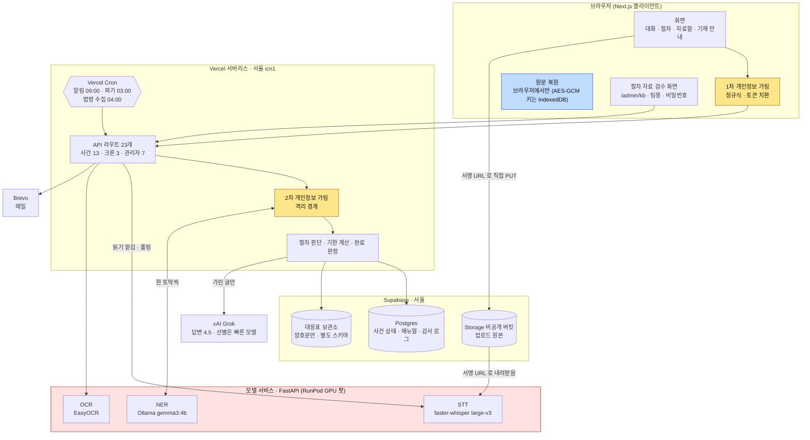
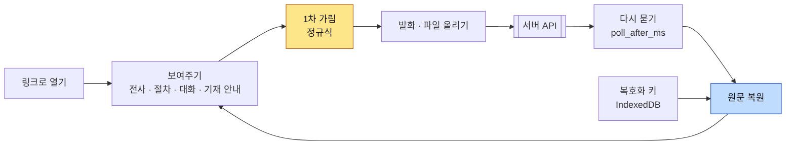
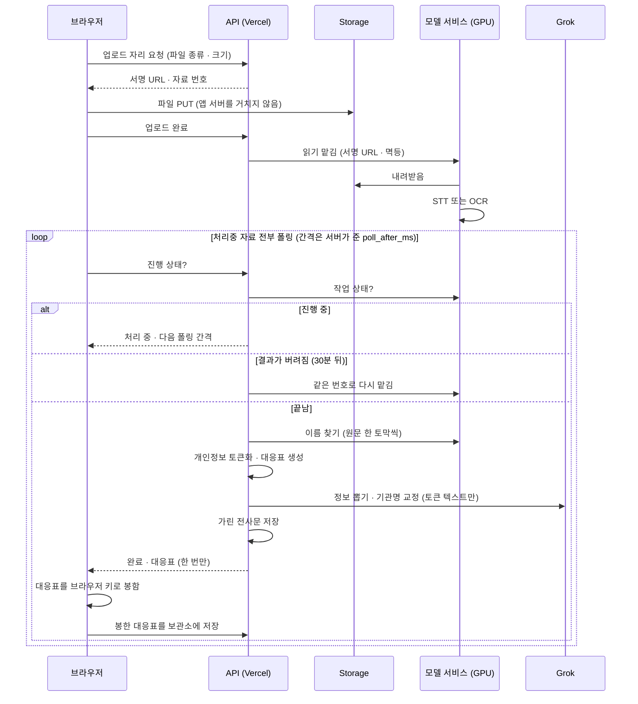
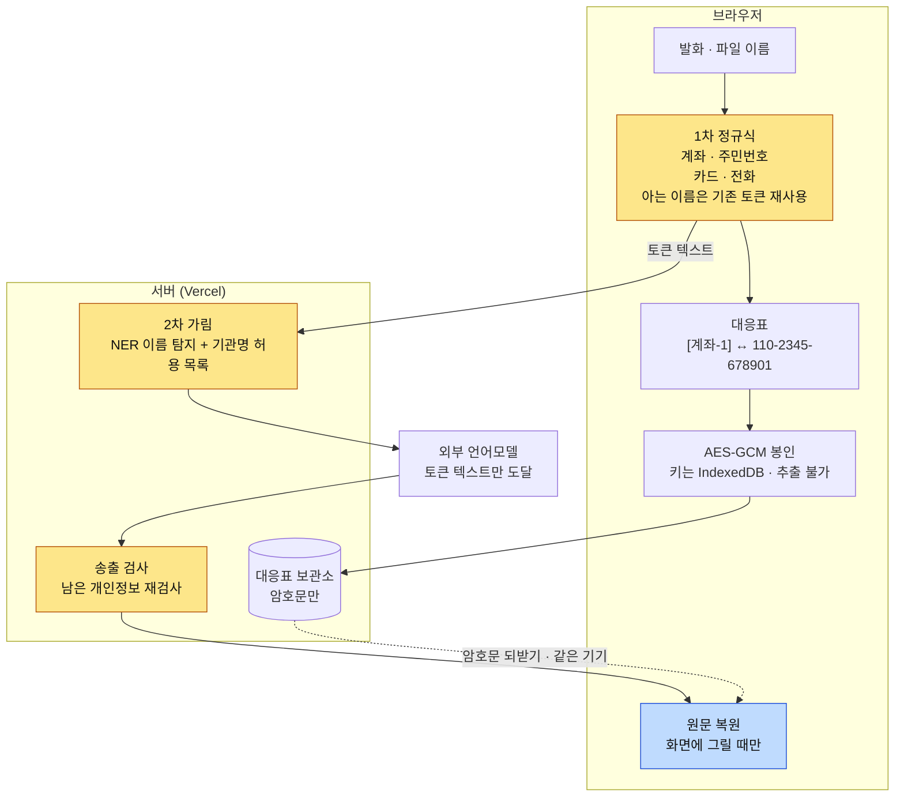
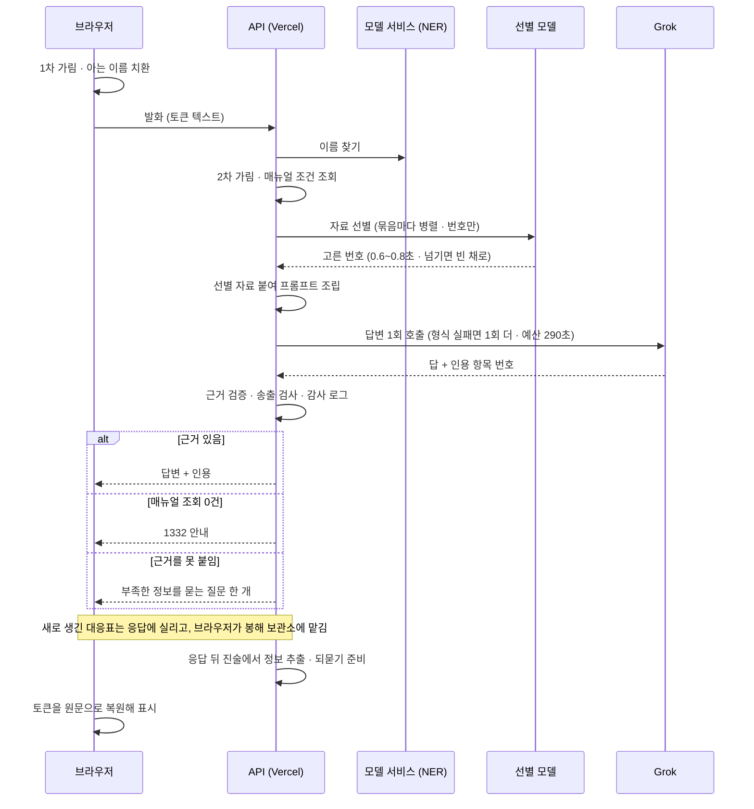
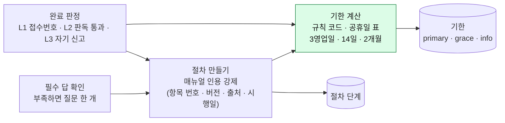
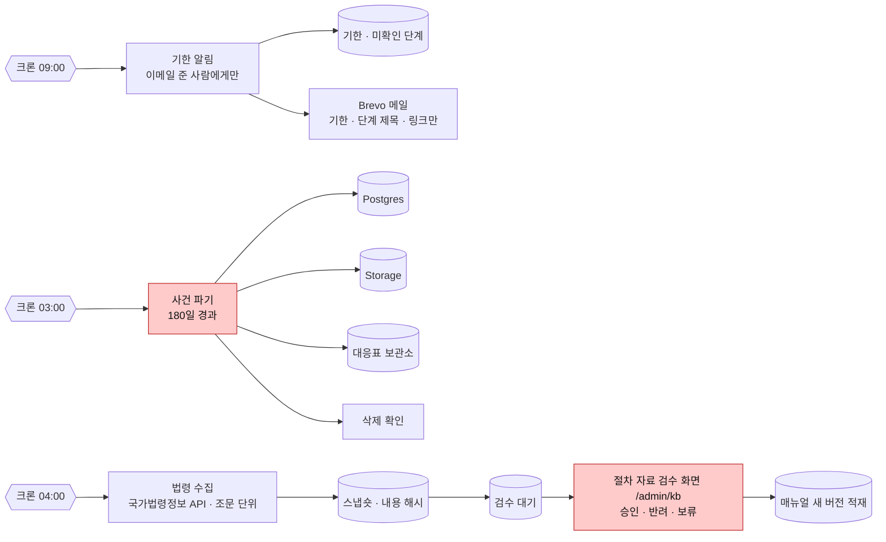
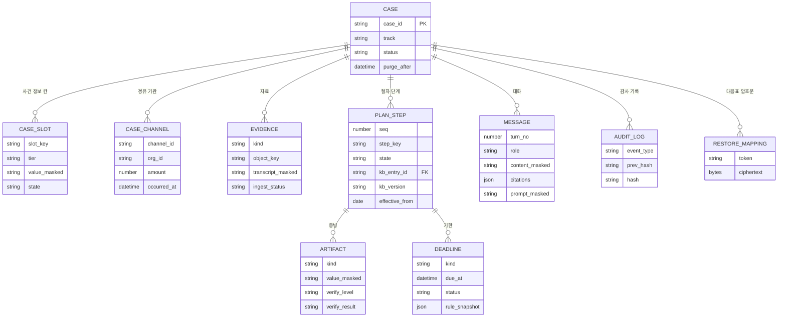
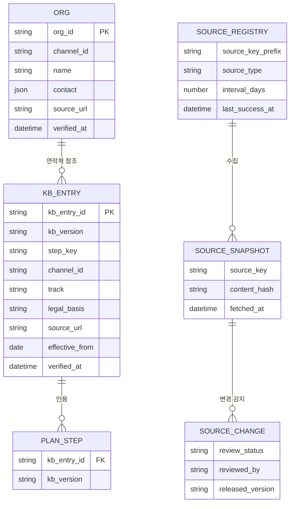

# 2026 금융 AI Challenge 기능 명세서 (FinAlly)

<!-- 이 파일이 원고입니다. 저장(md → hwpx)은 세션에 '기능명세서 저장해' 라고 하면 (첨부2) ... 기능명세서 - FinAlly.hwpx 로 구워 넣습니다.
     규칙: 빈 줄이 문단 경계(hwpx 에도 빈 줄로 들어갑니다). 빈 줄 없이 이어진 줄은 같은 문단 안의 줄바꿈(Shift+Enter).
     mermaid 코드 블록은 hwpx 변환 때 빠지고, 그 아래 [그림 N: 제목] 줄 자리에 그림이 들어갑니다.
     table 코드 블록(| 로 칸 구분, 첫 줄이 머리글)은 그 아래 [표 N: 제목] 줄 자리에 표로 들어갑니다. 표 번호는 문서 순서와 같아야 합니다.
     cards 코드 블록(한 줄이 카드 하나, 앞의 ①② 가 번호 칸)은 그 아래 [카드 N: 제목] 줄 자리에 카드 묶음으로 들어갑니다.
     그림 PNG 는 저장소의 assets/artifacts/plans/09-06-spec-diagrams/ 에 그림1.png ... 순서로 있습니다 (로컬 렌더는 기능명세서-그림/ 에 떨어지고 거기서 복사해 푸시). -->

## 팀명
FinAlly

## 구성원 성명
도재겸 (PM, 팀장)
김태현 (BE, 팀원)

## 1. MVP 구현 범위

보이스피싱 피해자가 진술만으로 사건을 열고, 돈이 지나간 경로에 맞는 절차 계획과 법정 기한을 받고, 증거를 올리고 서류 기재 안내를 보고, 링크 하나로 다시 돌아와 이메일 알림까지 받는 흐름이 실제 서버에서 동작합니다. 배포 주소는 https://fin-ally-khaki.vercel.app 입니다.

■ 풀스택 아키텍처



[그림 1: 전체 구성도] (assets/artifacts/plans/09-06-spec-diagrams/그림1.png 를 이 자리에 삽입)

○ 애플리케이션: Next.js 16(React 19, TypeScript) 한 벌로 화면과 API를 모두 만듭니다. API는 Vercel 서버리스 함수(서울 리전)로 실행되며 사건 API 13개, 크론 API 3개, 관리자 API 7개(절차 자료 검수)가 있습니다. 모든 API는 같은 입구를 지나며 요청 형식 검사, 링크 토큰 검증, 요청 횟수 제한을 거칩니다. 관리자 API와 크론 API 앞에는 인증 관문이 있어 세션 쿠키나 비밀값이 없으면 401로 막습니다.

○ 데이터: Supabase Postgres(서울)에 사건 상태(정보 칸, 절차 단계, 증빙, 기한, 대화), 감사 로그, 절차 매뉴얼, 법령 스냅숏을 둡니다. 토큰과 원문의 대응표는 같은 DB의 별도 스키마에 암호문으로만 저장하고, 서버는 그 암호문을 풀 키를 갖지 않습니다. 업로드한 파일 원본은 Supabase Storage의 비공개 버킷에 두고, 유효 시간이 있는 서명 URL로만 접근합니다.

○ 모델 서비스: 음성 인식, 문자 인식, 이름 탐지는 앱과 따로 도는 Python(FastAPI) 서비스가 맡습니다. 제공하는 API는 작업 접수(POST /jobs), 작업 상태 조회(GET /jobs/{id}), 이름 탐지(POST /ner), 서비스 상태 확인(GET /health) 넷입니다. 심사 기간에는 RunPod GPU 서버에서 실행하고, 예비로 OCI의 CPU 서버를 둡니다.

○ 외부 AI: 상담 답변, 사건 정보 추출, 기관명 교정에 xAI의 Grok 4.5를 씁니다. OpenAI 호환 chat/completions 방식의 HTTP 호출이며 도구 호출 기능은 쓰지 않습니다. 답변 모델 호출은 대화 한 턴에 한 번이고, 그 앞에 같은 제공자의 빠른 모델(grok-4.20-0309-non-reasoning)이 발화에 맞는 추가 자료(다른 유형의 절차, 기관 연락처, 법령 조문)의 번호만 고릅니다. 이 선별은 답변을 막지 않으며 시간을 넘기면 빈 채로 답변으로 갑니다. 답변 모델의 예산은 290초에서 선별에 쓴 시간을 뺀 값이고, 응답 형식이 어긋날 때 한 번 더 시도합니다.

○ 주기 실행과 메일: Vercel Cron이 하루 한 번씩 세 API를 깨웁니다(기한 알림 09:00, 사건 파기 03:00, 법령 수집 04:00, 한국 시간). 메일은 Brevo API로 보냅니다.

○ 배포: GitHub의 main 브랜치에 코드가 합쳐질 때마다 GitHub Actions가 타입 검사와 테스트를 돌린 뒤 Vercel에 배포합니다. 배포가 끝나면 실제 주소에서 Playwright 자동 점검 7건이 돌아 핵심 흐름이 살아 있는지 확인합니다.

■ 사용 모델

○ 음성 인식(STT): faster-whisper large-v3(GPU). CPU 예비 서버에서는 medium 모델을 씁니다. 문자와 대화 캡처는 말풍선이 놓인 좌우 위치로 보낸 사람과 받은 사람을 가릅니다. 통화 녹음은 시간 순서의 줄로 보여주고 누가 말한 줄인지는 가르지 않습니다.

○ 문자 인식(OCR): EasyOCR. 이체 화면, 문자 캡처 같은 이미지에서 글자를 읽습니다.

○ 이름 탐지(NER): Ollama로 띄운 gemma3:4b. 정규식으로는 잡을 수 없는 사람 이름을 찾습니다. 기관 이름을 사람 이름으로 잘못 가리지 않도록 기관명 허용 목록을 함께 씁니다. 위 세 모델은 모두 모델 서비스 안에서만 돌고, 원문은 밖으로 나가지 않습니다.

○ 언어모델(LLM): xAI Grok 4.5. 개인정보가 토큰으로 바뀐 텍스트만 입력으로 받습니다.

○ 자료 선별 모델: xAI grok-4.20-0309-non-reasoning. 토큰 상태의 최근 대화를 보고 후보 자료 가운데 이번 답변에 쓸 것의 번호만 고릅니다. 한 턴에 0.6초에서 0.8초 걸립니다.

■ 구현 범위 (기능 단위)

○ 사건 열기: 개인정보 동의 뒤 상황(돈이 나갔다, 계좌가 묶였다, 잘 모르겠다)을 고릅니다. 자료 제공은 선택이며 건너뛸 수 있습니다. 추측할 수 없는 26자 익명 링크를 발급하고, 이메일은 선택으로 등록합니다.

○ 절차 계획: 돈이 지나간 경로 9가지 유형(은행 이체, 인터넷전문은행, 증권, 간편결제, 가상자산, 대면 전달, 상품권, 소액결제, 카드)과 계좌가 묶인 경우에 맞춰 단계를 만듭니다. 단계마다 매뉴얼 항목 번호, 버전, 출처, 시행일이 붙고, 이 넷 중 하나라도 없는 단계는 DB가 저장을 거부합니다. 정보가 없어도 공통 안전 절차부터 시작합니다.

○ 문진과 정보 채움: 한 번에 한 질문만 묻고 버튼으로 답합니다. 모른다고 답해도 진행되고, 답할 때마다 계획이 다시 만들어집니다. 자유롭게 쓴 진술에서도 금액, 날짜, 경로 같은 값을 뽑아 확인 카드로 되묻고, 맞다고 하면 채웁니다.

○ 기한 관리: 3영업일, 14일 서류 보완 유예, 2개월 채권소멸 공고 같은 법정 기한을 주말과 공휴일 표를 반영한 규칙 코드로 계산해 남은 날짜를 보여주고, 등록한 이메일로 알립니다. 기한 계산에 언어모델은 쓰지 않습니다. 계좌가 묶인 경우의 5영업일은 은행이 결과를 알려 주는 기한이고 금융감독원 원문을 아직 확인하지 못해, 안내 문장으로만 보여주고 날짜로 세지 않습니다.

○ 증거 처리: 녹음, 화면 캡처, 텍스트 파일을 브라우저가 Storage에 직접 올리면 모델 서비스가 글로 바꾸고, 서버가 개인정보를 토큰으로 바꿔 저장합니다. 원문은 올린 브라우저에서만 복원합니다. 글로 바뀐 증거에서 금액, 날짜, 기관 같은 사건 정보를 언어모델이 뽑아 제안하고, 사용자가 확인하면 채워집니다.

○ 상담 대화: 사건 맥락을 아는 상담 답변을 제공합니다. 절차는 매뉴얼에서만 인용하고, 근거가 확인된 답변만 표시합니다. 발화에 맞춰 다른 유형의 절차, 기관 연락처, 법령 조문 원문도 골라 넣습니다. 외부 AI에 나가는 것은 토큰 텍스트뿐이고, 모델 호출은 토큰 상태로 감사 로그에 남습니다.

○ 단계 완료 판정: 접수번호 입력, 증빙 파일 판독, 자기 신고 세 가지 방법으로 판정합니다. 증빙 파일은 판독 결과에 접수번호가 있을 때만 통과합니다. 기관 이름만 보이는 사진은 접수번호를 적어 달라는 안내와 함께 미확인으로 둡니다. 단계가 끝나면 그 단계의 기한은 닫힙니다.

○ 서류 기재 안내: 피해구제 신청서 같은 서류에 무엇을 어느 칸에 적는지 사건 값과 짝지어 보여주고 제출처를 안내합니다.

○ 재진입과 공유: 계정 없이 링크 하나로 같은 사건에 돌아옵니다. 가족에게 링크를 공유하면 같은 화면을 봅니다.

○ 보존과 파기: 마지막 활동일로부터 180일이 지난 사건을 크론이 Postgres, Storage, 대응표 보관소에서 지우고 삭제를 확인합니다.

○ 절차 자료 운영: 국가법령정보 API에서 조문 단위로 법령 변경을 수집해 검수 대기열에 올립니다. 팀은 절차 자료 검수 화면(/admin/kb)에서 변경분을 조문 단위로 승인, 반려, 보류하고, 절차 자료를 고쳐 새 버전으로 적재합니다.

■ 처리 용량과 제한

○ 설계 기준: 심사 기간에 동시에 들어오는 수십 명 규모를 기준으로 잡았습니다. 그 이상의 대량 트래픽에 대한 부하 시험은 하지 않았습니다.

○ 앱 서버: Vercel 서버리스 함수라 요청마다 독립된 실행 환경에서 돌고, 사용자 수에 따라 자동으로 늘어납니다. 상담 API는 실행 시간 상한을 300초로, 판독 수거 API는 120초로 두었습니다. 데이터베이스에는 연결 풀(트랜잭션 풀러)을 통해 함수당 연결 하나만 쓰므로, 함수가 늘어나도 DB 연결 수가 그만큼 늘지 않습니다.

○ 요청 횟수 제한: 사람이 읽고 답하는 속도의 몇 배를 상한으로 두고, 넘으면 429와 함께 남은 대기 시간을 돌려줍니다. 없는 링크를 계속 찔러 보는 시도는 IP 기준으로 따로 막습니다. 카운터는 Postgres 표에 두어 서버리스 인스턴스 사이에 공유하고, 표에 문제가 있어도 정상 사용을 막지 않도록 그때는 그 인스턴스 안에서만 셉니다.

```table
무엇 | 기준 | 상한
상담 대화 | 사건당 | 1분에 20회
문진 답 | 사건당 | 1분에 60회
대응표 맡기기 | 사건당 | 1분에 60회
그 외 조회 (폴링 포함) | 세션당 | 1분에 300회
사건 생성 | IP당 | 1시간에 20건
없는 링크 조회 | IP당 | 1분에 10회
관리자 로그인 | IP당 | 10분에 10회
```

[표 1: 요청 횟수 제한] (표는 원고의 table 블록에서 만들어집니다)

○ 파일: 사건당 파일 30개, 총 300MB까지입니다. 파일은 브라우저가 Storage에 직접 올리므로 앱 서버의 요청 크기 한계와 대역폭을 쓰지 않습니다.

○ 모델 서비스: GPU 서버 한 대가 맡습니다. 접수된 작업은 응답을 기다리게 하지 않고 즉시 배경에서 돌며, 결과는 메모리에 30분 보관됩니다. 실측 처리 시간은 문자 캡처 1분 안팎, 3분 30초짜리 통화 녹음 2분 정도입니다. 여러 작업이 한꺼번에 들어오면 한 GPU에서 나눠 처리하므로 개별 처리 시간이 길어질 수 있습니다. 서버가 다시 뜨면 진행 중이던 작업은 사라지고, 앱이 같은 자료 번호로 다시 맡깁니다.

○ 외부 언어모델: 대화 한 턴에 답변 모델 한 번과 선별 모델 호출이 있고, 답변 모델은 290초 예산을 넘기면 끊습니다. 상담 응답 시간은 외부 서비스의 응답 지연이 좌우합니다.

## 2. 주요 기능 목록

아래 기능은 모두 현재 배포본에서 동작합니다(구현 상태: 완료).

① 사건 열기와 링크 발급
설명: 개인정보 동의 뒤 상황을 고르고, 자료는 선택으로 올리거나 건너뛰고, 익명 링크를 발급받아 사건 화면으로 들어갑니다. 이메일을 등록하면 기한 알림을 받습니다.
관련 화면: 시작 화면(/start), 링크 발급 화면
관련 API: POST /api/cases, PUT /api/cases/{token}/contact

② 유형별 절차 계획 생성
설명: 진술과 문진으로 돈이 지나간 경로를 가려내고, 매뉴얼에서 사건 상황(피해 유형, 경로, 기관, 오늘 날짜, 매뉴얼 버전)에 맞는 항목을 골라 단계를 만듭니다. 단계마다 근거와 시행일이 붙고, 지금 할 일이 맨 위에 옵니다.
관련 화면: 사건 화면(/c/{token})의 할 일 목록과 워크스페이스
관련 API: GET /api/cases/{token}/plan

③ 한 번에 한 질문 문진
설명: 계획을 정밀하게 만드는 데 필요한 정보만 버튼 위주로 묻습니다. 기억이 안 난다고 답해도 진행되며, 답하면 계획이 다시 만들어집니다. 자유 진술에서도 같은 추출기가 값을 뽑아 확인 카드로 되묻습니다.
관련 화면: 사건 화면의 대화
관련 API: PATCH /api/cases/{token}/slots/{slot_key}

④ 법정 기한 계산과 이메일 알림
설명: 3영업일, 14일 유예, 2개월 공고 같은 기한을 주말과 공휴일을 반영한 규칙으로 계산해 남은 날짜를 보여줍니다. 등록한 이메일로 매일 한 번 다가온 기한과 아직 확인되지 않은 단계를 알립니다. 메일에는 기한, 단계 제목, 사건 링크만 실립니다.
관련 화면: 사건 화면의 할 일(남은 날짜 표시), 알림 이메일
관련 API: GET /api/cases/{token}/deadlines, GET /api/cron/reminders

⑤ 증거 업로드와 텍스트화
설명: 녹음, 화면 캡처, 텍스트 파일을 브라우저가 Storage에 직접 올리면 모델 서비스가 음성 인식 또는 문자 인식으로 글로 바꾸고, 서버가 계좌번호 같은 값을 토큰으로 바꿔 보관합니다. 문자와 대화 캡처는 말풍선 위치로 보낸 사람과 받은 사람을 갈라 보여주고, 통화 녹음은 시간 순서의 줄로 보여줍니다. 화자를 갈라내는 기능은 아직 없고 화면이 그렇다고 알립니다. 원문은 올린 브라우저에서만 복원해 보여줍니다.
관련 화면: 자료함
관련 API: POST /api/cases/{token}/evidence, POST .../evidence/{id}/complete, GET .../evidence/{id}

⑥ 증거에서 사건 정보 자동 추출
설명: 글로 바뀐 증거(토큰 상태)에서 금액, 날짜, 기관 같은 값을 언어모델이 뽑아 제안합니다. 사용자가 맞다고 한 번 누르면 사건에 채워집니다. 확신도 0.7 미만인 값은 제안하지 않습니다. 전사문의 기관 이름은 공식 명칭으로 맞춥니다.
관련 화면: 사건 화면의 대화
관련 API: GET .../evidence/{id}(제안 값 포함), PATCH .../slots/{slot_key}

⑦ 상담 대화
설명: 사건 맥락을 아는 상담 답변을 제공합니다. 절차는 매뉴얼에서만 인용하고 근거가 확인된 답변만 표시합니다. 발화에 맞춰 다른 유형의 절차, 기관 연락처, 법령 조문 원문을 빠른 모델이 골라 답변 재료에 더합니다. 답변 아래 근거 줄에 인용한 매뉴얼 항목과 시행일이 붙고, 모델 호출은 토큰 상태로 감사 로그에 남습니다.
관련 화면: 사건 화면의 대화
관련 API: POST /api/cases/{token}/messages, GET /api/cases/{token}/messages

⑧ 단계 완료 판정
설명: 접수번호 입력, 증빙 파일 판독, 자기 신고 중 하나로 단계 완료를 판정하고 다음 단계를 엽니다. 워크스페이스에 올린 증빙 파일은 판독 결과에 접수번호가 있을 때만 완료로 인정합니다. 기관 이름만 보일 때는 접수번호를 적어 달라는 안내와 함께 확인하지 못한 상태로 둡니다. 자료함에 올린 자료는 증거로만 쓰고 완료 판정에는 쓰지 않습니다. 단계가 끝나면 그 단계의 기한은 닫힙니다.
관련 화면: 워크스페이스
관련 API: POST /api/cases/{token}/steps/{step_id}/artifacts

⑨ 서류 기재 안내
설명: 피해구제 신청서 같은 서류에 무엇을 어느 칸에 적는지 사건 값과 짝지어 보여주고 제출처를 안내합니다. 값의 원문 복원은 브라우저에서만 일어나고, 서버는 완성 문서를 만들지 않습니다.
관련 화면: 기재 안내
관련 API: GET /api/cases/{token}(합본 조회)

⑩ 링크 재진입과 가족 공유
설명: 계정 없이 링크 하나로 어느 기기에서든 같은 사건으로 돌아옵니다. 없는 링크는 404로, 형식이 틀린 링크는 서버에 닿기 전에 400으로 거릅니다. 링크를 마구 넣어 보는 시도에 서버 자원이 쓰이지 않게 하기 위해서입니다. 가족에게 링크를 보내면 같은 화면을 봅니다.
관련 화면: 사건 화면 헤더의 가족에게 링크 보내기
관련 API: GET /api/cases/{token}, POST 및 GET /api/cases/{token}/vault(대응표 암호문 맡기기와 되받기)

⑪ 보존기간 관리와 자동 파기
설명: 마지막 활동일로부터 180일이 지난 사건을 매일 자동으로 Postgres, Storage, 대응표 보관소에서 삭제하고, 저장소마다 삭제를 다시 확인합니다.
관련 화면: 없음(서버에서 자동 실행)
관련 API: GET /api/cron/purge

⑫ 법령 변경 자동 수집
설명: 매일 새벽 국가법령정보 API에서 등록된 법령을 조문 단위로 가져와 스냅숏으로 보관하고, 내용이 달라진 조문을 변경으로 잡아 검수 대기열에 올립니다. 수집은 앱과 분리되어 있어 실패해도 사건 진행에는 영향이 없습니다.
관련 화면: 없음(크론)
관련 API: GET /api/cron/kb-collect

⑬ 절차 자료 검수 화면
설명: 팀이 비밀번호로 들어가는 관리자 화면입니다. 로그인할 때 검수자 이름과 비밀번호를 넣는데, 이름은 계정이 아니라 누가 판단했는지 기록에 남기는 표시라 어떤 이름을 넣어도 들어갑니다. 받은편지함처럼 대기 중인 변경분을 조문 기준 또는 매뉴얼 기준으로 보고, 조문의 직전 원문과 이번 원문, 그 조문을 근거로 삼는 매뉴얼 항목을 함께 봅니다. 조문과 매뉴얼은 법 조항 번호로 규칙에 따라 잇고 모델은 쓰지 않습니다. 판단은 조문 단위로 승인, 반려, 보류이며 이력이 남습니다. 승인 뒤 절차 자료를 고쳐 새 버전으로 적재해야 안내에 반영됩니다. 피해자 화면 어디에서도 이 화면으로 가는 링크는 없습니다.
관련 화면: 절차 자료 검수 화면(/admin/kb)
관련 API: POST /api/admin-login, POST /api/admin/logout, GET /api/admin/kb/queue, GET /api/admin/kb/changes/{id}, POST /api/admin/kb/changes/{id}/decision, GET /api/admin/kb/entries, GET /api/admin/kb/history

## 3. 사용자 이용 흐름



[그림 2: 브라우저 쪽 흐름] (assets/artifacts/plans/09-06-spec-diagrams/그림2.png 를 이 자리에 삽입)

```cards
① 배포 주소에 접속해 첫 화면의 지금 시작하기를 누릅니다.
② 시작 화면에서 개인정보 동의를 하고, 무슨 일이 있었는지 고릅니다(내 돈이 나갔어요, 내 계좌가 갑자기 묶였어요, 잘 모르겠어요). 자료가 있으면 올리고, 없으면 건너뛰고 바로 시작합니다. 이메일은 넣어도 되고 안 넣어도 됩니다.
③ 링크가 발급됩니다. 이 링크가 열쇠이므로 저장하도록 안내하고, 사건 화면으로 들어갑니다.
④ 사건 화면의 왼쪽에는 지금 할 일(예: 112 신고 뒤 접수번호 입력)과 할 일 목록이, 오른쪽에는 대화가 있습니다. 대화의 첫 질문(어떤 방법으로 보내셨나요)에 버튼으로 답하면 계획이 그 유형에 맞게 다시 만들어집니다.
⑤ 자료함을 열어 올린 증거가 글로 바뀐 결과, 토큰으로 가려진 부분, 원문 복원을 확인하고 자료를 더 올립니다. 증거에서 읽어낸 사건 정보는 대화에서 확인해 채웁니다.
⑥ 기재 안내를 열어 서류 항목과 사건 값이 짝지어진 것과 제출처를 봅니다.
⑦ 단계를 진행하며 접수번호를 입력하거나 증빙을 올리면 판정 결과에 따라 완료되고 다음 단계가 열립니다. 피해구제 신청까지 완료하면 서류 제출 기한이 남은 날짜와 함께 붙습니다. 궁금한 것은 대화에 자유롭게 묻습니다.
⑧ 화면을 닫았다가 며칠 뒤 저장한 링크로 다시 들어오면 같은 사건이 그대로 있습니다. 확정된 기한은 이메일로 알림이 옵니다. 사건 종료는 사용자가 정하고, 마지막 활동일로부터 180일이 지나면 자동으로 삭제됩니다.
```

[카드 1: 이용 흐름 여덟 단계] (카드는 원고의 cards 블록에서 만들어집니다)

## 4. AI 및 데이터 처리 방식

■ AI가 수행하는 역할과 입출력

① 상담 답변 생성: 모델은 xAI Grok 4.5입니다. 입력은 토큰으로 가린 사용자 발화, 대화 이력, 사건 상태, 매뉴얼에서 골라낸 절차 항목, 그리고 선별 자료를 정해진 틀에 맞춰 붙인 프롬프트입니다. 선별 자료는 같은 제공자의 빠른 모델이 최근 대화를 보고 후보(현재 릴리스의 모든 절차 항목, 기관 연락처, 법령 조문 원문) 가운데 최대 5개의 번호만 고른 것입니다. 사용자 글과 전사문은 따로 표시해 넣어 모델이 그 안의 문장을 지시로 읽지 않게 합니다. 출력 형식은 고정되어 있습니다. 답변 문장과 인용한 매뉴얼 항목 번호를 정해진 JSON 구조로만 받고, 구조를 벗어난 응답은 한 번 더 시도한 뒤 버립니다. 모델이 자유 형식으로 절차를 서술할 수 없게 해 지어낸 내용이 섞일 자리를 없애는 장치입니다. 서버는 인용 번호가 실제로 프롬프트에 든 항목 안에 있는지 확인한 뒤 셋 중 하나로 응답합니다. 근거가 있을 때는 답변을 보내고, 매뉴얼에 해당 항목이 없을 때는 1332(금융감독원) 안내를 보내고, 근거를 붙이지 못할 때는 부족한 정보를 묻는 질문 하나를 보냅니다. 보내기 전에 남은 개인정보가 없는지 다시 검사합니다.

② 사건 정보 추출과 기관명 교정: 모델은 같은 Grok입니다. 입력은 토큰 상태의 전사문 또는 사용자 발화이고, 출력은 금액, 시각, 상대 계좌 토큰, 사칭한 기관 같은 후보 값과 공식 명칭으로 맞춘 기관 이름입니다. 확신도 0.7 이상인 값만 제안하고, 사용자가 화면에서 맞다고 누를 때만 사건에 확정됩니다. 추출은 응답을 보낸 뒤에 돌아 대화 지연에 더해지지 않습니다.

③ 이름 탐지(NER): 모델은 모델 서비스 안의 Ollama gemma3:4b입니다. 입력은 정규식 1차 가림을 마친 텍스트 한 토막이고, 출력은 사람 이름의 위치입니다. 기관명 허용 목록은 프롬프트가 아니라 코드로 적용해, 기관 이름을 사람 이름으로 잘못 가리는 일을 막습니다. 자체 평가셋(가상 발화 40건) 기준으로 깨끗한 문장에서 누출 0%, 과차단 0%였습니다. 평가셋 밖에서는 기관 이름 일부를 사람 이름으로 잘못 가리는 사례가 배포본 점검에서 나와 허용 목록을 넓히고 있습니다. 한 글자 조각은 이름으로 받지 않습니다(이름은 2자 이상, 전사문의 숫자 조각은 2자리 이상). 모델이 조사 한 글자를 이름으로 낸 사례를 배포본 점검에서 잡아 넣은 규칙입니다.

④ 음성 인식과 문자 인식: 모델은 faster-whisper large-v3와 EasyOCR입니다. 입력은 Storage에 있는 녹음과 이미지 원본이고, 출력은 텍스트입니다. 모델 서비스 안에서만 돌며 원본과 원문 텍스트는 밖으로 나가지 않습니다. 전사와 판독을 거친 뒤 정규식이 놓치는 개인정보의 비율을 직접 재어(음성 9.1%, 이미지 5.7%) 그 빈틈을 2차 가림이 메우도록 설계했고, 측정 방법과 평가 자료는 소스 저장소에 공개합니다.

■ 자료 업로드, 판독, 폴링 파이프라인



[그림 3: 자료 업로드와 판독, 폴링 시퀀스] (assets/artifacts/plans/09-06-spec-diagrams/그림3.png 를 이 자리에 삽입)

○ 파일은 앱 서버를 거치지 않고 브라우저가 Storage에 직접 올립니다. 서버리스 함수가 받을 수 있는 요청 크기에 한계가 있고, 원본이 앱 서버 메모리를 거치지 않게 하기 위해서입니다.

○ 판독은 맡겨 두고 결과를 되묻는 방식(폴링)입니다. 모델 서비스가 결과를 먼저 보내오지 않습니다. 브라우저가 처리 중인 자료 전부에 대해, 어느 화면에 있든, 서버가 알려준 간격(poll_after_ms)으로 진행 상태를 묻습니다. 모델 서비스가 30분이 지나 결과를 버렸을 때는 같은 자료 번호로 다시 맡깁니다. 같은 자료로 접수 요청이 두 번 와도 모델을 두 번 돌리지 않습니다.

○ 텍스트 파일로 올린 자료는 모델 서비스에 맡기지 않고 바로 가림 단계로 갑니다.

○ 녹음과 이미지의 원문 텍스트는 서버 쪽에서 만들어지므로 대응표도 서버가 한 번 만듭니다. 서버는 그 대응표를 브라우저에 한 번 넘기고 자기 쪽에서는 지웁니다. 브라우저는 자기 키로 봉해 보관소에 다시 맡깁니다. 그 뒤 서버에는 암호문만 남습니다.

■ 개인정보 가림(PII 게이트)의 동작



[그림 4: 개인정보 가림과 복원의 경계] (assets/artifacts/plans/09-06-spec-diagrams/그림4.png 를 이 자리에 삽입)

○ 대화를 보낼 때: 브라우저가 발화를 보내기 전에 정규식으로 계좌번호, 주민등록번호, 카드번호, 전화번호를 [계좌-1] 같은 토큰으로 바꿉니다. 이미 알고 있는 이름은 기존 토큰을 다시 씁니다. 토큰과 원문의 대응표는 브라우저가 AES-GCM으로 봉해 보관소에 맡기고, 그 키는 브라우저의 IndexedDB에 꺼낼 수 없는 형태로 둡니다. 서버는 받은 토큰 텍스트를 이름 탐지 모델로 한 번 더 훑어 이름을 가린 뒤에야 언어모델에 보냅니다. 응답은 토큰 상태로 돌아오고, 브라우저가 화면에 그릴 때만 원문으로 되돌립니다.

○ 녹음과 이미지를 판독할 때: 원문 텍스트는 모델 서비스와 앱 서버 사이에서만 오갑니다. 앱 서버가 정규식(1차)과 이름 탐지(2차)로 토큰화하고 대응표를 만든 뒤, 대응표를 브라우저에 한 번 넘기고 자기 쪽에는 남기지 않습니다. 브라우저가 봉해 보관소에 맡기는 것은 대화와 같습니다.

○ 다른 기기로 링크를 열 때: 보관소의 암호문을 받아도 그 기기에는 키가 없어 값이 토큰 채로 보입니다. 화면은 이것을 고장이 아니라 설계된 동작으로 안내합니다.

○ 송출 검사와 감사 기록: 언어모델 응답이 사용자에게 나가기 전에 남은 개인정보 패턴을 다시 검사합니다. 감사 로그는 모델 호출, 사건 생성, 파기, 정보 확정을 토큰 상태로 기록하고, 앞 기록의 해시를 다음 기록에 이어 적어 나중에 고쳐진 기록을 찾아낼 수 있게 합니다.

■ 상담 한 턴의 파이프라인



[그림 5: 상담 한 턴 시퀀스] (assets/artifacts/plans/09-06-spec-diagrams/그림5.png 를 이 자리에 삽입)

○ 상담은 검색 증강 생성(RAG) 구조입니다. 답변 전에 서버가 DB에서 이 사건에 맞는 절차 항목, 기관 연락처, 법령 조문을 꺼내 프롬프트에 넣고, 모델은 그 안에서만 답합니다. 매뉴얼 항목은 벡터 검색이 아니라 조건 조회로 고릅니다. 사건의 피해 유형, 돈이 지나간 경로, 기관, 오늘 날짜, 매뉴얼 버전을 서버가 조건으로 넣어 해당하는 항목만 꺼냅니다. 언어모델은 이 조건을 바꿀 수 없고, 꺼내지 않은 항목은 볼 수 없습니다.

○ 답변에 붙은 인용은 꺼낸 항목의 번호여야 합니다. 없는 번호를 인용한 문장은 화면에 나가지 않습니다.

○ 조건 조회에 들지 않은 자료는 선별 모델이 보탭니다. 발화가 다른 유형의 절차, 기관 연락처, 법령 조문을 요구할 때 빠른 모델이 후보에서 번호만 고르고, 본문은 서버가 매뉴얼과 법령 스냅숏에서 꺼내 넣습니다. 연락처는 진행이 막혔다고 말할 때만, 조문은 근거나 법 조항을 물을 때만 고릅니다. 선별이 늦거나 실패해도 답변은 그대로 진행됩니다.

■ 절차 생성, 기한 계산, 완료 판정



[그림 6: 절차 생성과 기한, 완료 판정] (assets/artifacts/plans/09-06-spec-diagrams/그림6.png 를 이 자리에 삽입)

○ 절차 단계는 매뉴얼 항목을 인용해야만 만들어집니다. 인용 정보가 없는 단계는 DB가 저장을 거부합니다. 그래서 언어모델이 절차를 지어낼 수 없습니다.

○ 기한은 세 종류입니다. 본 기한(primary), 보완 유예(grace), 기관이 하는 일의 예정 시점(info)입니다. 남은 날짜는 서버가 계산해 내려주고 화면은 날짜를 계산하지 않습니다. 기준일은 사용자가 답한 날짜가 있을 때는 그 날짜이고, 없을 때는 증빙에서 읽은 날짜입니다.

○ 증빙 파일로 완료를 판정할 때는 워크스페이스에 올린 파일의 판독 결과에 접수번호가 있을 때만 통과시킵니다. 기관 이름만 있을 때는 미확인으로 두고 접수번호를 적도록 안내합니다. 사기 문자에는 수사기관 이름이 거의 늘 들어 있어 이름만으로 통과시키면 뚫리기 때문입니다. 판독이 끝나기 전에는 보류합니다.

■ 주기 작업



[그림 7: 하루 한 번 도는 세 작업] (assets/artifacts/plans/09-06-spec-diagrams/그림7.png 를 이 자리에 삽입)

○ 크론 API는 비밀값이 맞을 때만 실행됩니다. 같은 기한에 알림을 두 번 보내지 않도록 발송 기록을 남깁니다.

○ 절차 자료 검수 화면은 팀용입니다. 비밀번호 하나로 들어가고(scrypt 해시로 대조, 로그인 시도는 IP당 10분에 10회), 함께 넣는 검수자 이름은 계정이 아니라 판단 기록에 남기는 표시입니다. 조문과 매뉴얼은 법 조항 번호로 규칙에 따라 잇습니다. 판단은 조문 단위이고 이력이 남습니다.

■ 데이터 모델



[그림 8: 데이터 모델(ERD) 사건 데이터] (assets/artifacts/plans/09-06-spec-diagrams/그림8.png 를 이 자리에 삽입)



[그림 9: 데이터 모델(ERD) 매뉴얼과 법령 수집] (assets/artifacts/plans/09-06-spec-diagrams/그림9.png 를 이 자리에 삽입)

○ 사건(case)을 뿌리로 정보 칸, 경유 기관, 자료, 절차 단계, 기한, 대화, 감사 기록이 매달립니다. 개인정보가 들어갈 수 있는 칸은 이름이 masked로 끝나고 토큰 상태로만 저장됩니다.

○ 절차 단계는 매뉴얼 항목(kb_entry)을 외래 키로 가리키고 버전, 출처, 시행일을 함께 적습니다. 그래서 어느 근거로 만들어졌는지 언제든 되짚을 수 있습니다.

○ 대응표(restore_mapping)는 별도 스키마에 토큰과 암호문만 둡니다. 원문도 키도 없습니다.

○ 요청 횟수 제한의 창(rate_limit_window)도 Postgres에 두어 서버리스 인스턴스 사이에 같은 값을 셉니다.

○ 원문 개인정보가 남는 곳은 셋 중 하나뿐입니다. Postgres의 공개 스키마에는 없습니다. 대응표 보관소에는 암호문만 있고 서버는 키가 없습니다. Storage에는 업로드 원본이 있으나 비공개 버킷에 사건별로 두고 사건과 함께 파기합니다.

■ 사용 데이터

○ 절차 매뉴얼: 통신사기피해환급법과 시행령, 금융감독원 안내, 그리고 은행과 카드사와 통신사와 거래소마다 다른 접수 창구와 정책을 하나의 절차 자료로 통합했습니다. 절차 35건(2026년 9월 기준 시행 중인 것은 33건), 기관 연락처 51곳, 공공기관 5곳이며, 모든 유형에 공통인 항목 위에 유형별 항목과 기관 전용 항목이 덮어쓰는 세 겹 구조라 사건의 기관에 맞는 절차와 창구가 골라집니다. 항목마다 법적 근거, 출처 URL, 시행일이 붙고 버전으로 관리합니다. 앱이 인용하는 버전은 환경 설정으로 고정합니다.

○ 법령 스냅숏: 국가법령정보 API에서 조문 단위로 가져온 원문과 내용 해시입니다. 등록한 소스는 통신사기피해환급법과 시행령 둘이고, 제출 시점에 조문 58개가 들어 있습니다. 조문 원문은 검수와 무관하게 상담의 선별 후보에 오릅니다.

○ 공휴일 표: 영업일 계산에 씁니다. 코드 안의 표이며 임시공휴일은 들어 있지 않습니다.

○ 사용자 데이터: 진술, 문진 답, 올린 증거 파일, 선택 등록한 이메일입니다. 텍스트는 토큰 상태로, 증거 원본은 비공개 버킷에 저장합니다.

○ 평가용 데이터: 개인정보 가림 성능을 재기 위해 가상의 진술 40건(가려야 할 값 33개, 가리면 안 되는 값 80개)과 가상의 증거 화면을 직접 만들었습니다. 실제 피해자 데이터는 쓰지 않았습니다.

■ 개인정보와 민감정보 처리 요약

○ 개인정보를 처리합니다. 계좌번호, 주민등록번호, 전화번호, 카드번호는 사용자 브라우저 안에서 토큰으로 바뀐 뒤에 전송됩니다. 토큰과 원문의 대응표는 브라우저가 봉한 암호문으로만 서버에 보관되고, 키는 브라우저에만 있어 서버는 원문을 알 수 없습니다.

○ 외부 언어모델에는 토큰 텍스트만 보냅니다. 이름 같은 2차 탐지는 자체 GPU 서버 안의 모델이 맡으며, 제출 시점 배포본에 켜져 있습니다.

○ 증거 원본은 비공개 버킷에 사건별로 저장하고 마지막 활동일로부터 180일 뒤 자동 삭제합니다. 신분증은 올리지 않도록 화면에서 안내합니다.

## 5. MVP 검증 방법

■ 확인 절차 (계정과 설치가 필요 없습니다)

○ 미리 만들어 둔 예시 사건이 둘 있습니다. 사건을 새로 만들지 않고 바로 화면을 보시려면 아래 링크를 여시면 됩니다. 둘 다 시중은행 계좌이체 상황이고 문진 답이 채워져 있어 계획과 근거가 서 있습니다.

  갓 만든 사건(피해 발생 직후): https://fin-ally-khaki.vercel.app/c/YETMRTB01BMJTBA8RRQJBF7A8Y

  진행이 더 된 사건(지급정지와 피해구제 신청 날짜까지 답한 상태): https://fin-ally-khaki.vercel.app/c/BET1YDKB9EVBGPKJT942RCFVEC

○ 예시 사건은 심사위원 여러 분이 같은 사건을 여는 것이라 한 분이 단계를 완료하면 다른 분에게도 그 상태로 보입니다. 처음부터 끝까지 혼자 걸어 보시려면 아래 ①부터 사건을 새로 만드시는 편이 낫습니다.

① https://fin-ally-khaki.vercel.app 에 접속해 지금 시작하기를 누릅니다.

② 동의에 체크하고 내 돈이 나갔어요를 고릅니다. 자료 단계의 예시 자료로 체험하기 칩을 누르면 가상의 증거 세 개(통화 녹음, 이체 화면, 문자 캡처)가 한 번에 담깁니다. 이메일은 비워 두어도 됩니다. 다음을 누르면 링크가 발급되고 사건 화면이 열립니다.

③ 사건 화면의 할 일에 112 신고, 지급정지 요청, 명의도용 점검 세 단계가 근거와 함께 보이는지 확인합니다. 대화의 첫 질문(어떤 방법으로 보내셨나요)에 버튼으로 답합니다. 예시 자료를 담았을 때는 올린 자료에서 찾은 보낸 금액입니다: 32,000,000원. 맞나요? 같은 확인 카드가 먼저 오고, 맞다고 답하면 사건에 채워집니다. 단계를 완료할수록 다음 단계가 열립니다.

④ 자료함을 열어 증거가 글로 바뀐 것(문자 캡처는 1분 안팎, 통화 녹음은 2분 정도 걸립니다), 계좌번호가 토큰으로 바뀐 것, 그 자리에서 원문이 복원되어 보이는 것을 확인합니다.

⑤ 대화에 자유롭게 묻습니다. 예: 지급정지는 어디에 전화하나요. 근거가 붙은 답변이 오고, 답변 아래 근거 줄에 인용한 매뉴얼 항목과 시행일이 보입니다.

⑥ 워크스페이스의 접수번호 칸에 임의의 번호를 넣으면 받아 적은 것으로 기록되어 단계가 완료되고 다음 단계가 열립니다. 증빙 파일로 완료할 때는 워크스페이스의 증빙 자리에 접수번호가 보이는 캡처를 올립니다. 판독이 끝나면 통과 여부가 표시됩니다. 시연용 증빙 세 장은 https://fin-ally-khaki.vercel.app/demo/receipt-relief.png (피해구제 신청 접수증), https://fin-ally-khaki.vercel.app/demo/receipt-112.png (112 신고 접수 문자), https://fin-ally-khaki.vercel.app/demo/notice-freeze.png (채권소멸절차 개시 공고 통지)에서 내려받을 수 있습니다. 모두 합성 자료입니다. 지급정지 요청과 피해구제 신청을 접수번호로 완료하면 신청서류 제출 단계에 남은 날짜가 붙고(본 기한 3영업일, 보완 유예 14일), 완료된 단계의 기한 표시는 사라집니다.

⑦ 헤더의 가족에게 링크 보내기로 링크를 복사한 뒤 새 창에서 열면 같은 사건이 그대로 열립니다. 기재 안내를 열어 서류 항목과 사건 값이 짝지어진 것을 확인합니다.

⑧ (선택) https://fin-ally-khaki.vercel.app/admin/kb 에 심사용 관리자 비밀번호 ri7aE6XdVWo2Ux4ecUdoZy6r 로 들어가면 법령 변경 검수 화면을 볼 수 있습니다. 로그인 카드의 검수자 이름 칸에는 아무 이름이나 넣으시면 됩니다. 계정이 아니라 판단 기록에 남기는 표시일 뿐이고, 비밀번호만 맞으면 들어갑니다. 대기 중인 조문의 직전 원문과 이번 원문, 그 조문에 닿는 매뉴얼 항목이 보이고 승인, 반려, 보류를 기록할 수 있습니다.

■ 화면 확인과 서버 동작의 대응

위 확인 절차의 각 걸음이 서버에서 어떤 API를 거치고 무엇으로 통과를 판단하는지입니다. 저희 QA도 같은 표를 따라 걷습니다.

```table
화면에서 하는 일 | 뒤에서 일어나는 일 (API) | 통과 기준
② 상황을 고르고 사건 열기 | POST /api/cases 가 사건과 26자 링크 토큰을 만듭니다 | 발급된 링크로 같은 사건이 다시 열립니다. 없는 링크는 404, 형식이 틀린 링크는 400
③ 할 일 3단계와 근거 보기 | GET .../plan 이 매뉴얼에서 조건에 맞는 항목을 골라 단계를 만듭니다 | 단계마다 매뉴얼 항목 번호, 버전, 출처, 시행일이 있습니다
③ 첫 질문에 버튼으로 답하기 | PATCH .../slots/{칸} 이 값을 저장하고 계획을 다시 만듭니다 | 응답에 계획을 다시 만들었다는 표시가 있고, 단계가 유형에 맞게 바뀝니다
④ 자료함에서 글로 바뀐 증거 보기 | POST .../evidence 로 자리를 받고, Storage 에 직접 올리고, 완료를 알린 뒤 GET .../evidence/{id} 로 되묻습니다 | 상태가 done 이 되고, 전사문에 [계좌-1] 같은 토큰은 있고 원문 계좌번호는 없습니다
④ 같은 기기에서 원문 복원 보기 | 대응표 암호문을 POST .../vault 로 맡기고 GET .../vault 로 되받습니다 | 되받은 암호문이 맡긴 것과 같고, 다른 기기로 열 때는 토큰 채로 보입니다
⑤ 대화에 묻기 | POST .../messages 가 2차 가림, 매뉴얼 조회, 모델 호출 1회, 근거 검증을 거칩니다 | 답변의 인용 번호가 조회한 항목 안에 있고, 근거 줄에 그 항목과 시행일이 보입니다
⑥ 접수번호 입력 또는 증빙 올리기 | POST .../steps/{단계}/artifacts 가 접수번호 또는 판독 결과로 완료를 판정하고 기한을 계산합니다 | 단계가 완료되고 다음 단계가 열리며, 피해구제 신청 완료 뒤 GET .../deadlines 에 본 기한과 보완 유예가 생깁니다
⑦ 새 창에서 링크로 다시 열기 | GET /api/cases/{token} 이 사건 합본을 돌려줍니다 | 계획, 자료, 대화가 그대로이고, 기재 안내에 사건 값이 짝지어져 있습니다
```

[표 2: 확인 절차와 서버 동작의 대응] (표는 원고의 table 블록에서 만들어집니다)

○ 위 걸음을 자동으로 도는 도구를 소스 저장소에 함께 둡니다(assets/datasets/08-27-qa-walk). 돈이 지나간 경로 9가지 유형을 한 번에 돌려 단계 수, 연락처, 기한 유무를 표로 뽑고, 이름 탐지 15문항과 기관명 오탐 문항을 검사합니다. 표준 라이브러리만 쓰므로 심사자도 같은 표를 다시 뽑을 수 있습니다. 가상자산 유형은 시행일(2026-10-01) 전이라 기한이 없는 것이 정답입니다.

○ 배포마다 자동으로 도는 점검 7건이 있습니다. 첫 화면, 예시 자료 칩, 사건 생성, 링크 재진입(API와 브라우저), 단계마다 근거, 잘못된 링크의 404와 400, 대응표 왕복입니다.

■ 시나리오별 유도 방법

위의 예시 사건 둘은 시중은행 계좌이체 하나뿐이라, 다른 상황은 사건을 새로 만들어 보셔야 합니다. 아래 선택만으로 각 시나리오에 닿습니다. 첫 질문(어떤 방법으로 보내셨나요)의 버튼이 돈이 지나간 경로 9가지 유형을 고릅니다.

```table
보고 싶은 것 | 유도 방법 | 무엇이 달라지나
시중은행 이체 (기본 흐름) | 위의 예시 사건 링크를 열거나, 내 돈이 나갔어요를 고르고 예시 자료로 체험하기를 누른 뒤 첫 질문에 시중은행 계좌이체 | 112 신고, 지급정지 요청, 명의도용 점검으로 시작하고 완료할수록 자율배상 문의, 서류 제출, 공고, 환급 결정 순으로 열립니다
인터넷은행 | 첫 질문에 인터넷은행 (토스뱅크 등) | 절차는 은행 이체와 같고, 기관을 답하면 그 기관의 연락처가 붙습니다
증권사 계좌 | 첫 질문에 증권사 계좌 | 공통 절차가 그대로 적용되고 창구만 증권사로 바뀝니다
간편송금 | 첫 질문에 간편송금 (카카오페이·토스 등) | 간편송금 사업자와 은행 두 곳에 알리는 단계가 들어갑니다
가상자산 | 첫 질문에 가상자산 (거래소 경유) | 지금은 환급 대상이 아니라는 안내와 지급정지가 걸리지 않는다는 단계가 나오고 기한이 없습니다. 2026년 10월 1일부터는 배포 없이 환급 대상 안내로 바뀝니다
대면편취 | 첫 질문에 대면편취 (현금 전달) | 112 신고에서 시작하고, 지급정지는 수사기관이 계좌를 특정한 뒤에 걸린다고 안내합니다
상품권 | 첫 질문에 상품권 (핀번호 전달) | 발행사 핀번호 사용정지와 한국소비자원 분쟁조정 단계가 나오고 공고는 없습니다
휴대폰 소액결제 | 첫 질문에 휴대폰 소액결제 | 사건사고사실확인원, 통신과금 정정요구, 2주 심사 대기 단계가 나오고 공고는 없습니다
카드 | 첫 질문에 카드 부정사용·카드론 | 카드사 통지, 이의제기, 서류 제출 단계가 나오고 공고는 없습니다
계좌가 묶인 경우 | 시작 화면에서 내 계좌가 갑자기 묶였어요 | 이의제기신청서 제출(공고일부터 2개월)과 심사 결과 단계가 열립니다. 공고 통지문을 증빙으로 올리면 공고일이 추출되어 기한이 섭니다
기한 두 개 | 지급정지 요청과 피해구제 신청을 접수번호로 완료 | 신청서류 제출 단계에 본 기한 3영업일과 보완 유예 14일이 붙습니다
증빙 판독으로 완료 | 워크스페이스 증빙 자리에 시연용 접수증 올리기 | 판독 뒤 접수번호를 찾아 완료로 인정합니다. 접수번호가 없는 사진은 기관 이름이 보여도 확인하지 못한 상태로 남고 접수번호를 적으라는 안내가 옵니다
진술에서 정보 추출 | 대화에 어제 300만 원을 보냈어요처럼 쓰기 | 응답 뒤 금액과 날짜를 뽑아 맞는지 확인 카드로 되묻습니다
법령 근거 묻기 | 대화에 법에 그렇게 적혀 있나요 같은 질문 | 선별 모델이 조문 원문을 골라 답변에 인용합니다
이름 가림 | 사람 이름이 든 문자 캡처나 녹음 올리기 | 자료함의 전사문에서 이름이 [이름-1] 같은 토큰으로 바뀌어 있고, 같은 기기에서만 원문이 복원됩니다
근거 없는 질문 | 매뉴얼에 없는 것을 묻기 (예: 대출 이자를 깎아 주나요) | 지어낸 절차 대신 부족한 정보를 묻는 질문이나 1332 안내가 옵니다
다른 기기로 열기 | 링크를 시크릿 창이나 다른 기기로 열기 | 계좌번호 같은 값이 토큰 채로 보이고 설계된 동작이라고 안내합니다
잘못된 링크 | 주소의 링크 토큰을 지우거나 한 글자 바꿔 열기 | 형식이 틀리면 400, 없는 링크면 404가 옵니다
절차 자료 검수 화면 | /admin/kb 에서 비밀번호 ri7aE6XdVWo2Ux4ecUdoZy6r 로 로그인 (검수자 이름은 아무거나) | 대기 중인 법령 변경분, 조문 원문 비교, 닿는 매뉴얼, 승인과 반려와 보류 기록
```

[표 3: 시나리오별 유도 방법] (표는 원고의 table 블록에서 만들어집니다)

■ 샘플 입력값과 예상 결과

○ 상황: 내 돈이 나갔어요. 자료: 예시 자료로 체험하기. 첫 질문(어떤 방법으로 보내셨나요) 답: 은행 이체. 확인 카드의 금액 32,000,000원은 예시 이체 화면에서 읽은 값입니다. 자유 발화 예: 검찰이라면서 전화가 와서 3백만 원을 보냈어요(실존하지 않는 값입니다).

○ 예상 결과: 사건 생성 1초에서 2초. 절차 계획은 처음 3단계(112 신고, 지급정지 요청, 명의도용 점검)로 열리고 완료할수록 다음 단계가 열립니다(112 신고 뒤 자율배상 문의, 서류 제출 뒤 공고, 공고 증빙 뒤 환급 결정과 절차 중지). 피해구제 신청을 완료하면 기한 2개(3영업일 기준 본 기한과 보완 유예)가 생깁니다. 증거 텍스트화는 문자 캡처 1분 안팎, 통화 녹음 2분 정도, 상담 답변은 수 초에서 수십 초이며, 다시 들어와도 같은 계획이 유지됩니다.

○ 계좌가 묶인 경우를 볼 때는 시작 화면에서 내 계좌가 갑자기 묶였어요를 고릅니다. 이의제기 제출 단계가 열립니다. 결과 통보 단계는 이의제기 접수증을 올려야 열리고, 은행이 5영업일 안에 알려 준다는 것은 안내 문장으로만 보여주고 날짜로 세지 않습니다. 예시 자료 칩은 상황과 무관하게 같은 세 파일을 담으므로, 공고일과 2개월 기한을 볼 때는 위의 공고 통지문(notice-freeze.png)을 공고 단계의 증빙 자리에 올립니다. 공고일 2026-09-03이 추출되어 확인을 거치면 이의제기 기한 2026-11-03이 섭니다.

■ 실행 환경과 브라우저

○ 최신 Chrome, Edge, Safari의 데스크톱과 모바일 브라우저에서 동작합니다. 계정, 앱 설치, 마이크 권한이 필요 없습니다.

○ 원문을 푸는 키는 브라우저의 IndexedDB에 있습니다. 다른 기기나 시크릿 창으로 링크를 열 때는 계좌번호 같은 값이 토큰으로 가려진 채 보입니다. 이는 설계된 동작이며 화면에서도 그렇게 안내합니다.

■ MVP 단계의 제한사항

○ 이름 같은 문맥형 개인정보의 2차 가림은 자체 GPU 서버가 맡으며 심사 기간 동안 켜 둡니다. 이 서버가 응답하지 않을 때는 개인정보가 새는 쪽이 아니라 대화와 정보 입력이 잠시 멈추는 쪽으로 동작합니다. 계좌번호 같은 규칙형 정보는 서버와 무관하게 사용자 기기에서 항상 가립니다.

○ 증거 파일은 녹음, 이미지, 텍스트만 받습니다. PDF는 받지 않습니다. 사건당 파일 30개, 총 300MB까지입니다.

○ 파일 속 주민등록번호를 자동으로 찾아 가리는 기능은 없습니다. 신분증은 올리지 않도록 안내합니다.

○ 서류 파일을 대신 만들지 않습니다. 무엇을 어디에 적는지 안내까지입니다.

○ 접수번호는 기관별 형식이 확보되지 않아 형식 검증 없이 받아 적은 것으로 기록합니다.

○ 공휴일은 코드 안의 표로 반영하며 임시공휴일은 반영하지 않습니다.

○ 상담 답변은 스트리밍 없이 한 번에 응답합니다. 외부 언어모델이 290초 안에 답하지 않을 때는 끊고 503으로 알리며, 같은 질문을 다시 보내면 됩니다. 법령 조문을 묻는 것처럼 자료가 많은 질문은 2분 가까이 걸리기도 합니다. 절차 자료는 출처를 확인한 것만 실려 있어 일부 기관 연락처는 비어 있을 수 있습니다.

○ 법령 자동 수집 크론은 매일 새벽 4시 배포본에서 돌며, 국가법령정보 API 사용자 ID는 배포 환경에 설정되어 있습니다. 제출 시점의 조문 58개는 로컬 수집으로 먼저 적재한 것입니다. 변경의 영향 판단과 매뉴얼 수정은 사람이 합니다.

○ 절차 자료 검수 화면은 팀용이라 관리자 비밀번호가 필요합니다. 심사용 비밀번호는 확인 절차 ⑧에 적어 두었습니다.

○ 링크가 곧 열쇠이므로 링크를 잃으면 사건을 복구할 수 없습니다. 이메일 알림은 등록한 경우에만 하루 한 번 발송됩니다.
